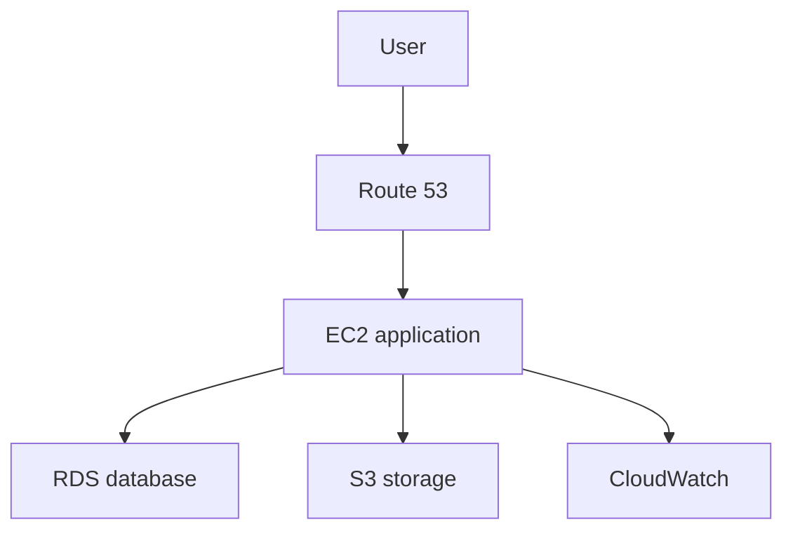
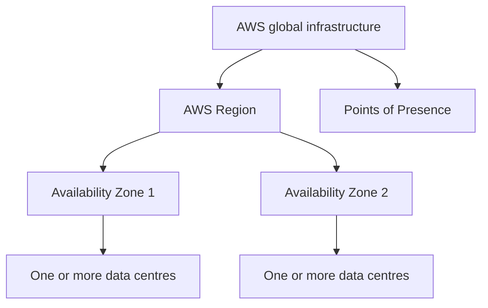
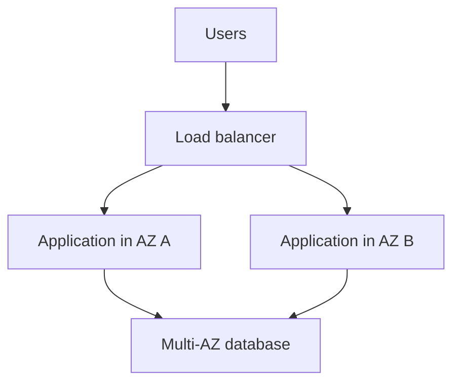
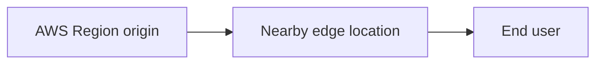

# Introduction to AWS

## Learning Objectives

By the end of these notes, I should be able to:

- Explain what AWS and cloud computing are.
- Describe common AWS use cases and advantages.
- Explain Regions, Availability Zones, and Points of Presence.
- Navigate the AWS Management Console.
- Describe the steps involved in creating and securing an AWS account.
- Explain why MFA, budgets, and billing alerts are essential.

---

## 1. AWS

**Amazon Web Services (AWS)** is a cloud computing platform provided by Amazon. It gives individuals and organisations on-demand access to IT resources through the internet.

These resources include:

- Virtual servers
- Storage
- Databases
- Networking
- Security and identity services
- Monitoring and logging
- Containers and serverless computing
- Data analytics, artificial intelligence, and machine learning

Instead of buying and maintaining physical servers, a business can rent the resources it needs from AWS and usually pay only for what it uses.

> Think of AWS like renting electricity: the provider manages the infrastructure, while the customer consumes and pays for the amount needed.

### Traditional Infrastructure vs AWS

| Traditional on-premises infrastructure | AWS Cloud |
| --- | --- |
| Buy physical servers in advance | Provision resources on demand |
| Large upfront cost | Mostly pay-as-you-go pricing |
| Hardware can take weeks to arrive | Resources can be launched in minutes |
| Organisation maintains the data centre | AWS manages the physical infrastructure |
| Capacity is difficult to predict | Capacity can scale up or down |
| Global expansion requires new facilities | Deploy into multiple geographic Regions |

---

## 2. AWS Introduction

Cloud computing is the on-demand delivery of IT resources over the internet with pay-as-you-go pricing.

AWS allows a user to build an application from separate cloud services. For example:

| Requirement | Example AWS service |
| --- | --- |
| Virtual server | Amazon EC2 |
| Object storage | Amazon S3 |
| Relational database | Amazon RDS |
| Private network | Amazon VPC |
| Domain name and DNS | Amazon Route 53 |
| Monitoring | Amazon CloudWatch |
| User and permission management | AWS IAM |
| Run code without managing servers | AWS Lambda |

### Example Web Application



AWS services are building blocks. The correct services are combined according to the application's requirements for cost, security, performance, reliability, and scalability.

---

## 3. AWS Facts

- AWS launched its first major cloud services in 2006.
- AWS supports individuals, start-ups, large enterprises, and public-sector organisations.
- AWS offers services across categories such as compute, storage, databases, networking, security, analytics, and AI.
- Resources can be managed through the AWS Management Console, AWS CLI, SDKs, APIs, and Infrastructure as Code tools.
- Many AWS services are **Regional**, so the selected Region affects where resources and data are located.
- Some services, including IAM, are considered **global services**.
- AWS operates under a **shared responsibility model**: AWS secures the cloud infrastructure, while customers must securely configure what they run in the cloud.

### Current Global Infrastructure

At the time these notes were written, AWS reported **39 geographic Regions** and **123 Availability Zones**, with additional Regions and Availability Zones planned.

AWS infrastructure changes over time, so current figures should always be checked on the official AWS Global Infrastructure page.

---

## 4. AWS Cloud Use Cases

### Website and Application Hosting

AWS can host websites, APIs, mobile back ends, and large web applications. Resources can scale when traffic increases and reduce when demand falls.

### Backup and Disaster Recovery

Data can be backed up to services such as Amazon S3. Workloads can also be copied to another Availability Zone or Region to improve resilience.

### Development and Testing

Teams can create temporary environments quickly, test their applications, and delete the resources when they are no longer required.

### Data Storage and Databases

AWS provides object, block, and file storage as well as relational, NoSQL, caching, and data warehouse services.

### Big Data and Analytics

Organisations can process large datasets, build reports, analyse logs, and stream real-time data.

### Containers and DevOps

AWS supports container workloads through services such as Amazon ECS and Amazon EKS. It also provides services for source control integration, build pipelines, deployment, infrastructure automation, logging, and monitoring.

### Artificial Intelligence and Machine Learning

AWS can provide computing power, managed tools, and foundation-model services for building and running AI/ML workloads.

### Hybrid Cloud

An organisation can connect its own data centre to AWS, allowing on-premises and cloud resources to work together.

### Main Cloud Benefits

- Replace large upfront costs with variable costs.
- Benefit from economies of scale.
- Stop guessing future capacity requirements.
- Increase speed and agility.
- Reduce time spent maintaining physical data centres.
- Deploy applications globally more quickly.

---

## 5. Global Infrastructure Introduction

AWS global infrastructure is designed around several layers:



| Component | Meaning | Main purpose |
| --- | --- | --- |
| Region | Separate geographic area | Place workloads near users and meet business or data-location requirements |
| Availability Zone | Isolated location within a Region | Improve availability and fault tolerance |
| Data centre | Facility containing physical infrastructure | Run the underlying compute, storage, and networking equipment |
| Point of Presence | Edge network site closer to end users | Reduce latency and deliver content faster |

These components are related, but they are not interchangeable.

---

## 6. AWS Regions

An **AWS Region** is a separate geographic area in which AWS operates multiple Availability Zones.

Examples include:

| Region name | Region code | Location |
| --- | --- | --- |
| Europe (London) | `eu-west-2` | London, United Kingdom |
| Europe (Ireland) | `eu-west-1` | Dublin, Ireland |
| US East (N. Virginia) | `us-east-1` | Northern Virginia, USA |
| US West (Oregon) | `us-west-2` | Oregon, USA |

### How to Choose a Region

Consider:

1. **Data governance and legal requirements** – Does the data need to remain in a particular country or area?
2. **Latency** – Which Region is closest to the users?
3. **Service availability** – Is the required AWS service available in that Region?
4. **Cost** – Prices can differ between Regions.
5. **Resilience and business requirements** – Is a multi-Region design required?

For a UK-based learning project, `eu-west-2` is often a logical starting point because it is the London Region. However, the project's service availability and cost must still be checked.

### Important Region Behaviour

- Creating an EC2 instance in `eu-west-2` does not automatically create it in another Region.
- The selected Region is displayed in the AWS console's top navigation bar.
- Accidentally using the wrong Region can make a resource appear to be missing.
- Some services are global and do not require a Region selection.

---

## 7. AWS Availability Zones (AZs)

An **Availability Zone** is one or more discrete data centres with independent and redundant power, networking, and connectivity inside an AWS Region.

Availability Zones within a Region are connected through high-bandwidth, low-latency networking, but they are physically separated to reduce the chance that one incident affects every zone.

Example AZ names in the London Region include:

- `eu-west-2a`
- `eu-west-2b`
- `eu-west-2c`

### Why Use Multiple Availability Zones?

If an application runs in only one AZ, an AZ failure could make the application unavailable. A highly available design can place resources across two or more AZs.



### Region vs Availability Zone

| Region | Availability Zone |
| --- | --- |
| Geographic area | Isolated location inside a Region |
| Contains multiple AZs | Contains one or more data centres |
| Used for geographic deployment | Used for high availability and fault isolation |
| Example: `eu-west-2` | Example: `eu-west-2a` |

---

## 8. Points of Presence (Edge Locations)

AWS **Points of Presence (PoPs)** are edge network locations positioned closer to users than the main AWS Regions.

Amazon CloudFront uses PoPs to cache and deliver content with lower latency. Instead of every user downloading a file from the application's Region, a cached copy may be served from a nearby edge location.



Common services that use AWS's edge network include:

- Amazon CloudFront
- Amazon Route 53
- AWS Global Accelerator
- AWS Shield

At the time these notes were written, AWS stated that CloudFront had **750+ Points of Presence in 100+ cities across 50+ countries**, plus embedded PoPs. These figures change as AWS expands.

### Region vs Edge Location

| Region | Edge location |
| --- | --- |
| Runs complete application workloads | Delivers or routes content closer to users |
| Contains multiple Availability Zones | Part of the AWS edge network |
| Selected when launching Regional resources | Usually selected automatically based on the user and service |

---

## 9. Tour of the AWS Console

The **AWS Management Console** is a web-based interface providing central access to AWS service consoles.

### Important Areas

| Console area | Purpose |
| --- | --- |
| Services/search bar | Find and open AWS services |
| Region selector | View or change the active Region |
| Account menu | Access account, security, and billing settings |
| AWS CloudShell | Open a browser-based command-line environment |
| Notifications | View AWS account and service notifications |
| Recently visited | Reopen commonly used services |
| Favourites | Save frequently used services |

### Console Checklist

1. Sign in using an administrative identity, not the root user for everyday work.
2. Confirm the selected Region before creating resources.
3. Search for a service such as EC2, S3, IAM, or CloudWatch.
4. Favourite services used regularly.
5. Check Billing and Cost Management frequently.
6. Sign out when using a shared computer.

> A resource that appears missing is often located in a different Region. Always check the Region selector first.

---

## 10. Creating an AWS Account Demo – Part 1

### Before Starting

Prepare:

- An email address not already linked to an AWS account
- A strong, unique password
- Contact information
- A valid payment method
- A phone number for identity verification
- An authenticator application or security key for MFA

### Initial Registration

1. Go to the official AWS sign-up page.
2. Enter the root user email address.
3. Enter an AWS account name.
4. Verify the email address using the code AWS sends.
5. Create a strong root user password.

The email address and password created here become the **root user credentials**. They provide full control of the AWS account and must be protected carefully.

---

## 11. Creating an AWS Account Demo – Part 2

### Contact and Payment Details

1. Choose whether the account is personal or business.
2. Enter accurate contact details.
3. Read and accept the AWS Customer Agreement.
4. Add a valid payment method.
5. Complete identity verification when requested.

AWS requires a payment method even when using a Free plan or Free Tier offers. Free Tier does **not** mean that every AWS service or every amount of usage is free.

### Cost Warning

- Check the price before launching a resource.
- Stop or delete practice resources when finished.
- Remember that stopping a resource may not stop every related charge.
- Check for attached storage, snapshots, public IP addresses, load balancers, databases, and data transfer costs.

---

## 12. Creating an AWS Account Demo – Part 3

### Plan and First Sign-In

During sign-up, new customers may be offered a Free account plan or Paid account plan. The exact offers, credits, and limits can change, so they should be checked on the AWS Free Tier page.

After account creation:

1. Sign in as the root user for the initial security setup.
2. Register MFA for the root user.
3. Create a separate administrative identity for everyday tasks, preferably through IAM Identity Center.
4. Do not use the root user for normal learning or administration.
5. Set up budgets and cost alerts.
6. Choose a default Region.

### Root User vs Administrative Identity

| Root user | Administrative identity |
| --- | --- |
| Created automatically with the AWS account | Created after account registration |
| Has unrestricted account access | Receives permissions through policies or permission sets |
| Used only for tasks that require root | Used for normal administrative work |
| Must have MFA | Must also use MFA |

> Never create access keys for the root user. Never place AWS credentials in source code or upload them to GitHub.

---

## 13. Tour of the AWS Console Demo

### Suggested Practice Tour

1. Open **Console Home**.
2. Use the search bar to find **IAM**, **EC2**, **S3**, **VPC**, and **CloudWatch**.
3. Add frequently used services to favourites.
4. Change the Region to **Europe (London) – `eu-west-2`**.
5. Open **Billing and Cost Management**.
6. Open **CloudShell** and explore the terminal without storing credentials manually.
7. Return to Console Home and check recently visited services.

### Console Safety Checks Before Creating Anything

- Am I signed in with the correct identity?
- Am I in the correct AWS account?
- Am I using the correct Region?
- Is this service included in my plan, credits, or Free Tier allowance?
- What resources and charges will remain after I finish?
- Do I know how to stop and delete everything I create?

---

## 14. Billing and MFA Setup

This is one of the most important parts of setting up an AWS account.

### Enable MFA

**Multi-factor authentication (MFA)** requires an additional verification method as well as the password.

For the root user:

1. Open the account menu.
2. Select **Security credentials**.
3. Find **Multi-factor authentication (MFA)**.
4. Choose **Assign MFA device**.
5. Register an authenticator app, passkey, or supported hardware device.
6. Store recovery information securely.

Enable MFA for all human users, especially identities with administrative permissions.

### Set Up an AWS Budget

AWS Budgets can send an alert when actual or forecasted spending reaches a chosen limit.

Suggested learning-account setup:

1. Open **Billing and Cost Management**.
2. Select **Budgets**.
3. Choose **Create budget**.
4. Create a monthly cost budget.
5. Set a deliberately low amount suitable for the account.
6. Add email alerts at more than one threshold, for example 50%, 80%, and 100%.

### Billing Alarm vs Budget

| AWS Budget | CloudWatch billing alarm |
| --- | --- |
| Tracks cost or usage against a budget | Monitors estimated AWS charges |
| Can alert on actual and forecasted cost | Alerts when a metric crosses a threshold |
| Supports flexible filters and periods | Billing metric is managed in `us-east-1` |

### Essential Cost-Safety Checklist

- Enable Free Tier usage alerts.
- Create a monthly cost budget.
- Review Cost Explorer and the Bills page.
- Tag resources so their purpose is clear.
- Stop and delete unused resources.
- Check every Region when cleaning up.
- Never assume that “stopped” means “free”.
- Protect the root user with MFA.
- Do not share or commit credentials.

---

## AWS CLI Connection to These Notes

The AWS CLI provides command-line access to AWS services.

Check that AWS CLI Version 2 is installed:

```powershell
aws --version
```

After a secure identity has been configured, confirm which account and identity the CLI is using:

```powershell
aws sts get-caller-identity
```

Do not run `aws configure` using root user access keys. Use a dedicated identity, IAM Identity Center, or another secure access method required by the environment.

---

## Quick Revision Questions

1. What does AWS provide?
2. What is the difference between on-premises infrastructure and cloud computing?
3. What are three common AWS use cases?
4. What is an AWS Region?
5. What is an Availability Zone?
6. Why should an application use more than one AZ?
7. What is a Point of Presence?
8. What factors affect Region selection?
9. Why should the root user not be used for daily work?
10. Why are MFA and AWS Budgets important?

---

## Key Takeaways

- AWS delivers IT resources on demand through the cloud.
- AWS services act as building blocks for applications and infrastructure.
- Regions are geographic areas containing multiple Availability Zones.
- Multiple AZs help create highly available and fault-tolerant systems.
- Edge locations move content and network services closer to users.
- Always confirm the account and Region before creating a resource.
- Secure the root user with MFA and use a separate identity for daily work.
- Set up budgets and alerts before beginning practical labs.
- Never upload AWS credentials or private keys to GitHub.

---

## Official AWS References

- [What is cloud computing?](https://aws.amazon.com/what-is-cloud-computing/)
- [Overview of Amazon Web Services](https://docs.aws.amazon.com/whitepapers/latest/aws-overview/introduction.html)
- [AWS Global Infrastructure](https://aws.amazon.com/about-aws/global-infrastructure/regions_az/)
- [AWS Regions and Availability Zones](https://docs.aws.amazon.com/global-infrastructure/latest/regions/aws-regions.html)
- [AWS Points of Presence](https://aws.amazon.com/cloudfront/features/)
- [AWS Management Console](https://docs.aws.amazon.com/awsconsolehelpdocs/latest/gsg/what-is.html)
- [Getting started with an AWS account](https://docs.aws.amazon.com/accounts/latest/reference/getting-started.html)
- [Root user best practices](https://docs.aws.amazon.com/IAM/latest/UserGuide/root-user-best-practices.html)
- [AWS Billing and Cost Management](https://docs.aws.amazon.com/awsaccountbilling/latest/aboutv2/billing-what-is.html)
- [Creating an AWS Budget](https://docs.aws.amazon.com/cost-management/latest
