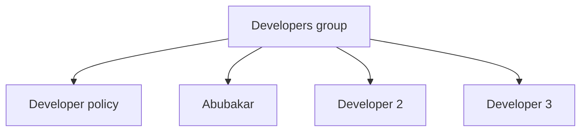
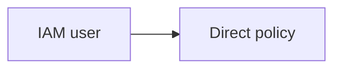
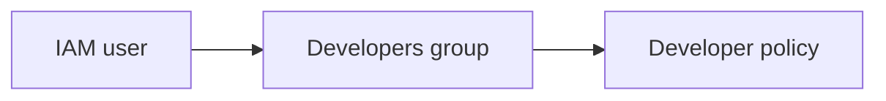
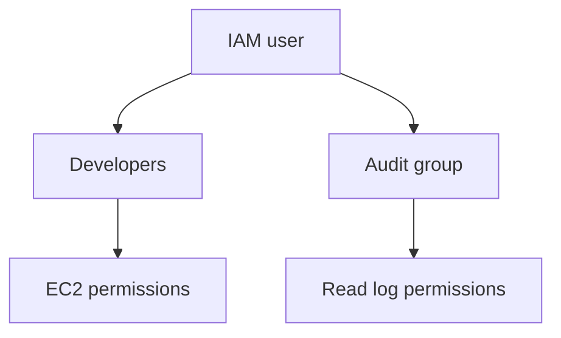
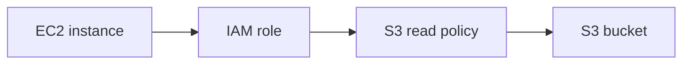

# IAM

IAM stands for **Identity and Access Management**. It controls who can access AWS and what they are permitted to do.

---

## 15. IAM Introduction

**AWS Identity and Access Management (IAM)** is a global AWS service used to securely manage access to AWS resources.

IAM controls two main things:

- **Authentication** – confirming who someone or something is.
- **Authorisation** – deciding what actions that identity is allowed to perform.

> Think of authentication as showing your ID at the entrance and authorisation as checking which rooms you are allowed to enter.

### Main IAM Components

| Component | Purpose |
| --- | --- |
| User | Represents one person or application |
| Group | Collection of IAM users |
| Role | Provides temporary permissions that can be assumed |
| Policy | JSON document defining permissions |

IAM is a **global service**, so IAM users, groups, roles and policies are not created inside one specific AWS Region.

IAM itself has no additional charge. Charges may still apply to the AWS resources accessed through IAM.

### Root User vs IAM Identity

| Root user | IAM identity |
| --- | --- |
| Created with the AWS account | Created after account registration |
| Has unrestricted access | Receives specific permissions |
| Used only for root-only tasks | Used for normal AWS work |
| Must be protected with MFA | Human identities should also use MFA |
| Must not have access keys | Uses approved temporary access where possible |

---

## 16. Users and Groups

### IAM Users

An **IAM user** is an identity created inside an AWS account.

An IAM user can represent:

- An individual person
- A legacy application requiring long-term credentials
- A specific technical process

An IAM user may have:

- A console password
- MFA devices
- Access keys for programmatic access
- Policies attached directly
- Permissions inherited from groups

For modern workforce access, AWS recommends federation and IAM Identity Center rather than creating a separate IAM user for every employee.

### IAM Groups

An **IAM group** is a collection of IAM users.

Policies can be attached to the group, and every user in that group receives those permissions.

Example groups:

- `Developers`
- `ReadOnlyUsers`
- `DatabaseAdmins`
- `SecurityTeam`



### Important Group Rules

- A group can contain multiple users.
- A user can belong to multiple groups.
- Groups cannot contain other groups.
- Groups do not have their own login credentials.
- Groups are used to manage permissions more efficiently.

> Instead of giving ten developers the same policy individually, attach the policy once to the Developers group.

---

## 17. Users and Groups – Demo

### Create an IAM Group

1. Sign in using an administrative identity.
2. Open the **IAM** console.
3. Select **User groups**.
4. Select **Create group**.
5. Enter a group name such as `Developers`.
6. Attach only the policies required for the group's work.
7. Select **Create group**.

### Create an IAM User

1. In IAM, select **Users**.
2. Select **Create user**.
3. Enter a clear username.
4. Only enable console access if the user needs it.
5. Add the user to the correct group.
6. Review the settings.
7. Select **Create user**.

### Naming Examples

Good names clearly identify the purpose of an identity:

```text
abubakar-dev
deployment-service
security-auditor
```

Avoid unclear names such as:

```text
user1
test123
new-user
```

---

## 18. Users and Groups – Demo 2

After creating a user and group, verify that the permissions work correctly.

### Suggested Test

1. Create a group called `S3ReadOnlyUsers`.
2. Attach a read-only S3 policy to the group.
3. Add a test user to the group.
4. Sign in using the test identity.
5. Confirm that the user can view permitted S3 information.
6. Confirm that the user cannot perform unauthorised write actions.

### What This Demonstrates

- Users inherit permissions from groups.
- An allowed action should work.
- An action without permission should be denied.
- Least privilege can be tested rather than assumed.

### Cleanup

After a temporary lab:

- Sign out of the test identity.
- Remove unneeded console access.
- Deactivate or delete unneeded access keys.
- Remove the user if it is no longer required.
- Remove unused custom groups and policies.

---

## 19. Permissions

IAM permissions determine which actions an identity can perform on which AWS resources.

Permissions are normally defined using **IAM policies**.

Example permissions include:

- View S3 buckets
- Start or stop EC2 instances
- Read CloudWatch logs
- Create Lambda functions
- Manage IAM users

### Permission Types

| Permission type | Meaning |
| --- | --- |
| Allow | Permits an action |
| Explicit deny | Blocks an action even if another policy allows it |
| Implicit deny | The action is denied because nothing allows it |

### Basic Evaluation Rules

1. AWS starts with an implicit deny.
2. An applicable explicit allow can grant access.
3. An applicable explicit deny overrides an allow.

```text
No matching Allow = Denied
Matching Allow = Allowed
Matching Explicit Deny = Denied
```

### Least Privilege

The **principle of least privilege** means granting only the permissions required to complete a task.

For example, someone who only needs to view S3 objects should not receive full administrator access.

---

## 20. IAM Policies and Inheritance

An IAM user can receive permissions from several places.

### Direct Policy

A policy can be attached directly to a user.



### Group Policy

A user inherits policies from every group they belong to.



### Multiple Groups

A user can inherit different permissions from multiple groups.



The user's effective permissions are evaluated from all applicable policies.

However, an applicable explicit deny still overrides an allow.

### Example

Suppose a user receives:

- EC2 read access from the `Developers` group
- CloudWatch read access from the `Audit` group
- S3 read access from a directly attached policy

The user may receive all three sets of allowed permissions, unless another applicable control explicitly denies an action.

---

## 21. IAM Policy Structure

IAM policies are written as JSON documents.

### Example Policy

```json
{
  "Version": "2012-10-17",
  "Statement": [
    {
      "Sid": "AllowListBuckets",
      "Effect": "Allow",
      "Action": "s3:ListAllMyBuckets",
      "Resource": "*"
    }
  ]
}
```

### Policy Elements

| Element | Meaning |
| --- | --- |
| `Version` | Version of the IAM policy language |
| `Statement` | Contains one or more permission statements |
| `Sid` | Optional statement identifier |
| `Effect` | `Allow` or `Deny` |
| `Action` | AWS API action affected by the statement |
| `Resource` | AWS resource affected by the action |
| `Condition` | Optional rules controlling when the policy applies |
| `Principal` | Identity trusted or affected in applicable policy types |

### Action Examples

```text
s3:GetObject
ec2:DescribeInstances
ec2:StartInstances
logs:GetLogEvents
```

### Resource Example

AWS resources are often identified using an **ARN**.

ARN stands for **Amazon Resource Name**.

```text
arn:aws:s3:::example-bucket/*
```

### More Restricted S3 Example

```json
{
  "Version": "2012-10-17",
  "Statement": [
    {
      "Effect": "Allow",
      "Action": "s3:GetObject",
      "Resource": "arn:aws:s3:::example-bucket/*"
    }
  ]
}
```

This permits reading objects from one bucket rather than granting access to every S3 resource.

---

## 22. Password Policy

An AWS account password policy defines password requirements for IAM users.

A custom policy can control settings such as:

- Minimum password length
- Required uppercase letters
- Required lowercase letters
- Required numbers
- Required symbols
- Whether users can change their own passwords
- Password reuse prevention
- Password expiry requirements

### Configure a Password Policy

1. Open the **IAM** console.
2. Open **Account settings**.
3. Find **Password policy**.
4. Select **Change password policy**.
5. Choose the required settings.
6. Save the changes.

### Important Notes

- The IAM password policy applies to IAM users, not the root user password.
- A strong password should be unique and difficult to guess.
- Passwords should not be shared.
- MFA should still be used even when the password is strong.
- Temporary or federated access is preferred over relying on long-term passwords where possible.

---

## 23. MFA

**MFA** stands for **multi-factor authentication**.

MFA requires more than one type of evidence during sign-in.

Usually this means:

1. Something the user knows – a password
2. Something the user has – an MFA device

### Why MFA Matters

If an attacker obtains a password, MFA provides another layer of protection.

MFA should be enabled for:

- The root user
- Administrative identities
- IAM users with console access
- Other human users where possible

> Password only = one security layer. Password plus MFA = two security layers.

---

## 24. MFA Device Options in AWS

AWS supports several MFA options.

### Passkeys and Security Keys

These use public-key cryptography and may include:

- Hardware security keys
- Device-based passkeys
- Platform authenticators

### Virtual Authenticator Applications

These applications generate time-based one-time codes.

Examples include compatible authenticator applications installed on a phone or computer.

### Hardware TOTP Tokens

These are dedicated physical devices that generate time-based codes.

### Selecting an MFA Method

Consider:

- Security level
- Recovery process
- Device availability
- Organisation policy
- Whether a backup authentication method is required

Recovery information must be protected securely. An MFA code, recovery code or device registration secret must never be uploaded to GitHub.

---

## 25. How Can Users Access AWS?

Users and applications can access AWS in several ways.

### AWS Management Console

The browser-based graphical interface.

Common credentials include:

- Account or access-portal information
- Username or federated identity
- Password
- MFA verification

### AWS CLI

The command-line interface used to run AWS commands from a terminal.

### AWS SDK

Programming libraries used to call AWS from application code.

### AWS APIs

AWS services expose APIs that receive authenticated requests.

### AWS CloudShell

A browser-based shell available from the AWS console.

### IAM Identity Center

Provides central workforce access and temporary credentials for AWS accounts and applications.

| Access method | Common user |
| --- | --- |
| Management Console | Human user |
| AWS CLI | Administrator, developer or automation |
| AWS SDK | Application developer |
| AWS API | Application or service |
| CloudShell | Console user needing a terminal |
| IAM Identity Center | Workforce user accessing one or more accounts |

---

## 26. Access Keys

An access key is a long-term credential associated with an IAM user or root user.

An access key contains:

- **Access key ID** – identifies the access key.
- **Secret access key** – proves possession of the credential and must remain secret.

The secret access key is normally shown only when the key is created.

### Access Key Security Rules

- Never create access keys for the root user.
- Avoid long-term access keys when temporary credentials can be used.
- Never hard-code access keys into an application.
- Never upload access keys to GitHub.
- Never send keys through email or chat.
- Disable and delete unused keys.
- If a key is exposed, deactivate or delete it immediately and investigate its use.

> Treat a secret access key like a password. It must never appear in your notes, screenshots or repository.

### Preferred Alternatives

Where possible, use:

- IAM roles
- IAM Identity Center
- Temporary credentials
- Workload identities provided by the AWS environment
- AWS CLI sign-in methods that issue short-term credentials

---

## 27. What Is the AWS CLI?

The **AWS Command Line Interface (AWS CLI)** is a tool used to manage AWS services from a terminal.

### General Command Format

```text
aws <service> <operation> [options]
```

### Examples

Check the installed version:

```powershell
aws --version
```

Show the current AWS identity:

```powershell
aws sts get-caller-identity
```

List S3 buckets:

```powershell
aws s3 ls
```

Describe EC2 instances in London:

```powershell
aws ec2 describe-instances --region eu-west-2
```

### Benefits of the CLI

- Faster repeatable administration
- Automation through scripts
- Useful for CI/CD pipelines
- Can manage many AWS services
- Produces machine-readable output

---

## 28. What Is the AWS SDK?

**SDK** stands for **Software Development Kit**.

AWS SDKs are programming libraries that allow applications to communicate with AWS services.

AWS provides SDKs for languages such as:

- Python
- JavaScript and TypeScript
- Java
- .NET
- Go
- PHP
- Ruby
- C++

### Python Example Using Boto3

```python
import boto3

s3 = boto3.client("s3")
response = s3.list_buckets()

for bucket in response["Buckets"]:
    print(bucket["Name"])
```

### CLI vs SDK

| AWS CLI | AWS SDK |
| --- | --- |
| Used in a terminal | Used inside application code |
| Useful for administration and scripts | Useful for software development |
| Commands begin with `aws` | Uses functions, methods and objects |
| Example: `aws s3 ls` | Example: `boto3.client("s3")` |

Credentials must not be written directly into SDK source code. Use the supported credential provider and temporary credentials.

---

## CLI Access Key Demo

Current AWS guidance prefers temporary credentials through IAM Identity Center, IAM roles or supported CLI sign-in methods. Only create a long-term IAM user access key if the course lab specifically requires it.

### Preferred IAM Identity Center Setup

```powershell
aws configure sso
```

Follow the prompts to create a named profile.

Sign in using the profile:

```powershell
aws sso login --profile course-lab
```

Test the identity:

```powershell
aws sts get-caller-identity --profile course-lab
```

### Access Key Lab Method

If the course specifically requires an access-key demonstration:

1. Use a dedicated IAM lab user, never the root user.
2. Grant only the permissions required for the lab.
3. Open the user's **Security credentials** tab.
4. Create an access key for the required use case.
5. Store the key securely and never display it in notes or screenshots.
6. Configure a named CLI profile.

```powershell
aws configure --profile course-lab
```

The CLI asks for:

```text
AWS Access Key ID
AWS Secret Access Key
Default region name
Default output format
```

Example non-secret settings:

```text
Default region name: eu-west-2
Default output format: json
```

Test the configured identity:

```powershell
aws sts get-caller-identity --profile course-lab
```

After the lab:

- Deactivate or delete the key if it is no longer required.
- Remove unnecessary permissions.
- Never commit the local AWS credentials folder to GitHub.

---

## 29. IAM Roles for AWS Services

An **IAM role** is an identity containing permissions that can be assumed temporarily.

Unlike an IAM user, a role does not normally have:

- A permanent password
- Permanent access keys
- One specific person permanently attached to it

Roles provide temporary credentials.

### Example: EC2 Accessing S3

Suppose an application running on EC2 needs to read objects from S3.

The unsafe approach is storing access keys on the EC2 instance.

The secure approach is:

1. Create an IAM role trusted by EC2.
2. Attach the required S3 permissions to the role.
3. Attach the role to the EC2 instance.
4. Let AWS provide temporary credentials automatically.



### Other Role Examples

- Lambda function writing logs to CloudWatch
- ECS task reading from S3
- EC2 instance reading from Secrets Manager
- User assuming a role in another AWS account
- CI/CD service deploying an application

> Applications running on AWS should normally use roles instead of stored access keys.

---

## 30. IAM Security Tools

AWS provides tools for reviewing IAM security.

### IAM Credential Report

The credential report provides account-level information about IAM users and their credentials.

It can show information such as:

- Whether a console password is enabled
- Password usage information
- Whether MFA is enabled
- Access key status
- Access key usage information

Use it to identify old, unused or unsecured credentials.

### IAM Access Advisor

Access Advisor and last-accessed information show when allowed AWS services were last accessed.

This helps identify permissions that may no longer be required.

### IAM Access Analyzer

IAM Access Analyzer can help:

- Identify external access
- Identify internal or unused access where supported
- Validate policies
- Detect policy errors and security warnings
- Refine permissions toward least privilege

### IAM Policy Simulator

The policy simulator can test whether a policy would allow or deny selected actions without performing the real action.

### Comparison

| Tool | Purpose |
| --- | --- |
| Credential report | Reviews IAM user credential status |
| Access Advisor | Shows service last-accessed information |
| Access Analyzer | Finds risky, external or unused access and validates policies |
| Policy Simulator | Tests whether policies allow or deny actions |

---

## 31. IAM Guidelines and Best Practices

### Protect the Root User

- Enable MFA.
- Do not use root for everyday work.
- Do not create root access keys.
- Protect the root email account and recovery details.

### Use Federation for Human Access

Use IAM Identity Center or another identity provider for workforce access where possible.

### Apply Least Privilege

Grant only the permissions required for the task.

Avoid giving `AdministratorAccess` when a smaller permission set is sufficient.

### Use Groups to Manage IAM Users

When IAM users are required, assign permissions through groups where practical instead of repeating the same policies on many users.

### Use Roles for Workloads

AWS services and applications should use IAM roles and temporary credentials instead of stored access keys.

### Require MFA

Enable MFA for privileged and human access.

### Protect Credentials

- Never share passwords or secret keys.
- Never commit credentials to GitHub.
- Never hard-code credentials.
- Remove unused credentials.
- Treat exposed credentials as compromised.

### Review Permissions Regularly

Use:

- Credential reports
- Access Advisor
- IAM Access Analyzer
- CloudTrail logs

### Use Clear Names and Tags

Use names that show the identity's owner or purpose.

### Monitor IAM Activity

Monitor important security events, including:

- Root user activity
- Policy changes
- Role changes
- Access key creation
- Failed authentication

---

## 32. IAM Section Summary

- IAM controls authentication and authorisation in AWS.
- Users represent individual identities or legacy technical identities.
- Groups organise IAM users and provide inherited permissions.
- Roles provide temporary permissions.
- Policies are JSON documents that define access.
- AWS begins with an implicit deny.
- An explicit allow can grant access.
- An explicit deny overrides an allow.
- Password policies apply to IAM users.
- MFA provides an additional authentication layer.
- Users can access AWS through the console, CLI, SDKs, APIs and CloudShell.
- Access keys are sensitive long-term credentials.
- Temporary credentials are preferred.
- AWS services should normally use IAM roles.
- Credential reports, Access Advisor and Access Analyzer help review security.
- Least privilege is one of the most important IAM principles.

---

## IAM Demo

This practical demo combines the main IAM concepts.

### Demo Goal

Create a test identity that can view S3 information but cannot modify IAM or other unrelated services.

### Steps

1. Sign in using an administrative identity.
2. Open the IAM console.
3. Create a group called `S3ReadOnlyUsers`.
4. Attach an appropriate S3 read-only policy.
5. Create a temporary test user only if required for the lab.
6. Add the user to `S3ReadOnlyUsers`.
7. Enable MFA if the user has console access.
8. Sign in using the test identity.
9. Confirm that the permitted read actions work.
10. Confirm that unauthorised actions are denied.
11. Review the user's inherited policies.
12. Generate or inspect the IAM credential report.
13. Review last-accessed information when available.
14. Remove the temporary user and credentials after the lab.

### What the Demo Proves

- Groups simplify permission management.
- Users inherit permissions from their groups.
- IAM denies actions that are not allowed.
- Least privilege limits the damage an identity could cause.
- MFA protects human sign-in.
- Unused identities and credentials should be removed.

---

## IAM Quick Revision Questions

1. What does IAM stand for?
2. What is the difference between authentication and authorisation?
3. What is an IAM user?
4. What is an IAM group?
5. Can a user belong to more than one group?
6. Can an IAM group contain another group?
7. What is an IAM policy?
8. How does a user inherit permissions?
9. What is the principle of least privilege?
10. Which policy decision overrides an allow?
11. What do `Effect`, `Action` and `Resource` mean?
12. What is an ARN?
13. What does an IAM password policy control?
14. Why is MFA important?
15. What MFA options are available in AWS?
16. How can a user access AWS?
17. What is the difference between the AWS CLI and an AWS SDK?
18. What are the two parts of an access key?
19. Why should access keys never be uploaded to GitHub?
20. Why are temporary credentials preferred?
21. What is an IAM role?
22. Why should an EC2 instance use a role instead of stored keys?
23. What information does an IAM credential report provide?
24. What is Access Advisor used for?
25. What does IAM Access Analyzer do?

---

## Official IAM References

- [What is IAM?](https://docs.aws.amazon.com/IAM/latest/UserGuide/introduction.html)
- [IAM users](https://docs.aws.amazon.com/IAM/latest/UserGuide/id_users.html)
- [IAM user groups](https://docs.aws.amazon.com/IAM/latest/UserGuide/id_groups.html)
- [Policies and permissions](https://docs.aws.amazon.com/IAM/latest/UserGuide/access_policies.html)
- [IAM JSON policy reference](https://docs.aws.amazon.com/IAM/latest/UserGuide/reference_policies.html)
- [IAM password policy](https://docs.aws.amazon.com/IAM/latest/UserGuide/id_credentials_passwords_account-policy.html)
- [Managing access keys](https://docs.aws.amazon.com/IAM/latest/UserGuide/id_credentials_access-keys.html)
- [Temporary credentials](https://docs.aws.amazon.com/IAM/latest/UserGuide/id_credentials_temp.html)
- [IAM credential reports](https://docs.aws.amazon.com/IAM/latest/UserGuide/id_credentials_getting-report.html)
- [IAM Access Analyzer](https://docs.aws.amazon.com/IAM/latest/UserGuide/what-is-access-analyzer.html)
- [IAM security best practices](https://docs.aws.amazon.com/IAM/latest/UserGuide/best-practices.html)
- [Configure IAM Identity Center for the AWS CLI](https://docs.aws.amazon.com/cli/latest/userguide/cli-configure-sso.html)
