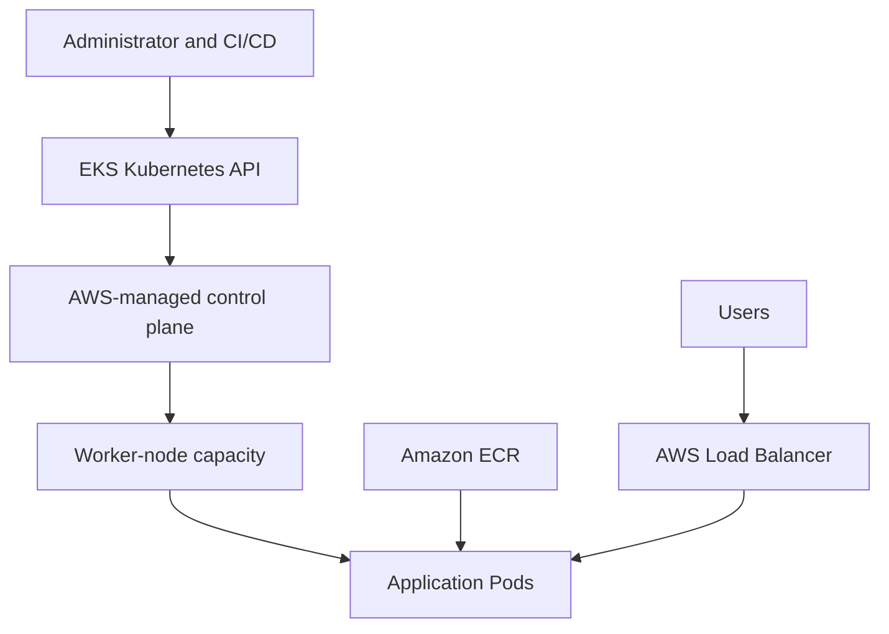

# Containers on AWS

## Learning Objectives

By the end of these notes, I should be able to:

- Explain what containers and container images are.
- Describe how Docker runs on a host operating system.
- Explain where Docker images and container data are stored.
- Compare containers with virtual machines.
- Use essential Docker commands.
- Identify the main AWS container services.
- Explain how Amazon ECS works.
- Describe the ECS EC2 launch type.
- Compare ECS task, execution and container-instance IAM roles.
- Connect an ECS service to a load balancer.
- Scale an ECS service automatically.
- Store and manage container images in Amazon ECR.
- Explain what Amazon EKS provides.
- Describe the EKS control plane and data plane.
- Compare EKS managed nodes, self-managed nodes, Fargate and Auto Mode.

---

# 86. Containers on AWS

A **container** is a lightweight, isolated environment used to run an application and its dependencies.

A container can package:

- Application code
- Runtime
- Libraries
- System packages
- Configuration defaults
- Application dependencies

> A container packages an application so it can run consistently across different environments.

---

## Traditional Deployment Problem

An application may work on a developer’s laptop but fail on another server because of differences in:

- Operating-system packages
- Library versions
- Runtime versions
- Environment variables
- File locations
- Configuration

This is commonly described as:

```text
"It works on my machine."
```

Containers reduce this problem by packaging the application and its required dependencies together.

---

## Container Image vs Container

| Container image | Container |
| --- | --- |
| Read-only application template | Running instance of an image |
| Used to create containers | Executes the application |
| Built from a Dockerfile | Created using commands such as `docker run` |
| Stored locally or in a registry | Runs on a container host |
| Can be versioned | Has a temporary writable layer |

Example:

```text
Image: nginx:1.29
Container: One running NGINX process created from that image
```

Several containers can be created from one image.

```text
nginx image
├── Container 1
├── Container 2
└── Container 3
```

---

## Container Workflow

```text
Write application
       ↓
Create Dockerfile
       ↓
Build image
       ↓
Test image locally
       ↓
Push image to registry
       ↓
Container platform pulls image
       ↓
Run container
```

On AWS, the workflow may use:

```text
Docker → Amazon ECR → Amazon ECS or EKS
```

---

## Benefits of Containers

- Consistent environments
- Fast startup
- Lightweight compared with full VMs
- Application isolation
- Easier deployments
- Versioned images
- Simplified rollback
- Efficient use of infrastructure
- Suitable for CI/CD
- Easier horizontal scaling
- Portable application packaging

---

## Containers Are Not Automatically Secure

Containers still require:

- Secure base images
- Image vulnerability scanning
- Least-privilege IAM permissions
- Network controls
- Secret management
- Runtime monitoring
- Operating-system patching
- Dependency updates
- Logging
- Resource limits

A container is isolated, but it still shares infrastructure with its host.

---

# 87. Docker on an Operating System

Docker normally runs on a host operating system.

The host can be:

- Physical server
- Virtual machine
- Developer laptop
- EC2 instance
- Cloud development environment

---

## Docker Engine

Docker Engine includes components such as:

| Component | Purpose |
| --- | --- |
| Docker CLI | Accepts commands such as `docker run` |
| Docker daemon | Creates and manages Docker objects |
| Docker API | Allows tools to communicate with Docker |
| containerd | Manages container lifecycle and images |
| Container runtime | Starts the container process |

---

## Simplified Docker Architecture

```text
User
 ↓
docker CLI
 ↓
Docker API
 ↓
Docker daemon
 ↓
containerd and runtime
 ↓
Container process
```

---

## Containers Share the Host Kernel

Linux containers use the Linux kernel of the host.

Each container does not normally include a separate kernel.

```text
Applications inside containers
            ↓
Container isolation
            ↓
Shared Linux kernel
            ↓
Host operating system
            ↓
Server hardware
```

This is one reason containers are smaller and start faster than virtual machines.

---

## Container Isolation

Linux container isolation uses technologies such as:

- Namespaces
- Control groups
- Filesystem layers
- Linux capabilities
- Security profiles
- Network namespaces

### Namespaces

Namespaces isolate what a container can see.

Examples include:

- Processes
- Network interfaces
- Mount points
- Hostnames
- Users

### Control Groups

Control groups, also called **cgroups**, control resource usage.

They can limit or measure:

- CPU
- Memory
- Processes
- I/O

---

## Linux and Windows Containers

Linux containers require a compatible Linux kernel.

Windows containers require a compatible Windows host environment.

When Docker Desktop runs Linux containers on Windows or macOS, it normally uses a lightweight Linux virtual machine behind the scenes.

---

## Docker Is Not an Operating System

Docker is not a complete operating system.

It is a platform for building and running containers.

A container image may contain files from a Linux distribution, but it still uses the host kernel.

Example:

```text
Ubuntu container image
        +
Linux host kernel
        =
Running Ubuntu-based container
```

The container does not boot a complete Ubuntu virtual machine.

---

# 88. Where Are Docker Images Stored?

Docker images can exist in two main places:

1. A local image store
2. A remote container registry

---

## Local Image Store

When an image is pulled or built, Docker stores its layers locally on the Docker host.

View local images:

```bash
docker image ls
```

or:

```bash
docker images
```

The exact storage location and format depend on:

- Operating system
- Docker version
- Storage backend
- Docker configuration
- Whether Docker Desktop is being used

Traditional Linux Docker installations often store Docker-managed data underneath:

```text
/var/lib/docker
```

Newer Docker installations may use the containerd image store.

Do not manually edit Docker’s internal storage directories.

Use Docker commands to manage images.

---

## Remote Container Registry

A registry stores and distributes container images.

Examples include:

- Amazon ECR
- Docker Hub
- GitHub Container Registry
- GitLab Container Registry
- Quay

Example image URI:

```text
ACCOUNT_ID.dkr.ecr.eu-west-2.amazonaws.com/nginx-container-lab:v1
```

---

## Registry Structure

```text
Registry
└── Repository
    ├── Image tag: v1
    ├── Image tag: v2
    └── Image tag: production
```

---

## Image Layers

Docker images are built from read-only layers.

Example Dockerfile:

```dockerfile
FROM nginx:alpine
COPY index.html /usr/share/nginx/html/index.html
```

This can produce layers such as:

```text
Base NGINX layer
        ↓
Alpine system layer
        ↓
Custom index.html layer
```

Layers can be reused between images, reducing download time and storage duplication.

---

## Image Tag vs Digest

### Tag

A human-readable label.

Examples:

```text
v1
v2
production
latest
```

A tag can be moved to a different image unless immutability is enabled.

### Digest

A content-based identifier.

Example:

```text
sha256:abc123...
```

A digest identifies specific image content.

For controlled production deployments, a versioned tag or image digest is safer than relying only on:

```text
latest
```

---

## Container Writable Layer

When a container starts, Docker adds a temporary writable layer above the read-only image layers.

```text
Read-only image layers
          +
Writable container layer
          =
Container filesystem
```

Files written to this layer normally disappear when the container is deleted.

---

## Persistent Container Data

Persistent data should be stored using:

- Docker volumes
- Bind mounts
- Amazon EBS
- Amazon EFS
- Databases
- Amazon S3 where object storage is suitable

Example Docker volume:

```bash
docker volume create application-data
```

```bash
docker run -d \
  --name nginx-volume-demo \
  -v application-data:/usr/share/nginx/html \
  nginx:alpine
```

---

# 89. Docker vs Virtual Machines

Containers and virtual machines both isolate workloads, but they work differently.

---

## Virtual Machine Architecture

```text
Application
Guest operating system
Virtual hardware
Hypervisor
Host operating system or hardware
```

Every VM normally includes:

- A complete guest operating system
- Its own kernel
- Virtual CPU
- Virtual memory
- Virtual storage

---

## Container Architecture

```text
Containerised application
Container libraries
Container runtime
Shared host kernel
Host operating system
Hardware
```

Containers normally share the host kernel.

---

## Comparison

| Containers | Virtual machines |
| --- | --- |
| Share the host kernel | Have separate guest kernels |
| Start quickly | Take longer to boot |
| Usually smaller | Usually larger |
| Efficient resource usage | More resource overhead |
| Package application dependencies | Include a complete guest OS |
| Weaker isolation boundary than a full VM | Stronger infrastructure isolation |
| Useful for microservices and CI/CD | Useful for different operating systems and legacy workloads |

---

## Containers Inside Virtual Machines

Containers and VMs are often used together.

Example:

```text
AWS physical server
        ↓
EC2 virtual machine
        ↓
Docker or containerd
        ↓
Several containers
```

Amazon ECS using the EC2 launch type follows this general model.

---

## When to Use Containers

Containers are suitable when:

- Applications need fast deployment.
- Services need to scale independently.
- CI/CD is being used.
- Consistency is required between environments.
- Applications can be divided into services.
- Efficient infrastructure usage is important.

---

## When to Use Virtual Machines

VMs may be suitable when:

- A complete operating system is required.
- Different kernels are needed.
- Stronger isolation is required.
- The application cannot be containerised easily.
- Legacy applications depend on the full OS.
- An administrator needs full server control.

---

# 90. Getting Started with Docker

## Check Docker

```bash
docker --version
```

Display detailed information:

```bash
docker info
```

---

## Pull an Image

```bash
docker pull nginx:alpine
```

This downloads the image into the local image store.

---

## List Images

```bash
docker image ls
```

---

## Run a Container

```bash
docker run -d \
  --name nginx-demo \
  -p 8080:80 \
  nginx:alpine
```

### Command Meaning

| Part | Meaning |
| --- | --- |
| `docker run` | Creates and starts a container |
| `-d` | Runs in the background |
| `--name nginx-demo` | Gives the container a name |
| `-p 8080:80` | Maps host port 8080 to container port 80 |
| `nginx:alpine` | Image and tag |

Open:

```text
http://localhost:8080
```

---

## List Containers

Running containers:

```bash
docker ps
```

All containers:

```bash
docker ps -a
```

---

## Read Container Logs

```bash
docker logs nginx-demo
```

Follow the logs:

```bash
docker logs -f nginx-demo
```

---

## Run a Command Inside a Container

```bash
docker exec -it nginx-demo sh
```

A small Alpine image may have `sh` but not Bash.

---

## Stop and Remove

```bash
docker stop nginx-demo
```

```bash
docker rm nginx-demo
```

Remove an image:

```bash
docker image rm nginx:alpine
```

---

## Example Dockerfile

```dockerfile
FROM nginx:alpine

COPY index.html /usr/share/nginx/html/index.html

EXPOSE 80
```

Example `index.html`:

```html
<!doctype html>
<html lang="en">
<head>
  <meta charset="utf-8">
  <title>Abubakar's AWS Container Lab</title>
</head>
<body>
  <h1>Hello from a Docker container!</h1>
  <p>This image can be stored in Amazon ECR.</p>
</body>
</html>
```

---

## Build the Image

```bash
docker build -t nginx-container-lab:v1 .
```

---

## Run the Custom Image

```bash
docker run -d \
  --name nginx-container-lab \
  -p 8080:80 \
  nginx-container-lab:v1
```

Test:

```bash
curl http://localhost:8080
```

---

## Docker Security Basics

- Use trusted base images.
- Use specific image versions.
- Scan images for vulnerabilities.
- Run applications as a non-root user where possible.
- Do not store secrets in Dockerfiles.
- Do not copy `.env` files into images.
- Use multi-stage builds.
- Remove unnecessary packages.
- Keep images small.
- Do not expose the Docker socket to untrusted containers.
- Apply CPU and memory limits.

---

# 91. Container-Related Services on AWS

AWS provides services for building, storing and running containers.

| Service | Purpose |
| --- | --- |
| Amazon ECS | AWS-native container orchestration |
| Amazon EKS | Managed Kubernetes |
| AWS Fargate | Serverless compute for containers |
| Amazon ECR | Container image registry |
| AWS App Runner | Simplified deployment of web applications and APIs |
| AWS Batch | Runs batch workloads using containers |
| Amazon Lightsail Containers | Simplified container hosting |
| AWS Lambda | Can run functions packaged as container images |
| ECS Anywhere | Extends ECS to external infrastructure |
| EKS Hybrid Nodes | Connects on-premises or edge nodes to EKS |

---

## Amazon ECS

**ECS** stands for **Elastic Container Service**.

ECS is AWS’s managed container orchestration service.

It manages:

- Task placement
- Desired task count
- Service deployments
- Health
- Load-balancer registration
- Container restarts and replacement
- Integration with AWS services

---

## Amazon EKS

**EKS** stands for **Elastic Kubernetes Service**.

EKS provides a managed Kubernetes control plane.

It is suitable when:

- Kubernetes APIs are required.
- Kubernetes portability is important.
- The organisation already uses Kubernetes.
- Kubernetes tools and extensions are needed.

---

## AWS Fargate

Fargate provides on-demand compute capacity for containers.

With Fargate, the customer does not manage EC2 container hosts.

Fargate can be used with:

- Amazon ECS
- Amazon EKS

---

## Amazon ECR

ECR stores container images.

It integrates with services such as:

- ECS
- EKS
- App Runner
- Lambda
- CI/CD pipelines

---

## ECS vs EKS

| Amazon ECS | Amazon EKS |
| --- | --- |
| AWS-native orchestrator | Managed Kubernetes |
| Simpler AWS learning curve | Requires Kubernetes knowledge |
| Deep AWS integration | Kubernetes ecosystem and APIs |
| Uses task definitions and services | Uses Pods, Deployments and Services |
| Less orchestration complexity | Greater flexibility and complexity |

---

# 92. Amazon ECS – EC2 Launch Type

With the ECS EC2 launch type, containers run on EC2 instances managed by the customer.

---

## ECS EC2 Architecture

```text
Amazon ECS cluster
├── EC2 container instance 1
│   ├── ECS agent
│   ├── Task 1
│   └── Task 2
└── EC2 container instance 2
    ├── ECS agent
    └── Task 3
```

---

## ECS Container Instance

An **ECS container instance** is an EC2 instance that:

- Runs the ECS container agent
- Runs a supported container runtime
- Is registered with an ECS cluster
- Provides CPU and memory for tasks

---

## ECS Agent

The ECS agent communicates between:

- ECS control plane
- EC2 container instance
- Container runtime

It helps ECS:

- Register the instance
- Start tasks
- Stop tasks
- Report task status
- Report available resources

---

## Core ECS Components

| Component | Meaning |
| --- | --- |
| Cluster | Logical group of ECS capacity and workloads |
| Container instance | EC2 instance registered with ECS |
| Task definition | Versioned blueprint for running containers |
| Task | Running copy of a task definition |
| Service | Maintains a desired number of tasks |
| Capacity provider | Defines where task capacity comes from |
| Container | Application process running inside a task |

---

## Task Definition

A task definition can specify:

- Container image
- CPU
- Memory
- Port mappings
- Environment variables
- Secrets
- IAM roles
- Logging
- Volumes
- Health checks
- Network mode
- Startup dependencies

A task definition is versioned.

Example:

```text
nginx-task:1
nginx-task:2
nginx-task:3
```

---

## Task vs Service

### Task

A task is one running copy of a task definition.

It may be suitable for:

- Batch job
- One-time process
- Testing

### Service

A service maintains a selected number of tasks.

Example:

```text
Desired count: 3
```

If one task stops, the service starts a replacement.

---

## Customer Responsibilities with EC2 Launch Type

The customer manages:

- EC2 instance types
- EC2 purchasing options
- Operating-system patches
- ECS agent updates
- Docker/container runtime
- Cluster capacity
- Auto Scaling group
- Security groups
- EBS storage
- Instance monitoring

AWS manages the ECS orchestration control plane.

---

## ECS EC2 vs Fargate

| ECS on EC2 | ECS on Fargate |
| --- | --- |
| Customer manages EC2 instances | AWS manages underlying compute |
| Greater host control | No host management |
| Can improve cost through task packing | Pay for configured task resources |
| Supports specialised instance types | Uses supported Fargate configurations |
| Customer manages cluster capacity | Fargate provides task capacity |
| Can use Reserved and Spot Instances | Can use supported Fargate pricing options |

---

## Capacity Providers

A capacity provider connects ECS with compute capacity.

For ECS on EC2, it can integrate with an EC2 Auto Scaling group.

Managed scaling can add or remove EC2 container instances based on cluster capacity requirements.

This is different from ECS Service Auto Scaling, which changes the number of application tasks.

---

# 93. Amazon ECS – IAM Roles

ECS uses different IAM roles for different purposes.

These roles should not be confused.

---

## Main ECS Roles

| IAM role | Used by | Purpose |
| --- | --- | --- |
| Task role | Application container | Allows application code to access AWS services |
| Task execution role | ECS or Fargate agent | Pulls images, writes logs and retrieves referenced secrets |
| Container instance role | EC2 container host | Allows the ECS agent and host to communicate with ECS |
| Service-linked role | ECS service | Allows ECS to manage AWS resources on the account’s behalf |

---

## ECS Task Role

The **task role** is used by application code inside the container.

Example:

```text
Container application needs to read an S3 object
        ↓
Task role allows s3:GetObject
```

The application receives temporary credentials.

Do not place permanent access keys inside the image.

---

## Task Role Example

```json
{
  "Version": "2012-10-17",
  "Statement": [
    {
      "Effect": "Allow",
      "Action": "s3:GetObject",
      "Resource": "arn:aws:s3:::example-application-bucket/*"
    }
  ]
}
```

This policy should be attached to the task role, not stored inside the container.

---

## Task Execution Role

The **task execution role** is used by ECS or the Fargate agent to prepare and run the task.

It can allow actions such as:

- Pulling a private image from ECR
- Sending container logs to CloudWatch Logs
- Retrieving referenced secrets
- Retrieving Systems Manager parameters

Common managed policy:

```text
AmazonECSTaskExecutionRolePolicy
```

---

## Container Instance Role

The **container instance role** is attached to EC2 container instances.

It allows the ECS agent and container host to:

- Register with the ECS cluster
- Report available resources
- Poll ECS for work
- Report task status
- Communicate with ECS APIs

This role is not a replacement for the application’s task role.

---

## IAM Role Mental Model

```text
Application needs S3
        ↓
Task role

ECS needs to pull ECR image
        ↓
Task execution role

EC2 host needs to join ECS cluster
        ↓
Container instance role
```

---

## IAM Security Rules

- Use separate roles for separate purposes.
- Apply least privilege.
- Never place access keys inside images.
- Never pass permanent keys through environment variables.
- Use Secrets Manager or Parameter Store for secrets.
- Review CloudTrail logs.
- Restrict who can pass IAM roles using `iam:PassRole`.

---

# 94. Amazon ECS – Load Balancer Integrations

ECS services can integrate with Elastic Load Balancing.

AWS generally recommends an Application Load Balancer for HTTP and HTTPS ECS services unless another load-balancer type provides a required feature.

---

## ECS Load-Balancing Flow

```text
Internet
   ↓
Application Load Balancer
   ↓
Target group
   ↓
ECS service
├── Task 1
├── Task 2
└── Task 3
```

---

## ECS and Target Groups

When ECS starts a service task:

1. The task starts.
2. ECS registers the task with the target group.
3. The load balancer performs health checks.
4. The task becomes healthy.
5. The load balancer sends traffic to it.

When a task stops:

1. ECS deregisters the target.
2. Connection draining begins.
3. The task is removed.
4. ECS starts a replacement when required.

---

## ECS Load-Balancer Options

| Load balancer | Common ECS use |
| --- | --- |
| Application Load Balancer | HTTP, HTTPS, host and path routing |
| Network Load Balancer | TCP, UDP, TLS and high-performance traffic |
| Gateway Load Balancer | Network appliance workloads |
| Classic Load Balancer | Older ECS applications |

---

## Dynamic Host Port Mapping

With EC2 and a suitable network mode, ECS can dynamically select a host port.

Example:

```text
Container port: 80

Task 1 host port: 32768
Task 2 host port: 32769
Task 3 host port: 32770
```

The ALB discovers the correct host port through target registration.

This allows several copies of the same container to run on one EC2 instance.

---

## Target Type and Network Mode

### `awsvpc` Network Mode

Each task receives its own network interface and IP address.

Use target type:

```text
ip
```

### Bridge or Host Networking

For supported EC2 task configurations, target type may be:

```text
instance
```

The correct target type must be selected when creating the target group.

---

## ECS Load-Balancer Security Groups

```text
ALB security group:
Inbound TCP 80 or 443 from clients

Task or instance security group:
Inbound application port from ALB security group
```

Do not expose task application ports to the entire internet when traffic should enter through the load balancer.

---

# 95. ECS Service Auto Scaling

ECS Service Auto Scaling changes the desired number of tasks in an ECS service.

It uses the AWS Application Auto Scaling service.

---

## Example

```text
Minimum tasks: 2
Desired tasks: 2
Maximum tasks: 10
```

During high demand:

```text
2 tasks → 8 tasks
```

When demand falls:

```text
8 tasks → 2 tasks
```

---

## Scaling Policy Types

ECS Service Auto Scaling supports policies such as:

- Target tracking
- Step scaling
- Scheduled scaling

---

## Target Tracking

Target tracking attempts to keep a metric near a selected target.

Example:

```text
Metric: Average ECS service CPU
Target value: 50%
```

When CPU rises, ECS adds tasks.

When CPU falls, ECS can remove tasks safely.

---

## Common ECS Scaling Metrics

- ECS service average CPU
- ECS service average memory
- ALB request count per target
- Custom CloudWatch metrics
- Queue length per task

---

## Service Scaling vs Cluster Scaling

These are different.

### ECS Service Auto Scaling

Changes:

```text
Number of application tasks
```

### ECS Cluster Auto Scaling

Changes:

```text
Number of EC2 container instances
```

---

## Capacity Problem Example

```text
Service requests 10 tasks
EC2 cluster only has capacity for 4
```

Result:

```text
4 tasks running
6 tasks pending
```

For ECS on EC2, enough container-instance capacity must exist.

An EC2 Auto Scaling group capacity provider can help scale the cluster.

With Fargate, AWS provides the underlying task compute capacity.

---

## Scaling During Deployments

ECS Service Auto Scaling may pause some scale-in behaviour during deployments to avoid removing too much capacity.

Deployment and scaling settings should be tested together.

---

# 96. Amazon ECR

**ECR** stands for **Elastic Container Registry**.

Amazon ECR is AWS’s managed container image registry.

It can store:

- Docker images
- Open Container Initiative images
- Multi-architecture images
- Supported OCI artifacts

---

## ECR Structure

```text
AWS account
└── ECR registry
    └── Repository
        ├── Image v1
        ├── Image v2
        └── Image production
```

---

## ECR Image URI

```text
ACCOUNT_ID.dkr.ecr.eu-west-2.amazonaws.com/nginx-container-lab:v1
```

| Part | Meaning |
| --- | --- |
| `ACCOUNT_ID` | AWS account containing the repository |
| `eu-west-2` | Repository Region |
| `nginx-container-lab` | Repository name |
| `v1` | Image tag |

---

## ECR Features

- Private and public repositories
- IAM access control
- Encryption
- Image vulnerability scanning
- Tag immutability
- Lifecycle policies
- Cross-Region replication
- Cross-account replication
- Pull-through cache
- CloudTrail integration
- EventBridge events

---

## Create an ECR Repository

```bash
aws ecr create-repository \
  --repository-name nginx-container-lab \
  --image-scanning-configuration scanOnPush=true \
  --image-tag-mutability IMMUTABLE \
  --region eu-west-2
```

---

## Authenticate Docker with ECR

```bash
aws ecr get-login-password \
  --region eu-west-2 \
  | docker login \
      --username AWS \
      --password-stdin \
      ACCOUNT_ID.dkr.ecr.eu-west-2.amazonaws.com
```

The authentication token is temporary.

Use an approved IAM identity, not root-user access keys.

---

## Build the Image

```bash
docker build -t nginx-container-lab:v1 .
```

---

## Tag the Image

```bash
docker tag nginx-container-lab:v1 \
  ACCOUNT_ID.dkr.ecr.eu-west-2.amazonaws.com/nginx-container-lab:v1
```

---

## Push the Image

```bash
docker push \
  ACCOUNT_ID.dkr.ecr.eu-west-2.amazonaws.com/nginx-container-lab:v1
```

---

## Pull the Image

```bash
docker pull \
  ACCOUNT_ID.dkr.ecr.eu-west-2.amazonaws.com/nginx-container-lab:v1
```

---

## Tags and Immutability

If tag immutability is enabled, an existing tag cannot be overwritten.

Example:

```text
v1 always refers to the original v1 image
```

To deploy an update:

```text
v2
```

or use the exact image digest.

---

## Image Scanning

ECR scanning can identify known software vulnerabilities in:

- Operating-system packages
- Application dependencies
- Image libraries

A scan result does not guarantee that an image is completely secure.

Critical and high findings should be reviewed before deployment.

---

## Lifecycle Policies

A lifecycle policy can automatically expire old images.

Example:

```text
Keep the newest 10 production images.
Expire older untagged images.
```

This reduces storage cost and repository clutter.

Test lifecycle rules before applying them.

---

## ECR Security

- Keep repositories private unless public access is intended.
- Use IAM least privilege.
- Enable image scanning.
- Use immutable tags or image digests.
- Enable encryption.
- Remove unused images.
- Do not store secrets inside image layers.
- Restrict cross-account repository policies.
- Record image versions used in deployments.

---

# 97. Amazon EKS Overview

**EKS** stands for **Elastic Kubernetes Service**.

Amazon EKS is AWS’s managed Kubernetes service.

AWS manages the Kubernetes control plane.

The customer deploys and manages Kubernetes workloads.

---

## What Is Kubernetes?

Kubernetes is a container orchestration platform.

It manages:

- Container deployment
- Scheduling
- Scaling
- Service discovery
- Load balancing
- Configuration
- Secrets
- Storage
- Self-healing
- Rolling updates

---

## Important Kubernetes Terms

| Term | Meaning |
| --- | --- |
| Cluster | Complete Kubernetes environment |
| Control plane | Makes cluster decisions and manages state |
| Node | Machine providing compute capacity |
| Pod | Smallest deployable Kubernetes unit |
| Deployment | Manages replicated Pods and updates |
| Service | Provides stable networking for Pods |
| Namespace | Logical separation inside a cluster |
| ConfigMap | Stores non-secret configuration |
| Secret | Stores sensitive Kubernetes data |
| Ingress | Routes HTTP/HTTPS traffic to Services |

---

## EKS Responsibilities

### AWS Manages

- Kubernetes control-plane infrastructure
- Control-plane availability
- Control-plane patching
- Managed API endpoints
- etcd infrastructure
- Integration with AWS services

### Customer Manages

Depending on the compute option:

- Kubernetes workloads
- Container images
- Pod configuration
- IAM access
- Kubernetes RBAC
- Networking policies
- Application security
- Worker-node configuration
- Cluster add-ons
- Kubernetes version upgrades and compatibility
- Logging and monitoring

Managed options can reduce some node-management responsibilities.

---

## Why Use EKS?

- Use Kubernetes APIs and tools
- Run Kubernetes on AWS
- Integrate with ECR, IAM, ELB and CloudWatch
- Deploy across multiple Availability Zones
- Use EC2, Fargate or managed node options
- Support hybrid workloads
- Use the Kubernetes ecosystem
- Improve application portability

---

## ECS vs EKS Decision

Choose ECS when:

- AWS-native orchestration is suitable.
- Simpler management is preferred.
- Kubernetes is not required.
- Deep AWS integration is the priority.

Choose EKS when:

- Kubernetes is an organisational standard.
- Kubernetes APIs are required.
- Existing Kubernetes tools are used.
- Portability and ecosystem compatibility matter.
- The team can manage Kubernetes complexity.

---

# 98. Amazon EKS Diagram

## Basic EKS Architecture



---

## Control Plane

The Kubernetes control plane contains components such as:

- Kubernetes API server
- Scheduler
- Controller manager
- etcd datastore

AWS runs the EKS control plane across multiple Availability Zones for resilience.

---

## Data Plane

The data plane provides the compute where Pods run.

Possible compute options include:

- EKS managed node groups
- Self-managed EC2 nodes
- AWS Fargate
- EKS Auto Mode
- Hybrid nodes

---

## Application Traffic Flow

```text
Internet user
      ↓
AWS Load Balancer
      ↓
Kubernetes Service or Ingress
      ↓
Application Pods
      ↓
Database or other AWS services
```

---

## Image Deployment Flow

```text
Developer builds image
        ↓
Pushes image to Amazon ECR
        ↓
Kubernetes Deployment references image
        ↓
EKS node pulls image
        ↓
Pod starts container
```

---

## Kubernetes Deployment Example

```yaml
apiVersion: apps/v1
kind: Deployment
metadata:
  name: nginx-container-lab
spec:
  replicas: 3
  selector:
    matchLabels:
      app: nginx-container-lab
  template:
    metadata:
      labels:
        app: nginx-container-lab
    spec:
      containers:
        - name: nginx
          image: ACCOUNT_ID.dkr.ecr.eu-west-2.amazonaws.com/nginx-container-lab:v1
          ports:
            - containerPort: 80
```

Apply:

```bash
kubectl apply -f deployment.yaml
```

Check Pods:

```bash
kubectl get pods
```

Check Deployments:

```bash
kubectl get deployments
```

---

## Kubernetes Service Example

```yaml
apiVersion: v1
kind: Service
metadata:
  name: nginx-container-service
spec:
  selector:
    app: nginx-container-lab
  ports:
    - port: 80
      targetPort: 80
  type: ClusterIP
```

This creates an internal Kubernetes Service.

External traffic normally requires a suitable LoadBalancer Service or Ingress configuration and AWS load-balancer integration.

---

## EKS IAM and Pod Permissions

Applications inside Pods should not use permanent access keys.

AWS options include:

- EKS Pod Identity
- IAM roles for service accounts
- Temporary credentials

The Kubernetes service account is associated with suitable AWS permissions.

---

# 99. Amazon EKS Node Types

A Kubernetes **node** provides CPU and memory for Pods.

Different EKS compute options provide different levels of control and management.

---

## EKS Managed Node Groups

Managed node groups use EC2 instances managed through EKS node-group operations.

AWS helps automate:

- Node provisioning
- Node registration
- Updates
- Draining during updates
- Node termination
- Auto Scaling group integration

The EC2 instances and Auto Scaling groups run inside the customer’s AWS account.

The customer still chooses areas such as:

- Instance types
- Capacity type
- Scaling configuration
- Subnets
- AMI options
- Security groups
- Node IAM role

---

## Self-Managed Nodes

Self-managed nodes are EC2 instances configured and maintained by the customer.

The customer manages:

- EC2 Auto Scaling groups
- Node AMIs
- Bootstrap configuration
- Kubernetes version compatibility
- Patching
- Updates
- Draining
- Replacement
- Security

Self-managed nodes provide more control but more operational work.

---

## AWS Fargate for EKS

Fargate runs selected Kubernetes Pods without the customer managing EC2 worker nodes.

The customer defines Fargate profiles that select Pods using:

- Namespaces
- Labels

Benefits:

- No EC2 node management
- Per-Pod compute isolation
- On-demand capacity
- Simplified infrastructure operations

Considerations:

- Not every Kubernetes workload is suitable.
- Some privileged or host-level features are unavailable.
- Supported resource combinations must be used.
- Costs and workload restrictions should be reviewed.

---

## EKS Auto Mode

EKS Auto Mode automates more of the cluster infrastructure.

It can manage areas including:

- EC2 node creation
- Node deletion
- Node patching
- Compute scaling
- Load-balancer integration
- Storage integration
- Networking components

The customer remains responsible for:

- Applications
- Container images
- Kubernetes resources
- Workload security
- IAM and access
- Application monitoring

Auto Mode has additional service charges alongside the AWS resources it creates.

---

## EKS Hybrid Nodes

EKS Hybrid Nodes allow on-premises or edge infrastructure to join an EKS cluster as worker nodes.

AWS manages the AWS-hosted Kubernetes control plane.

The customer manages the hybrid node infrastructure.

This is an advanced option for applications that must run outside AWS Regions.

---

## Node Option Comparison

| Option | Infrastructure management | Best suited for |
| --- | --- | --- |
| Managed node groups | Shared between AWS and customer | Standard EC2-based EKS workloads |
| Self-managed nodes | Mostly customer | Maximum control and custom requirements |
| Fargate | AWS manages task compute | Supported serverless Pod workloads |
| EKS Auto Mode | AWS automates more cluster infrastructure | Reduced operational management |
| Hybrid nodes | Customer manages external nodes | On-premises and edge workloads |

---

## Node Capacity Types

EC2-based node groups can use options such as:

### On-Demand Instances

- Stable capacity
- No interruption from Spot reclamation
- Suitable for critical workloads

### Spot Instances

- Lower potential cost
- Can be interrupted
- Suitable for fault-tolerant workloads
- Use several instance types and Availability Zones where possible

---

## Specialised Nodes

EKS nodes can also use supported EC2 hardware for:

- GPUs
- AWS Graviton processors
- Machine-learning accelerators
- Memory-intensive workloads
- Storage-intensive workloads
- Windows containers

The selected AMI, architecture and Kubernetes configuration must be compatible.

---

# Practical Demo: Docker to ECR

This lab builds a custom NGINX image and pushes it to Amazon ECR.

---

## Step 1: Create the Files

Create:

```text
nginx-container-lab/
├── Dockerfile
└── index.html
```

`Dockerfile`:

```dockerfile
FROM nginx:alpine

COPY index.html /usr/share/nginx/html/index.html

EXPOSE 80
```

`index.html`:

```html
<!doctype html>
<html lang="en">
<head>
  <meta charset="utf-8">
  <title>Abubakar's ECS Container</title>
</head>
<body>
  <h1>Hello from Amazon ECS!</h1>
  <p>This image is stored in Amazon ECR.</p>
</body>
</html>
```

---

## Step 2: Build and Test

```bash
docker build -t nginx-container-lab:v1 .
```

```bash
docker run -d \
  --name nginx-container-test \
  -p 8080:80 \
  nginx-container-lab:v1
```

Test:

```bash
curl http://localhost:8080
```

---

## Step 3: Confirm AWS Identity

```bash
aws sts get-caller-identity
```

Confirm the correct:

- AWS account
- IAM identity
- Region

Never use root-user access keys.

---

## Step 4: Create the ECR Repository

```bash
aws ecr create-repository \
  --repository-name nginx-container-lab \
  --image-scanning-configuration scanOnPush=true \
  --image-tag-mutability IMMUTABLE \
  --region eu-west-2
```

---

## Step 5: Sign In to ECR

```bash
aws ecr get-login-password \
  --region eu-west-2 \
  | docker login \
      --username AWS \
      --password-stdin \
      ACCOUNT_ID.dkr.ecr.eu-west-2.amazonaws.com
```

---

## Step 6: Tag the Image

```bash
docker tag nginx-container-lab:v1 \
  ACCOUNT_ID.dkr.ecr.eu-west-2.amazonaws.com/nginx-container-lab:v1
```

---

## Step 7: Push the Image

```bash
docker push \
  ACCOUNT_ID.dkr.ecr.eu-west-2.amazonaws.com/nginx-container-lab:v1
```

---

## Step 8: Verify

Open:

```text
Amazon ECR
→ Private repositories
→ nginx-container-lab
→ Images
```

Check:

- Image tag
- Image digest
- Image size
- Push time
- Scan status
- Vulnerability findings

---

# Practical ECS EC2 Deployment Outline

## Required Resources

```text
ECR repository
ECS cluster
EC2 Auto Scaling group or capacity provider
ECS container instances
Task execution role
Task definition
ECS service
Target group
Application Load Balancer
CloudWatch log group
```

---

## Task Definition Example

```json
{
  "family": "nginx-container-task",
  "networkMode": "awsvpc",
  "requiresCompatibilities": ["EC2"],
  "executionRoleArn": "TASK_EXECUTION_ROLE_ARN",
  "containerDefinitions": [
    {
      "name": "nginx-container",
      "image": "ACCOUNT_ID.dkr.ecr.eu-west-2.amazonaws.com/nginx-container-lab:v1",
      "essential": true,
      "portMappings": [
        {
          "containerPort": 80,
          "protocol": "tcp"
        }
      ],
      "logConfiguration": {
        "logDriver": "awslogs",
        "options": {
          "awslogs-group": "/ecs/nginx-container-lab",
          "awslogs-region": "eu-west-2",
          "awslogs-stream-prefix": "ecs"
        }
      }
    }
  ]
}
```

---

## Service Configuration

Example:

```text
Service name: nginx-container-service
Desired tasks: 2
Launch option: EC2 capacity provider
Network mode: awsvpc
Load balancer: Application Load Balancer
Target type: IP
Container port: 80
```

The service should be distributed across multiple Availability Zones where possible.

---

# Container Troubleshooting

## Docker Build Fails

Check:

- The Dockerfile exists.
- The build context is correct.
- File names match exactly.
- Base-image access works.
- The Docker daemon is running.
- Network and DNS access work.
- Dockerfile syntax is valid.

---

## ECR Login Fails

Check:

- AWS CLI identity
- Region
- Registry URL
- IAM permissions
- System time
- Temporary credentials
- ECR repository Region

Run:

```bash
aws sts get-caller-identity
```

---

## ECR Push Is Denied

Check permissions such as:

- `ecr:GetAuthorizationToken`
- `ecr:InitiateLayerUpload`
- `ecr:UploadLayerPart`
- `ecr:CompleteLayerUpload`
- `ecr:PutImage`

Also check:

- Repository exists.
- Correct account is used.
- Correct Region is used.
- Immutable tag does not already exist.

---

## ECS Task Remains Pending

Possible causes:

- No EC2 container capacity
- Insufficient CPU
- Insufficient memory
- Port conflict
- Placement constraint
- Capacity provider problem
- EC2 container instance not registered
- Unsupported architecture
- No suitable Availability Zone capacity

---

## ECS Task Stops

Open the task and check:

```text
Stopped reason
Container exit code
Container reason
```

Also review:

- CloudWatch logs
- Image URI
- IAM roles
- Secrets
- Port mappings
- Health checks
- CPU and memory settings

---

## Cannot Pull ECR Image

Check:

- Task execution role
- ECR repository policy
- ECR image URI
- Image tag
- Network route
- NAT gateway or ECR VPC endpoints
- DNS resolution
- Security groups
- ECR authentication permissions

---

## ECS Service Is Unhealthy

Check:

- Container is listening on the expected port.
- Target group uses the correct target type.
- Health-check path exists.
- Task security group allows the ALB.
- ALB security group permits outbound traffic.
- Target group health-check port is correct.
- Application startup time is considered.

---

## EKS Pod Is Pending

Check:

```bash
kubectl describe pod POD-NAME
```

Possible causes:

- Insufficient node CPU
- Insufficient node memory
- Node selector mismatch
- Taints and tolerations
- Persistent volume unavailable
- Fargate profile does not match
- Node group cannot scale

---

## EKS ImagePullBackOff

Check:

```bash
kubectl describe pod POD-NAME
```

Possible causes:

- Incorrect ECR image URI
- Missing node or Pod IAM permissions
- Image tag does not exist
- Network path to ECR unavailable
- Wrong Region
- Architecture mismatch
- Repository policy denies access

---

# Container Security and Cost Checklist

- [ ] Use trusted base images.
- [ ] Pin important image versions.
- [ ] Avoid relying only on `latest`.
- [ ] Enable ECR image scanning.
- [ ] Review critical and high vulnerabilities.
- [ ] Enable ECR tag immutability where appropriate.
- [ ] Use ECR lifecycle policies.
- [ ] Never store secrets inside images.
- [ ] Use ECS task roles instead of access keys.
- [ ] Separate task and execution roles.
- [ ] Apply least privilege.
- [ ] Restrict task security groups.
- [ ] Send logs to CloudWatch.
- [ ] Set CPU and memory limits.
- [ ] Use non-root containers where possible.
- [ ] Keep container hosts patched.
- [ ] Use several Availability Zones.
- [ ] Configure load-balancer health checks.
- [ ] Configure service Auto Scaling.
- [ ] Ensure EC2 cluster capacity can support scaled tasks.
- [ ] Delete unused ECS services and clusters.
- [ ] Delete unused ECR images and repositories.
- [ ] Delete unused load balancers.
- [ ] Delete unused EKS clusters and node groups.
- [ ] Remember that EKS control planes, EC2 nodes, Fargate tasks and load balancers generate charges.
- [ ] Review AWS Billing after every lab.

---

# Quick Revision Questions

1. What is a container?
2. What is the difference between an image and a container?
3. What information can an image contain?
4. What does Docker Engine do?
5. Do Linux containers normally have their own kernel?
6. What are namespaces used for?
7. What are control groups used for?
8. Why does Docker Desktop use a Linux VM for Linux containers?
9. Where are Docker images stored?
10. What is a container registry?
11. What is an image layer?
12. What is the difference between a tag and digest?
13. What happens to the container writable layer when the container is deleted?
14. How should persistent container data be stored?
15. What is the main difference between containers and VMs?
16. What does `docker run -p 8080:80` mean?
17. What does ECS stand for?
18. What does EKS stand for?
19. What does ECR stand for?
20. What does Fargate provide?
21. What is an ECS cluster?
22. What is an ECS container instance?
23. What is a task definition?
24. What is the difference between an ECS task and service?
25. What does the ECS agent do?
26. What must the customer manage with ECS on EC2?
27. What is an ECS capacity provider?
28. What is the difference between a task role and task execution role?
29. What is the container instance role?
30. Why should access keys not be stored in container images?
31. How does an ECS service integrate with a target group?
32. What is dynamic host port mapping?
33. When should a target group use target type `ip`?
34. What does ECS Service Auto Scaling change?
35. What does ECS cluster scaling change?
36. Why might ECS tasks remain pending after service scale-out?
37. What is an ECR repository?
38. What is tag immutability?
39. What is an ECR lifecycle policy?
40. Why should ECR images be scanned?
41. What does Kubernetes manage?
42. Which parts of EKS are managed by AWS?
43. What is a Kubernetes Pod?
44. What is a Kubernetes Deployment?
45. What is a Kubernetes Service?
46. What is the difference between the EKS control and data planes?
47. What is an EKS managed node group?
48. What is a self-managed node?
49. How does EKS Fargate work?
50. What does EKS Auto Mode manage?
51. What are EKS Hybrid Nodes?
52. When should ECS be selected instead of EKS?
53. When should EKS be selected instead of ECS?

---

# Key Takeaways

- Containers package applications and their dependencies.
- Images are read-only templates.
- Containers are running instances of images.
- Linux containers normally share the host’s Linux kernel.
- Docker Engine manages images, containers, networks and volumes.
- Docker images are stored locally and in remote registries.
- Images contain reusable layers.
- A container’s writable layer is temporary.
- Persistent data should use volumes or external storage.
- Containers are lighter than complete virtual machines.
- ECS is AWS’s native container orchestration service.
- EKS provides managed Kubernetes.
- Fargate provides serverless container compute.
- ECR stores and distributes container images.
- ECS on EC2 requires the customer to manage EC2 capacity.
- Task definitions describe how ECS containers run.
- ECS services maintain the desired number of tasks.
- Task roles grant permissions to application code.
- Task execution roles help ECS prepare and run tasks.
- Container instance roles allow EC2 hosts to communicate with ECS.
- ECS services can integrate with Application and Network Load Balancers.
- ECS Service Auto Scaling changes the number of tasks.
- ECS cluster scaling changes the number of EC2 container hosts.
- ECR supports image scanning, immutability and lifecycle policies.
- The EKS control plane is managed by AWS.
- EKS worker capacity runs Kubernetes Pods.
- Managed node groups reduce EC2 node-management work.
- Self-managed nodes provide more control.
- Fargate runs supported Pods without user-managed EC2 nodes.
- EKS Auto Mode automates more compute, networking and storage infrastructure.
- Containers still require security, monitoring, patching and cost management.

---

# Official References

- [What is Amazon ECS?](https://docs.aws.amazon.com/AmazonECS/latest/developerguide/Welcome.html)
- [Amazon ECS clusters](https://docs.aws.amazon.com/AmazonECS/latest/developerguide/clusters.html)
- [Amazon ECS task definitions](https://docs.aws.amazon.com/AmazonECS/latest/developerguide/task_definitions.html)
- [Amazon ECS services](https://docs.aws.amazon.com/AmazonECS/latest/developerguide/ecs_services.html)
- [ECS launch types and capacity providers](https://docs.aws.amazon.com/AmazonECS/latest/developerguide/capacity-launch-type-comparison.html)
- [ECS container instances](https://docs.aws.amazon.com/AmazonECS/latest/developerguide/create-capacity.html)
- [ECS IAM roles](https://docs.aws.amazon.com/AmazonECS/latest/developerguide/security-ecs-iam-role-overview.html)
- [ECS task roles](https://docs.aws.amazon.com/AmazonECS/latest/developerguide/task-iam-roles.html)
- [ECS task execution role](https://docs.aws.amazon.com/AmazonECS/latest/developerguide/task_execution_IAM_role.html)
- [ECS load balancing](https://docs.aws.amazon.com/AmazonECS/latest/developerguide/service-load-balancing.html)
- [ECS Service Auto Scaling](https://docs.aws.amazon.com/AmazonECS/latest/developerguide/service-auto-scaling.html)
- [ECS cluster Auto Scaling](https://docs.aws.amazon.com/AmazonECS/latest/developerguide/cluster-auto-scaling.html)
- [What is Amazon ECR?](https://docs.aws.amazon.com/AmazonECR/latest/userguide/what-is-ecr.html)
- [Push an image to ECR](https://docs.aws.amazon.com/AmazonECR/latest/userguide/docker-push-ecr-image)
