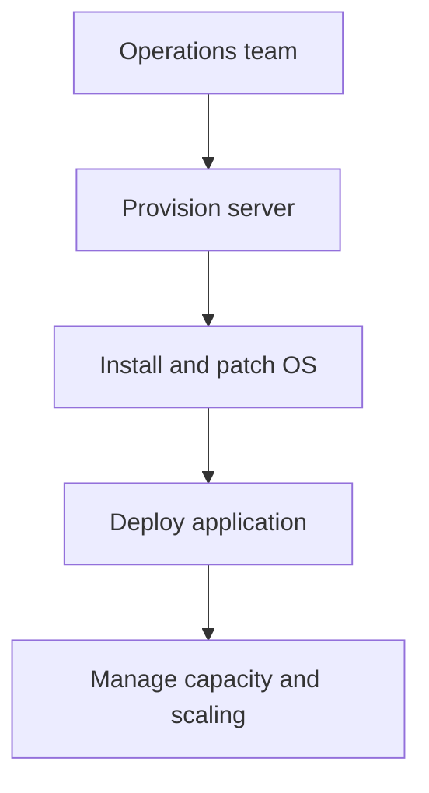
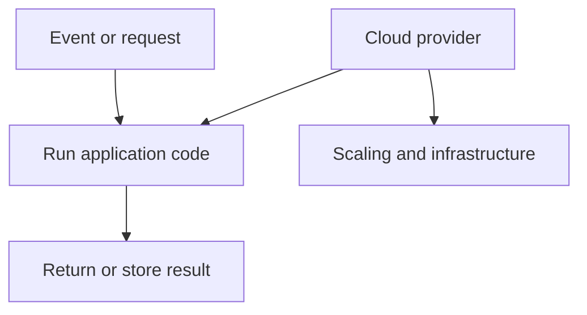
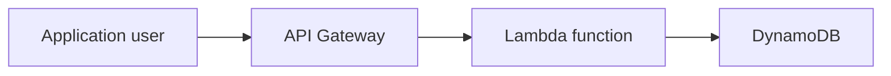
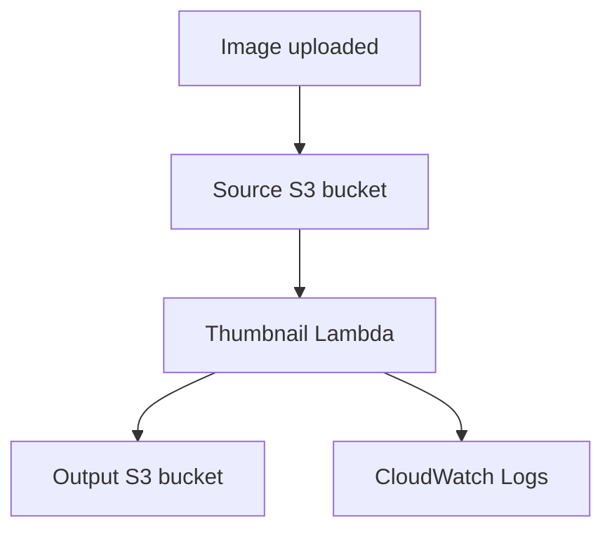
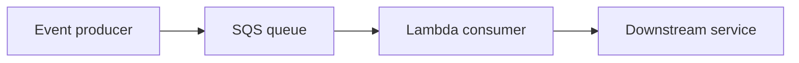
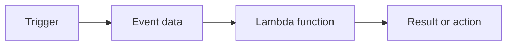
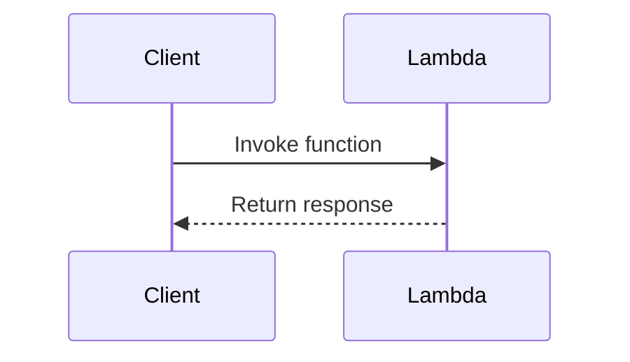
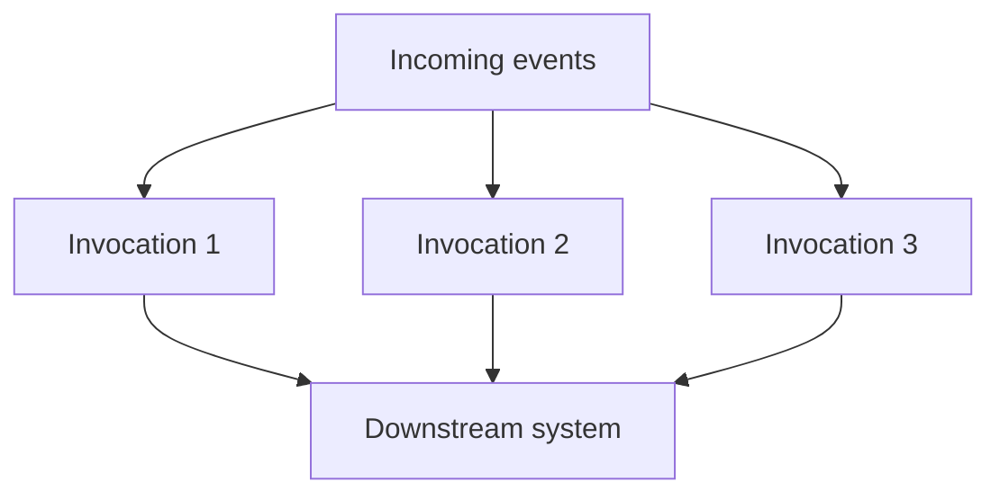
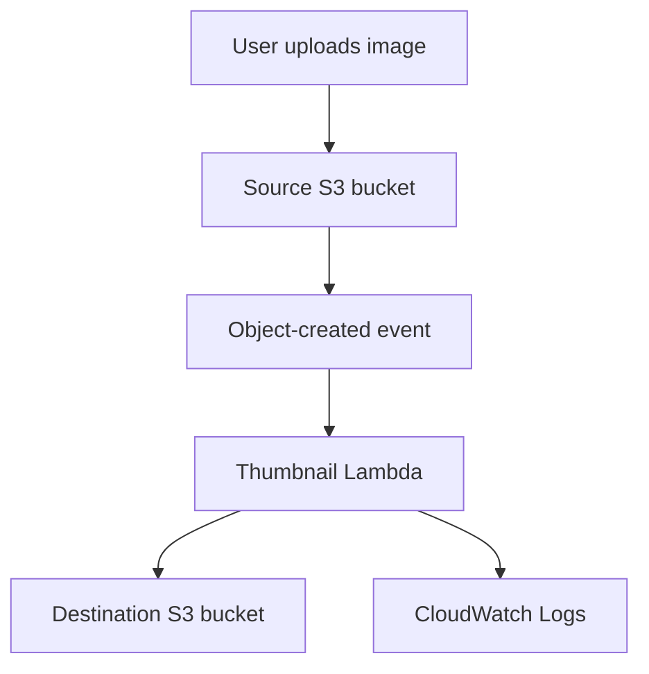

# Serverless

Serverless computing allows applications to run without the developer managing the underlying servers.

Servers still exist, but the cloud provider handles tasks such as:

- Provisioning servers
- Maintaining infrastructure
- Patching operating systems
- Replacing failed hardware
- Scaling compute capacity
- Managing much of the availability

The developer can concentrate on application code, events and business logic.

> **Serverless does not mean that there are no servers. It means that you do not manage those servers directly.**

---

## Serverless Learning Objectives

By the end of this section, you should understand:

- What serverless computing means
- How serverless differs from traditional infrastructure
- Which AWS services support serverless architectures
- What AWS Lambda is
- Why Lambda is useful
- How Lambda functions are invoked
- Which programming languages Lambda supports
- How Lambda permissions work
- How to create thumbnails using S3 and Lambda
- How to monitor and troubleshoot Lambda
- The security and cost considerations of serverless applications

---

# 100. Serverless Overview

In a traditional environment, an organisation must provision and manage servers before running an application.

This may include:

- Selecting hardware
- Installing an operating system
- Installing application dependencies
- Applying security patches
- Configuring networking
- Monitoring the server
- Adding more servers when demand increases
- Replacing failed infrastructure

Serverless computing transfers much of this infrastructure management to the cloud provider.

---

## Traditional Server Model



The organisation manages both the application and the server environment.

---

## Serverless Model



The developer provides the code and configuration. The cloud provider manages the servers used to run that code.

---

## Main Characteristics of Serverless Computing

### No Direct Server Management

You do not normally:

- Select a physical server
- Install an operating system
- Patch the host
- Replace failed hardware
- Manually add servers during traffic increases

### Event-Driven Execution

Serverless applications are commonly triggered by events.

Examples include:

- An HTTP request reaches an API
- A file is uploaded to an S3 bucket
- A message arrives in an SQS queue
- A database record changes
- A scheduled time is reached
- An EventBridge event occurs

### Automatic Scaling

The platform can create more execution environments when more events arrive.

If demand decreases, the platform can reduce the amount of active compute.

### Pay for Usage

Serverless compute is normally charged according to usage, such as:

- Number of requests
- Execution duration
- Memory or compute allocated
- Related service usage
- Data transfer
- Logs and monitoring

There is usually no charge for an idle Lambda function that is not being invoked, although optional features and connected services may still create charges.

### Stateless Design

Serverless functions should generally be designed as stateless.

This means the function should not depend on information remaining in its local memory or filesystem between invocations.

Persistent information should be stored in services such as:

- Amazon S3
- Amazon DynamoDB
- Amazon RDS
- Amazon ElastiCache
- Amazon EFS

---

## Traditional Servers vs Serverless

| Traditional server | Serverless |
| --- | --- |
| Server capacity is provisioned in advance | Capacity is provided when needed |
| Operating system must be maintained | Cloud provider manages the host environment |
| Often charged while running | Commonly charged according to actual execution |
| Scaling must be configured or performed | Compute can scale automatically |
| Suitable for long-running applications | Commonly used for short event-driven tasks |
| Greater operating-system control | Less control over the underlying environment |
| State may be stored locally | Persistent state should normally use another service |
| Infrastructure management is required | Infrastructure management is reduced |

---

## Shared Responsibility Still Applies

Serverless does not remove the customer's security responsibilities.

### AWS Manages

AWS manages areas such as:

- Physical data centres
- Physical servers
- Host operating systems
- Hardware replacement
- Core Lambda execution infrastructure
- Infrastructure availability

### The Customer Manages

The customer remains responsible for:

- Application code
- IAM permissions
- Data protection
- Function configuration
- Dependencies
- Secrets
- Input validation
- Logging and monitoring
- Network configuration where applicable
- Compliance requirements

> AWS manages the infrastructure, but you must still secure the application.

---

## Benefits of Serverless

- Less infrastructure administration
- Faster application development
- Automatic scaling
- Integration with other cloud services
- Pay-per-use pricing
- Suitable for event-driven automation
- Built-in availability across infrastructure
- Faster experimentation and deployment

---

## Serverless Challenges

Serverless also introduces trade-offs.

- Functions have runtime and resource limits.
- Cold starts can add latency.
- Debugging distributed applications can be more difficult.
- Applications may depend heavily on cloud-specific services.
- Functions must handle retries and duplicate events.
- Local storage is temporary.
- Long-running workloads may not be suitable.
- Poorly controlled concurrency can affect databases or other downstream systems.
- Many small functions can become difficult to manage without clear standards.

---

# 101. Serverless in AWS

AWS provides several managed services that can be combined to create serverless applications.

---

## Common AWS Serverless Services

| AWS service | Purpose |
| --- | --- |
| AWS Lambda | Runs code in response to events |
| Amazon API Gateway | Creates and manages APIs |
| Amazon S3 | Stores objects and can produce events |
| Amazon DynamoDB | Managed NoSQL database |
| Amazon EventBridge | Routes events between applications and services |
| Amazon SQS | Stores messages in queues |
| Amazon SNS | Sends messages to multiple subscribers |
| AWS Step Functions | Coordinates multi-step workflows |
| Amazon ECS with AWS Fargate | Runs containers without managing EC2 hosts |
| Amazon ECR | Stores container images |
| Amazon Aurora Serverless | Automatically adjusts compatible database capacity |
| Amazon Athena | Runs SQL queries against data in S3 |
| Amazon Cognito | Provides application user identity features |

Not every managed service is serverless in exactly the same way. However, these services reduce or remove direct infrastructure management.

---

## Example Serverless API



In this example:

1. A user sends an HTTP request.
2. API Gateway receives the request.
3. API Gateway invokes a Lambda function.
4. Lambda processes the request.
5. Lambda reads or writes information in DynamoDB.
6. A response is returned to the user.

No EC2 instance is required to host the application code.

---

## Example Event-Driven File Processing



The image upload is the event that starts the workflow.

---

## Event-Driven Architecture

An **event** is a record showing that something happened.

Examples:

```text
A customer uploaded a file.
An order was created.
A payment failed.
A user signed in.
A scheduled time was reached.
An EC2 instance changed state.
```

In an event-driven architecture, services respond to events instead of constantly checking for work.

---

## Important Event Services

### Amazon EventBridge

EventBridge receives events and routes them to matching targets.

Possible targets include:

- Lambda
- SQS
- SNS
- Step Functions
- ECS tasks
- Other event buses

### Amazon SQS

SQS stores messages in a queue until a consumer processes them.

This can protect a Lambda function or downstream system from sudden traffic increases.



### Amazon SNS

SNS publishes one message to multiple subscribers.

Subscribers could include:

- Lambda functions
- SQS queues
- Email endpoints
- HTTP endpoints

### AWS Step Functions

Step Functions coordinates several tasks into a workflow.

It can support:

- Sequential steps
- Parallel steps
- Decisions
- Retries
- Waiting
- Error handling

---

## Example Serverless Use Cases

- REST APIs
- Website backends
- Image and video processing
- Scheduled automation
- Log processing
- Notifications
- File validation
- Data transformation
- Security-response automation
- IoT event processing
- Queue consumers
- Stream processing
- Infrastructure housekeeping

---

## Serverless and DevOps

Serverless is important in DevOps because it supports:

- Automated deployments
- Infrastructure as Code
- Event-driven automation
- Independent deployment of small components
- Automatic scaling
- Reduced server maintenance
- Rapid experimentation
- Cloud-native monitoring
- CI/CD pipelines

A DevOps engineer may still need to manage:

- Infrastructure templates
- IAM permissions
- Deployment packages
- Environment variables
- Logs and alarms
- Function versions
- Release strategies
- Security controls
- Cost monitoring

---

# 102. Why AWS Lambda?

**AWS Lambda** is a serverless compute service that runs code in response to events.

A piece of code deployed to Lambda is called a **Lambda function**.

> Lambda is commonly used when code must run after a request or event without maintaining a continuously running server.

---

## Basic Lambda Flow



Example:

```text
Trigger: Image uploaded to S3
Event: S3 sends the bucket and object name
Function: Lambda downloads and resizes the image
Result: Thumbnail is uploaded to another bucket
```

---

## Main Lambda Components

| Component | Purpose |
| --- | --- |
| Function code | Instructions that Lambda runs |
| Runtime | Language environment used to execute the code |
| Handler | Entry point Lambda calls |
| Trigger | Service or event that invokes the function |
| Event | JSON data supplied to the function |
| Execution role | IAM role used by the function |
| Environment variables | Configuration values supplied to the code |
| Timeout | Maximum permitted execution time |
| Memory | Memory allocated to the function |
| Temporary storage | Local `/tmp` storage available during execution |
| Layer | Shared code or dependencies |
| Version | Immutable snapshot of function code and configuration |
| Alias | Friendly name pointing to a function version |

---

## Lambda Handler

The **handler** is the function Lambda calls when an invocation begins.

Python example:

```python
def lambda_handler(event, context):
    return {
        "statusCode": 200,
        "body": "Hello from Lambda"
    }
```

The handler receives:

- `event` – information supplied by the trigger
- `context` – information about the current Lambda invocation

For this example, the handler configuration is:

```text
lambda_function.lambda_handler
```

This means:

```text
File: lambda_function.py
Function: lambda_handler
```

---

## Invocation Types

Lambda can be invoked in several ways.

### Synchronous Invocation

The caller waits for Lambda to finish and return a response.

Examples:

- API Gateway
- Application Load Balancer
- Direct Lambda API call
- AWS CLI invocation



### Asynchronous Invocation

The event is placed into Lambda's internal processing system and the caller does not wait for the function result.

Examples include:

- Amazon S3
- Amazon SNS
- Amazon EventBridge

Lambda can retry asynchronous events when processing fails.

### Event Source Mapping

Lambda can poll supported services for records and invoke a function with batches of records.

Examples include:

- Amazon SQS
- Amazon Kinesis
- DynamoDB Streams
- Amazon MSK

---

## Lambda Execution Role

A Lambda execution role is an IAM role that the function assumes while running.

The role determines which AWS services the function can access.

For example, a thumbnail function may require permission to:

- Read images from a source S3 bucket
- Write thumbnails to a destination S3 bucket
- Write logs to CloudWatch Logs

The function should receive only the permissions it requires.

> Lambda permissions should follow the principle of least privilege.

---

## Execution Role vs Resource-Based Policy

These two permission types perform different jobs.

| Permission | Purpose |
| --- | --- |
| Lambda execution role | Controls what the function can access |
| Lambda resource-based policy | Controls who or which service can invoke the function |

For an S3-triggered Lambda function:

```text
S3 needs permission to invoke Lambda.
Lambda needs permission to read and write S3 objects.
```

---

## Environment Variables

Environment variables store function configuration separately from the code.

Example:

```text
DESTINATION_BUCKET=example-thumbnail-output
THUMBNAIL_WIDTH=300
```

Python can read these values:

```python
import os

destination_bucket = os.environ["DESTINATION_BUCKET"]
thumbnail_width = int(os.environ.get("THUMBNAIL_WIDTH", "300"))
```

Environment variables are useful for configuration, but sensitive secrets should normally be stored in:

- AWS Secrets Manager
- AWS Systems Manager Parameter Store

Do not hard-code:

- Passwords
- Access keys
- Database credentials
- API secrets

---

## Lambda Resource Configuration

A standard Lambda function can currently be configured with:

- Between **128 MB and 10,240 MB** of memory
- A timeout between **1 second and 900 seconds**
- Configurable temporary `/tmp` storage
- Either `x86_64` or `arm64` architecture

Lambda allocates additional CPU capacity as the configured memory increases.

A function should be given enough memory and time to complete its work, without allocating much more than it requires.

---

## Temporary Storage

Lambda functions can use the following directory during execution:

```text
/tmp
```

This storage is temporary.

It can be useful for:

- Downloading a file
- Extracting an archive
- Temporarily processing an image
- Caching reusable information

Do not use `/tmp` as permanent application storage.

Use S3, EFS or a database when information must persist reliably.

---

## Cold and Warm Starts

### Cold Start

A cold start happens when Lambda creates and prepares a new execution environment.

This may include:

- Starting the runtime
- Loading the function code
- Loading dependencies
- Running initialisation code

### Warm Start

Lambda may reuse an existing execution environment for another invocation.

This can reduce startup time.

However, code must not assume that an environment will always be reused.

---

## Reusing SDK Clients

Objects that can safely be reused should normally be created outside the handler.

```python
import boto3

s3 = boto3.client("s3")

def lambda_handler(event, context):
    return s3.list_buckets()
```

This may allow an existing SDK client or connection to be reused during warm invocations.

---

## Lambda Scaling

When more events arrive, Lambda can create additional execution environments to process them concurrently.



This automatic scaling is useful, but downstream systems must also be able to handle the traffic.

For example, hundreds of Lambda invocations could create hundreds of database connections.

---

## Lambda Concurrency

**Concurrency** is the number of function invocations running at the same time.

### Reserved Concurrency

Reserved concurrency can:

- Reserve capacity for one function
- Prevent the function from using more than a chosen amount
- Protect downstream systems
- Prevent one function from consuming all account concurrency

### Provisioned Concurrency

Provisioned concurrency prepares execution environments before requests arrive.

This can reduce cold-start latency, but it creates additional cost.

---

## Workloads Suitable for Lambda

Lambda is well suited to:

- Short event-driven tasks
- API request processing
- Scheduled automation
- Image and document processing
- Queue consumers
- Notifications
- Log analysis
- Security automation
- Small data transformations

---

## Workloads That May Need Another Service

Lambda may not be suitable when a workload:

- Must run longer than 15 minutes
- Requires full operating-system control
- Requires a continuously running process
- Depends heavily on persistent local state
- Requires specialised host configuration
- Has very predictable continuous high usage
- Requires more resources than Lambda provides

Possible alternatives include:

- Amazon ECS with Fargate
- Amazon ECS with EC2
- Amazon EKS
- Amazon EC2
- AWS Batch

---

## Lambda vs Containers vs EC2

| AWS Lambda | ECS with Fargate | Amazon EC2 |
| --- | --- | --- |
| Runs event-driven functions | Runs containers | Runs virtual servers |
| Maximum invocation duration applies | Supports long-running containers | Supports long-running applications |
| No server management | No EC2 host management | Customer manages the instance |
| Highly managed runtime | More container control | Full operating-system control |
| Automatic per-invocation scaling | Task and service scaling | Instance and application scaling |
| Best for short tasks | Best for containerised services | Best when full control is required |

---

# 103. Benefits of AWS Lambda

AWS Lambda provides several technical and operational benefits.

---

## No Server Administration

With Lambda, you do not normally manage:

- EC2 instances
- Server operating systems
- Host patching
- Physical hardware
- Capacity replacement

This reduces operational work.

---

## Automatic Scaling

Lambda can create additional execution environments when demand increases.

This makes it useful for workloads where traffic changes unexpectedly.

---

## Pay for Execution

Lambda charges are generally based on areas such as:

- Number of requests
- Execution duration
- Memory or compute configuration
- Optional provisioned concurrency
- Related services and data transfer

A function that is not invoked does not normally create standard execution-duration charges.

However, connected resources such as these can still cost money:

- CloudWatch Logs
- S3 storage
- API Gateway
- DynamoDB
- Data transfer
- Provisioned concurrency
- ECR storage
- Other services invoked by the function

---

## Built-In Availability

Lambda runs functions using AWS-managed infrastructure designed for availability within a Region.

Developers do not manually place individual Lambda execution environments into particular Availability Zones.

The application still needs resilient design, including:

- Retry handling
- Idempotency
- Durable storage
- Failure destinations
- Monitoring
- Multi-Region planning when required

---

## AWS Service Integrations

Lambda integrates with many AWS services.

Examples include:

- S3
- API Gateway
- EventBridge
- SQS
- SNS
- DynamoDB
- Kinesis
- CloudWatch
- Step Functions
- Application Load Balancer

This makes Lambda useful for connecting AWS services through event-driven automation.

---

## Faster Deployment

A function is often smaller than a complete server application.

This can make it easier to:

- Test one component
- Deploy one component
- Roll back one component
- Update functions independently
- Build automated CI/CD pipelines

---

## Lambda Versions and Aliases

A **version** is an immutable snapshot of a Lambda function.

An **alias** is a name that points to a version.

Example aliases:

```text
development
testing
production
```

Aliases can help with:

- Stable production references
- Deployment separation
- Gradual traffic shifting
- Rollbacks
- Blue/green or canary deployment strategies

---

## Monitoring

Lambda automatically integrates with Amazon CloudWatch.

You can monitor metrics such as:

- Invocations
- Errors
- Duration
- Throttles
- Concurrent executions
- Iterator age for supported stream sources

Application logs are normally sent to CloudWatch Logs when the execution role has the required permissions.

Useful CLI command:

```powershell
aws logs tail /aws/lambda/create-thumbnail `
  --follow `
  --region eu-west-2
```

On Linux or macOS:

```bash
aws logs tail /aws/lambda/create-thumbnail \
  --follow \
  --region eu-west-2
```

---

## Lambda Challenges and Responses

| Challenge | Possible response |
| --- | --- |
| Cold-start latency | Reduce package size or consider provisioned concurrency |
| Duplicate events | Make the function idempotent |
| Function errors | Configure retries and failure destinations |
| Too many invocations | Apply reserved concurrency |
| Downstream overload | Use SQS buffering and concurrency controls |
| Missing logs | Check the execution role and CloudWatch configuration |
| Secrets in code | Use Secrets Manager or Parameter Store |
| Large dependencies | Use layers or container images |
| Long-running task | Use ECS, Batch or another suitable service |
| Distributed debugging | Use structured logs, metrics and tracing |

---

## Idempotency

An operation is **idempotent** when processing the same event more than once produces the same final result.

This matters because event-driven systems can sometimes deliver or process an event more than once.

For example, a thumbnail function can always write to the same destination key:

```text
thumbnails/photo.jpg
```

If the event is processed twice, the second execution replaces the same thumbnail instead of creating an additional unexpected object.

---

## Error Handling

Depending on the invocation type, Lambda may retry a failed invocation.

Possible failure-handling options include:

- CloudWatch alarms
- Amazon SQS dead-letter queues
- Lambda destinations
- EventBridge targets
- Step Functions error handling
- Application-level retry logic

Retries must be considered when the function:

- Sends an email
- Processes a payment
- Creates a database record
- Updates inventory
- Calls an external API

Without idempotency, retries could repeat a business action.

---

## Lambda Security Best Practices

- Use a dedicated execution role.
- Apply least privilege.
- Never use root credentials.
- Never hard-code access keys.
- Store secrets securely.
- Validate all event input.
- Keep dependencies updated.
- Monitor errors and unusual invocation counts.
- Use reserved concurrency where appropriate.
- Encrypt sensitive environment variables and data.
- Avoid logging passwords, tokens or personal data.
- Review CloudTrail activity.
- Remove unused functions, roles, layers and permissions.

---

# 104. AWS Lambda Language Support

AWS Lambda supports several programming languages through managed or custom runtimes.

---

## Managed Lambda Runtimes

AWS provides managed runtimes for language families including:

- Node.js
- Python
- Java
- .NET
- Ruby

The exact supported versions change over time.

Always check the current AWS Lambda runtime documentation before starting a new production application.

---

## Additional Language Options

Other languages can be used through:

- OS-only runtimes
- Custom runtimes
- Lambda container images

Examples can include:

- Go
- Rust
- C++
- PowerShell
- Other languages that can communicate with the Lambda Runtime API

---

## Runtime Responsibilities

A Lambda runtime:

- Runs the programming language
- Receives invocation events
- Passes the event to the handler
- Returns the handler response
- Communicates with the Lambda service

---

## Handler Examples

### Python

File:

```text
lambda_function.py
```

Code:

```python
def lambda_handler(event, context):
    return {"message": "Hello from Python"}
```

Handler:

```text
lambda_function.lambda_handler
```

### Node.js

File:

```text
index.mjs
```

Code:

```javascript
export const handler = async (event) => {
  return {
    message: "Hello from Node.js"
  };
};
```

Handler:

```text
index.handler
```

### Java

A Java handler may use a class and method reference.

Example format:

```text
com.example.Handler::handleRequest
```

### .NET

A .NET handler normally identifies:

```text
Assembly::Namespace.Class::Method
```

---

## Choosing a Language

Consider:

- Team experience
- Application libraries
- Startup performance
- Execution performance
- Package size
- Runtime support lifecycle
- Existing application code
- Tooling and testing support

For beginner Lambda labs, Python is commonly used because the code is concise and AWS SDK support is straightforward.

---

## AWS SDKs in Lambda

Lambda functions commonly use an AWS SDK to call other AWS services.

For Python, the SDK is:

```text
Boto3
```

Example:

```python
import boto3

s3 = boto3.client("s3")
```

For Node.js, applications commonly use the AWS SDK for JavaScript.

Production deployments should package and control important dependency versions rather than relying unnecessarily on versions supplied by a runtime environment.

---

## Deployment Package Options

### ZIP Deployment Package

A ZIP package can contain:

- Function code
- Libraries
- Application dependencies

Example structure:

```text
deployment-package.zip
├── lambda_function.py
├── PIL/
├── pillow.libs/
└── other dependencies
```

Dependencies containing native code must be built for a compatible Linux environment and processor architecture.

### Lambda Layer

A layer can contain shared:

- Libraries
- Dependencies
- Runtime components
- Configuration files

Layers can reduce duplication across multiple functions, although layer versions must still be maintained.

### Container Image

Lambda can run a compatible container image stored in Amazon ECR.

This is useful when:

- The function has large dependencies
- A custom runtime is required
- The team already uses container tooling
- More control over the package is needed

---

## Example Lambda Container Image

`Dockerfile`:

```dockerfile
FROM public.ecr.aws/lambda/python:3.13

COPY requirements.txt ${LAMBDA_TASK_ROOT}

RUN pip install \
    --no-cache-dir \
    -r requirements.txt \
    --target ${LAMBDA_TASK_ROOT}

COPY lambda_function.py ${LAMBDA_TASK_ROOT}

CMD ["lambda_function.lambda_handler"]
```

`requirements.txt`:

```text
Pillow
```

Build the image:

```bash
docker build -t thumbnail-lambda .
```

The image would then be:

1. Tagged for an ECR repository
2. Pushed to ECR
3. Selected when creating the Lambda function

The container image must be compatible with Lambda and its configured processor architecture.

---

## Runtime Deprecation

Language versions eventually reach end of support.

When a runtime approaches deprecation:

- Review AWS notifications.
- Test the function with a supported runtime.
- Update application dependencies.
- Deploy the updated function.
- Monitor for errors.
- Remove unsupported versions.

> A serverless platform manages servers, but the development team must still maintain its code and dependencies.

---

# 105. Example: Serverless Thumbnail Creation

This example creates thumbnails automatically whenever an image is uploaded to an S3 bucket.

---

## Architecture



---

## Workflow

1. A user uploads an image to the source bucket.
2. S3 produces an object-created event.
3. S3 invokes the Lambda function.
4. Lambda reads the source bucket and object key from the event.
5. Lambda downloads the image.
6. Pillow resizes the image.
7. Lambda uploads the thumbnail to the destination bucket.
8. Lambda writes execution logs to CloudWatch Logs.

---

## Why Use Two Buckets?

Use separate source and destination buckets:

```text
Source bucket: Original uploaded images
Destination bucket: Generated thumbnails
```

If a function writes its output into the same bucket that triggers it, the output could trigger the function again.

This can cause:

- Recursive invocations
- Unexpected charges
- Throttling
- Large numbers of generated files
- An application failure loop

An alternative is using carefully separated prefixes and event filters, but two buckets are simpler for a beginner lab.

---

## Planned Resources

Example resource names:

```text
Region: eu-west-2
Function: create-thumbnail
Execution role: create-thumbnail-lambda-role
Source bucket: aws-course-thumbnail-source-UNIQUE
Destination bucket: aws-course-thumbnail-output-UNIQUE
Environment variable: DESTINATION_BUCKET
```

S3 bucket names must be globally unique.

Replace `UNIQUE` with a suitable unique value.

---

## Before Starting

Check:

```text
Correct AWS account?
Correct identity?
Correct Region?
Expected cost?
Source and output separated?
Cleanup plan ready?
```

Use the London Region:

```text
eu-west-2
```

The S3 bucket and Lambda function used by the direct trigger must be in the same AWS Region.

---

## Step 1: Create the S3 Buckets

Create two general-purpose S3 buckets in `eu-west-2`.

Example:

```text
aws-course-thumbnail-source-UNIQUE
aws-course-thumbnail-output-UNIQUE
```

Recommended settings:

- Keep Block Public Access enabled.
- Do not make the images publicly accessible for this lab.
- Enable default encryption.
- Consider versioning only if required.
- Add lifecycle rules if objects should be removed automatically.

---

## Step 2: Create the Lambda Execution Role

Create a role trusted by the Lambda service.

The role needs permission to:

- Read objects from the source bucket
- Write objects to the destination bucket
- Create and write CloudWatch logs

### Trust Policy

```json
{
  "Version": "2012-10-17",
  "Statement": [
    {
      "Effect": "Allow",
      "Principal": {
        "Service": "lambda.amazonaws.com"
      },
      "Action": "sts:AssumeRole"
    }
  ]
}
```

---

## Example Least-Privilege S3 Policy

Replace the example bucket names with your actual bucket names.

```json
{
  "Version": "2012-10-17",
  "Statement": [
    {
      "Sid": "ReadOriginalImages",
      "Effect": "Allow",
      "Action": [
        "s3:GetObject"
      ],
      "Resource": "arn:aws:s3:::aws-course-thumbnail-source-UNIQUE/*"
    },
    {
      "Sid": "WriteThumbnailImages",
      "Effect": "Allow",
      "Action": [
        "s3:PutObject"
      ],
      "Resource": "arn:aws:s3:::aws-course-thumbnail-output-UNIQUE/*"
    }
  ]
}
```

The AWS-managed policy below can provide basic CloudWatch logging permissions:

```text
AWSLambdaBasicExecutionRole
```

Avoid granting full S3 access when the function only requires access to two particular buckets.

---

## Step 3: Prepare the Function Code

This example uses Python and the Pillow image-processing library.

`lambda_function.py`:

```python
import os
from io import BytesIO
from urllib.parse import unquote_plus

import boto3
from PIL import Image, ImageOps

s3 = boto3.client("s3")

DESTINATION_BUCKET = os.environ["DESTINATION_BUCKET"]
THUMBNAIL_WIDTH = int(os.environ.get("THUMBNAIL_WIDTH", "300"))
SUPPORTED_EXTENSIONS = (".jpg", ".jpeg", ".png")


def lambda_handler(event, context):
    processed_objects = []

    for record in event.get("Records", []):
        source_bucket = record["s3"]["bucket"]["name"]
        source_key = unquote_plus(record["s3"]["object"]["key"])

        if not source_key.lower().endswith(SUPPORTED_EXTENSIONS):
            print(f"Skipping unsupported file: {source_key}")
            continue

        print(f"Processing s3://{source_bucket}/{source_key}")

        response = s3.get_object(
            Bucket=source_bucket,
            Key=source_key
        )

        image_data = response["Body"].read()

        with Image.open(BytesIO(image_data)) as image:
            image = ImageOps.exif_transpose(image)

            image.thumbnail(
                (THUMBNAIL_WIDTH, THUMBNAIL_WIDTH),
                Image.Resampling.LANCZOS
            )

            if image.mode not in ("RGB", "L"):
                image = image.convert("RGB")

            output_buffer = BytesIO()

            image.save(
                output_buffer,
                format="JPEG",
                quality=85,
                optimize=True
            )

            output_buffer.seek(0)

        filename = source_key.rsplit("/", 1)[-1]
        filename_without_extension = filename.rsplit(".", 1)[0]

        destination_key = (
            f"thumbnails/{filename_without_extension}.jpg"
        )

        s3.put_object(
            Bucket=DESTINATION_BUCKET,
            Key=destination_key,
            Body=output_buffer.getvalue(),
            ContentType="image/jpeg"
        )

        processed_objects.append(destination_key)

        print(
            f"Created s3://{DESTINATION_BUCKET}/"
            f"{destination_key}"
        )

    return {
        "statusCode": 200,
        "processed": processed_objects
    }
```

---

## Understanding the Code

### Read Configuration

```python
DESTINATION_BUCKET = os.environ["DESTINATION_BUCKET"]
```

The destination bucket is stored as configuration rather than hard-coded into the function.

### Read the S3 Event

```python
source_bucket = record["s3"]["bucket"]["name"]
source_key = unquote_plus(record["s3"]["object"]["key"])
```

The S3 event provides the source bucket and object name.

`unquote_plus()` correctly decodes characters in the object key.

### Download the Image

```python
response = s3.get_object(
    Bucket=source_bucket,
    Key=source_key
)
```

Lambda uses its execution role to read the object.

### Resize the Image

```python
image.thumbnail(
    (THUMBNAIL_WIDTH, THUMBNAIL_WIDTH),
    Image.Resampling.LANCZOS
)
```

This keeps the image within the selected dimensions while preserving its aspect ratio.

### Upload the Thumbnail

```python
s3.put_object(
    Bucket=DESTINATION_BUCKET,
    Key=destination_key,
    Body=output_buffer.getvalue(),
    ContentType="image/jpeg"
)
```

The processed image is written to the destination bucket.

---

## Step 4: Package Pillow

Pillow is not guaranteed to be available in the standard Lambda Python environment.

The deployment must include it using one of these options:

- ZIP deployment package
- Lambda layer
- Lambda-compatible container image

Dependencies containing compiled code must be built for:

- A compatible Linux environment
- The selected Python runtime
- The selected Lambda architecture

Building Pillow on an unrelated operating system may result in an import error.

---

## Step 5: Create the Lambda Function

In the Lambda console:

1. Select **Create function**.
2. Select **Author from scratch**.
3. Enter `create-thumbnail`.
4. Choose the latest supported Python runtime.
5. Select the correct architecture.
6. Select the execution role created earlier.
7. Create the function.
8. Upload the deployment ZIP or configure the layer.
9. Set the handler to:

```text
lambda_function.lambda_handler
```

Example lab configuration:

```text
Memory: 512 MB
Timeout: 30 seconds
Architecture: x86_64
Region: eu-west-2
```

These are starting values for the lab, not requirements for every image-processing workload.

---

## Step 6: Configure Environment Variables

Add:

```text
DESTINATION_BUCKET=aws-course-thumbnail-output-UNIQUE
THUMBNAIL_WIDTH=300
```

Do not include passwords or access keys.

---

## Step 7: Add the S3 Trigger

Configure an S3 trigger with:

```text
Bucket: aws-course-thumbnail-source-UNIQUE
Event type: All object create events
Suffix filter: .jpg
```

A suffix filter reduces unnecessary invocations.

If you also want to support `.jpeg` and `.png`, configure suitable notification rules while avoiding overlapping or conflicting filters.

When the trigger is created through the AWS console, AWS can add the Lambda resource-based permission that allows the source bucket to invoke the function.

---

## Step 8: Upload a Test Image

Upload an image to the source bucket.

Example CLI command:

```bash
aws s3 cp example.jpg \
  s3://aws-course-thumbnail-source-UNIQUE/example.jpg \
  --region eu-west-2
```

Then check the output bucket:

```bash
aws s3 ls \
  s3://aws-course-thumbnail-output-UNIQUE/thumbnails/ \
  --region eu-west-2
```

Download the generated thumbnail:

```bash
aws s3 cp \
  s3://aws-course-thumbnail-output-UNIQUE/thumbnails/example.jpg \
  ./thumbnail-example.jpg \
  --region eu-west-2
```

---

## Step 9: Check the Logs

Open:

```text
CloudWatch
→ Log groups
→ /aws/lambda/create-thumbnail
```

Look for messages showing:

- Source bucket
- Source object key
- Destination object key
- Execution duration
- Memory usage
- Errors

CLI command:

```bash
aws logs tail /aws/lambda/create-thumbnail \
  --follow \
  --region eu-west-2
```

---

## Duplicate and Out-of-Order Events

S3 Event Notifications are designed for at-least-once delivery.

This means:

- An event may occasionally be delivered more than once.
- Events are not guaranteed to arrive in order.
- The Lambda function should be idempotent.

The thumbnail example generates a predictable destination key:

```text
thumbnails/example.jpg
```

If the same event is processed again, the function writes to the same key instead of creating unlimited duplicate objects.

For more advanced applications, duplicate detection could use:

- S3 object version IDs
- Event sequencer values
- DynamoDB
- An idempotency library
- A record of completed events

---

## Failure Handling

For a production workflow, consider:

- CloudWatch alarms
- An SQS dead-letter queue
- Lambda failure destinations
- Controlled retry behaviour
- Structured JSON logs
- Metrics for failed images
- Idempotent processing
- Input-size validation
- File-type validation

An SQS queue can also be placed between the event producer and Lambda when buffering or stronger workload control is needed.

---

## Common Thumbnail Demo Problems

| Problem | Likely cause | Suggested check |
| --- | --- | --- |
| `Unable to import module` | Missing dependency | Check the deployment package or layer |
| `No module named PIL` | Pillow was not packaged | Add a compatible Pillow dependency |
| `AccessDenied` from S3 | Execution role lacks permission | Review the source and destination ARNs |
| Function is not invoked | Trigger or invocation permission is missing | Check the S3 notification and Lambda policy |
| Function times out | Image is large or timeout is too low | Increase timeout and inspect performance |
| Out-of-memory error | Memory setting is too low | Increase function memory |
| Output keeps triggering Lambda | Source and output are not separated | Use different buckets or strict prefix filters |
| Thumbnail is rotated incorrectly | Image orientation metadata was ignored | Use `ImageOps.exif_transpose()` |
| JPEG save fails | Unsupported colour mode | Convert the image to RGB |
| No output object | Processing failed before `PutObject` | Inspect CloudWatch Logs |
| Encrypted object cannot be read | Missing KMS permission | Review the KMS key policy and execution role |
| Trigger ignores PNG files | Suffix filter only allows `.jpg` | Add an appropriate notification rule |

---

## Cost Considerations

This example may create costs from:

- Lambda invocations
- Lambda execution duration
- S3 object storage
- S3 requests
- CloudWatch Logs
- ECR storage if a container image is used
- Data transfer in applicable situations

Prevent unexpected costs by:

- Restricting file types
- Limiting accepted object sizes
- Setting a sensible timeout
- Applying reserved concurrency if required
- Configuring billing alerts
- Setting log retention
- Deleting lab resources after testing
- Avoiding recursive event configurations

---

## Cleanup

After completing the lab:

1. Disable or remove the S3 trigger.
2. Empty the source bucket.
3. Empty the destination bucket.
4. Delete the buckets if no longer required.
5. Delete the Lambda function.
6. Delete unused Lambda layers.
7. Delete the ECR image and repository if one was created.
8. Delete the dedicated IAM role and custom policy.
9. Delete the CloudWatch log group if it is no longer required.
10. Check the Billing console.

> Emptying or deleting an S3 bucket permanently removes its lab objects. Confirm the bucket names before deleting anything.

---

# Serverless Architecture Best Practices

## Keep Functions Focused

Each function should perform a clear task.

Example:

```text
Good: Resize one uploaded image
Too broad: Process images, send emails, update billing and generate reports
```

---

## Store State Outside the Function

Use durable services such as:

- S3
- DynamoDB
- RDS
- EFS
- ElastiCache

Do not depend on local memory or `/tmp` remaining available between invocations.

---

## Design for Retries

Assume that an event could be processed again.

Use:

- Idempotent operations
- Unique request identifiers
- Conditional database writes
- Duplicate detection
- Safe retry logic

---

## Apply Least Privilege

A thumbnail function should not receive:

```text
AdministratorAccess
AmazonS3FullAccess
```

It should receive only the required actions against the required resources.

---

## Protect Downstream Systems

Automatic Lambda scaling can overload:

- Databases
- Third-party APIs
- Internal services
- Legacy applications

Use:

- Reserved concurrency
- SQS queues
- Rate limiting
- Connection reuse
- Backoff and retry controls

---

## Monitor the Application

Monitor:

- Errors
- Duration
- Throttles
- Invocation counts
- Concurrency
- Queue depth
- Failed destinations
- Log volume
- Unexpected cost increases

---

## Use Infrastructure as Code

Serverless resources can be deployed using:

- AWS CloudFormation
- AWS SAM
- AWS CDK
- Terraform

Infrastructure as Code helps make deployments:

- Repeatable
- Reviewable
- Version controlled
- Easier to reproduce
- Safer to remove

Never commit credentials or secrets into an Infrastructure as Code repository.

---

# Serverless Security Checklist

- [ ] The root user is not being used.
- [ ] The function has a dedicated execution role.
- [ ] IAM permissions follow least privilege.
- [ ] No access keys are stored in the function.
- [ ] Secrets are stored in an appropriate service.
- [ ] S3 Block Public Access remains enabled.
- [ ] Sensitive data is encrypted.
- [ ] Event input is validated.
- [ ] Dependencies are maintained.
- [ ] CloudWatch logs do not expose secrets.
- [ ] Concurrency limits have been considered.
- [ ] Retry and duplicate behaviour has been considered.
- [ ] Failure destinations or queues are configured where required.
- [ ] CloudTrail and CloudWatch monitoring are enabled.
- [ ] Unused functions, roles, layers and images are removed.

---

# Serverless Cost-Safety Checklist

- [ ] A budget and billing alerts are configured.
- [ ] The Lambda timeout is appropriate.
- [ ] Memory allocation has been tested.
- [ ] Recursive triggers have been prevented.
- [ ] S3 event filters reduce unnecessary invocations.
- [ ] CloudWatch log retention is configured.
- [ ] Reserved or provisioned concurrency is understood.
- [ ] Unexpected invocation counts are monitored.
- [ ] Test buckets are emptied after the lab.
- [ ] Unused ECR images and Lambda layers are deleted.
- [ ] Resources are checked in the correct Region.
- [ ] Related service costs are included in estimates.

---

# Serverless Quick Revision Questions

1. What does serverless computing mean?
2. Does serverless mean that no servers exist?
3. Who manages the underlying infrastructure in a serverless service?
4. What is an event-driven architecture?
5. Give three examples of events that could invoke a function.
6. Why should serverless functions normally be stateless?
7. Where should persistent information be stored?
8. Name five AWS services commonly used in serverless architectures.
9. What is AWS Lambda?
10. What is a Lambda function?
11. What is a Lambda handler?
12. What information is passed through the `event` parameter?
13. What is a Lambda execution role?
14. What is the difference between an execution role and a resource-based policy?
15. What is a synchronous invocation?
16. What is an asynchronous invocation?
17. What is an event source mapping?
18. What is Lambda concurrency?
19. What is reserved concurrency?
20. What is provisioned concurrency?
21. What is a cold start?
22. What is a warm start?
23. What is the maximum standard Lambda invocation duration?
24. What is the purpose of the `/tmp` directory?
25. Why should a function not rely on `/tmp` for permanent storage?
26. Which managed language families does Lambda support?
27. What is a Lambda custom runtime?
28. What are the three main Lambda packaging options?
29. Why must native dependencies match the Lambda environment?
30. What event starts the thumbnail example?
31. Why are separate source and destination buckets recommended?
32. What permissions does the thumbnail execution role require?
33. Why is Pillow included in the deployment package?
34. What is idempotency?
35. Why must Lambda functions handle duplicate events?
36. Are S3 events guaranteed to arrive in order?
37. How can SQS protect a downstream system?
38. Where are Lambda logs normally stored?
39. What could cause an `AccessDenied` error?
40. When might ECS, Fargate or EC2 be more suitable than Lambda?

---

# Serverless Key Takeaways

- Serverless means that the cloud provider manages the underlying servers.
- The customer is still responsible for code, permissions, configuration and data.
- Serverless applications are commonly event-driven.
- AWS Lambda runs code in response to events.
- Lambda can be invoked synchronously, asynchronously or through event source mappings.
- Lambda automatically scales by running concurrent invocations.
- Functions should normally be stateless.
- Persistent data should be stored outside the execution environment.
- Lambda execution roles control which AWS resources a function can access.
- Resource-based policies control who can invoke a Lambda function.
- Least privilege must be applied to every function.
- Lambda supports managed, custom and container-based runtimes.
- S3 can invoke Lambda when an object is created.
- Separate source and output buckets prevent recursive thumbnail invocations.
- S3 events may be duplicated or delivered out of order.
- Event-driven functions should be idempotent.
- CloudWatch provides Lambda metrics and logs.
- Concurrency controls can protect downstream systems.
- Serverless reduces infrastructure management but does not remove operational responsibility.
- Unused serverless resources and related services should still be cleaned up.

---

# Official Serverless References

- [What is AWS Lambda?](https://docs.aws.amazon.com/lambda/latest/dg/welcome.html)
- [AWS Lambda runtimes](https://docs.aws.amazon.com/lambda/latest/dg/lambda-runtimes.html)
- [Lambda programming languages](https://docs.aws.amazon.com/lambda/latest/dg/lambda-programming-languages.html)
- [AWS Lambda quotas](https://docs.aws.amazon.com/lambda/latest/dg/gettingstarted-limits.html)
- [Configuring Lambda memory](https://docs.aws.amazon.com/lambda/latest/dg/configuration-memory.html)
- [Lambda execution environment](https://docs.aws.amazon.com/lambda/latest/dg/lambda-runtime-environment.html)
- [Lambda execution roles](https://docs.aws.amazon.com/lambda/latest/dg/lambda-intro-execution-role.html)
- [Lambda invocation methods](https://docs.aws.amazon.com/lambda/latest/dg/lambda-invocation.html)
- [Lambda concurrency](https://docs.aws.amazon.com/lambda/latest/dg/lambda-concurrency.html)
- [Lambda container images](https://docs.aws.amazon.com/lambda/latest/dg/images-create.html)
- [Python ZIP deployment packages](https://docs.aws.amazon.com/lambda/latest/dg/python-package.html)
- [Using S3 to create thumbnail images](https://docs.aws.amazon.com/lambda/latest/dg/with-s3-tutorial.html)
- [Processing S3 events with Lambda](https://docs.aws.amazon.com/lambda/latest/dg/with-s3.html)
- [Amazon S3 Event Notifications](https://docs.aws.amazon.com/AmazonS3/latest/userguide/EventNotifications.html)
- [S3 notification filtering](https://docs.aws.amazon.com/AmazonS3/latest/userguide/notification-how-to-filtering.html)
