# AWS Networking

AWS networking controls how cloud resources communicate with:

- Other resources inside the same VPC
- Resources in other VPCs
- AWS services
- On-premises networks
- The public internet

The main AWS networking service is **Amazon Virtual Private Cloud**, normally called **Amazon VPC**.

---

## AWS Networking Learning Objectives

By the end of this section, you should understand:

- IPv4 addresses and CIDR notation
- Subnet masks
- Public and private IPv4 addresses
- Default and custom VPCs
- Public, private and isolated subnets
- Route tables
- Internet gateways
- Bastion hosts
- NAT gateways and NAT instances
- Security groups and network ACLs
- VPC peering
- VPC endpoints and AWS PrivateLink
- IPv6 addressing and routing
- Egress-only internet gateways
- How to design and troubleshoot a complete VPC

---

# 106. Amazon Networking

AWS networking provides the services used to connect and protect cloud resources.

The central service is:

```text
Amazon Virtual Private Cloud
```

It is normally shortened to:

```text
Amazon VPC
```

---

## What Is a Network?

A network is a group of devices that can communicate with each other.

Each device normally needs:

- An IP address
- A route to the destination
- Permission to send or receive the traffic
- A protocol and port where applicable

Example:

```text
Browser → Load balancer → EC2 instance → Database
```

Every connection in this path depends on networking configuration.

---

## Important AWS Networking Components

| Component | Purpose |
| --- | --- |
| VPC | Isolated virtual network |
| CIDR block | Defines the VPC's IP address range |
| Subnet | Smaller IP range inside a VPC |
| Route table | Decides where network traffic is sent |
| Internet gateway | Connects a VPC to the internet |
| NAT gateway | Provides outbound connectivity for private resources |
| Security group | Stateful firewall attached to resources |
| Network ACL | Stateless firewall applied to a subnet |
| Elastic IP | Static public IPv4 address |
| Network interface | Virtual network card |
| VPC peering | Privately connects two VPCs |
| VPC endpoint | Provides private access to a service or resource |
| Egress-only internet gateway | Provides outbound-only IPv6 internet access |
| Transit Gateway | Central hub for connecting multiple networks |
| VPC Flow Logs | Records information about network traffic |

---

## Basic AWS Network Flow

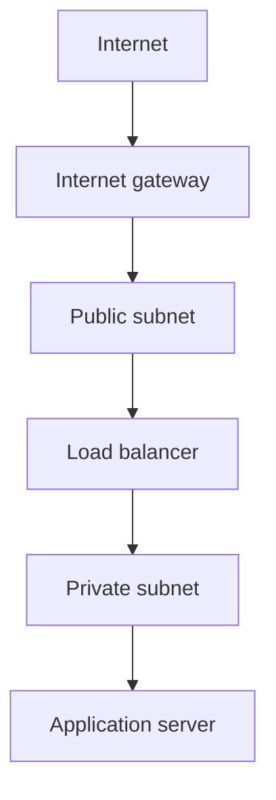

---

## The Five Main Connectivity Questions

When troubleshooting AWS networking, ask:

1. Does the source have an IP address?
2. Is there a route to the destination?
3. Does the security group allow the traffic?
4. Does the NACL allow both directions?
5. Is the application listening on the expected port?

> An IP address alone does not create connectivity.

---

# 107. Understanding CIDR – IPv4

**CIDR** stands for:

```text
Classless Inter-Domain Routing
```

CIDR notation defines a range of IP addresses.

Example:

```text
10.0.0.0/24
```

The `/24` is called the **prefix length**.

---

## IPv4 Address Structure

An IPv4 address contains 32 binary bits divided into four octets.

Example:

```text
10.0.1.25
```

Each octet contains 8 bits:

```text
8 + 8 + 8 + 8 = 32 bits
```

Each decimal octet can contain a value from:

```text
0 to 255
```

---

## Network Bits and Host Bits

In this CIDR block:

```text
10.0.1.0/24
```

The `/24` means:

- First 24 bits identify the network
- Remaining 8 bits identify addresses inside the network

```text
Network bits: 24
Host bits: 32 - 24 = 8
```

---

## Calculating the Number of Addresses

Use:

```text
2^(32 - prefix length)
```

For a `/24`:

```text
2^(32 - 24)
= 2^8
= 256 total addresses
```

---

## Common IPv4 CIDR Sizes

| CIDR | Total addresses | AWS-usable subnet addresses |
| --- | ---: | ---: |
| `/16` | 65,536 | 65,531 |
| `/20` | 4,096 | 4,091 |
| `/22` | 1,024 | 1,019 |
| `/24` | 256 | 251 |
| `/25` | 128 | 123 |
| `/26` | 64 | 59 |
| `/27` | 32 | 27 |
| `/28` | 16 | 11 |
| `/32` | 1 | Used to identify one IPv4 address |
| `/0` | Every IPv4 address | Used for default routes or open rules |

AWS reserves five IPv4 addresses in every subnet.

---

## AWS-Reserved Subnet Addresses

For this subnet:

```text
10.0.1.0/24
```

AWS reserves:

| Address | Purpose |
| --- | --- |
| `10.0.1.0` | Network address |
| `10.0.1.1` | VPC router |
| `10.0.1.2` | DNS-related AWS reservation |
| `10.0.1.3` | Reserved for future use |
| `10.0.1.255` | Network broadcast address |

AWS VPC does not support traditional network broadcast, but the final address is still reserved.

Therefore:

```text
Total addresses: 256
AWS reserved: 5
Usable addresses: 251
```

---

## Special CIDR Values

### One Specific IP Address

```text
203.0.113.25/32
```

This represents one IPv4 address.

It is useful for restricting SSH access to one trusted public IP.

### All IPv4 Addresses

```text
0.0.0.0/0
```

This represents every possible IPv4 address.

It is commonly used for:

- An internet default route
- Public HTTP or HTTPS access
- Outbound internet access

It should not normally be used for public SSH access.

---

## CIDR Size Rule

A smaller prefix number represents a larger network.

```text
/16 = large network
/24 = smaller network
/28 = very small network
/32 = one address
```

---

# 108. Understanding CIDR – Subnet Mask

A subnet mask is another way of showing which bits belong to the network.

Example:

```text
CIDR: 192.168.1.0/24
Subnet mask: 255.255.255.0
```

---

## Common CIDR and Subnet Masks

| CIDR | Subnet mask |
| --- | --- |
| `/8` | `255.0.0.0` |
| `/16` | `255.255.0.0` |
| `/20` | `255.255.240.0` |
| `/21` | `255.255.248.0` |
| `/22` | `255.255.252.0` |
| `/23` | `255.255.254.0` |
| `/24` | `255.255.255.0` |
| `/25` | `255.255.255.128` |
| `/26` | `255.255.255.192` |
| `/27` | `255.255.255.224` |
| `/28` | `255.255.255.240` |
| `/32` | `255.255.255.255` |

---

## Useful Binary Values

| Binary | Decimal |
| --- | ---: |
| `10000000` | 128 |
| `11000000` | 192 |
| `11100000` | 224 |
| `11110000` | 240 |
| `11111000` | 248 |
| `11111100` | 252 |
| `11111110` | 254 |
| `11111111` | 255 |

---

## Example: `/26`

A `/26` has:

```text
26 network bits
6 host bits
```

Total addresses:

```text
2^6 = 64
```

Subnet mask:

```text
255.255.255.192
```

The block size is:

```text
256 - 192 = 64
```

Possible `/26` networks inside `192.168.1.0/24` are:

```text
192.168.1.0/26
192.168.1.64/26
192.168.1.128/26
192.168.1.192/26
```

---

## CIDR Planning Rules

When designing a VPC:

- Leave enough addresses for future growth.
- Do not create overlapping subnets.
- Remember AWS reserves five IPv4 addresses per subnet.
- Plan for multiple Availability Zones.
- Avoid overlapping ranges with other VPCs.
- Avoid overlapping with on-premises networks.
- Allow space for future VPC peering or Transit Gateway connections.

---

# 109. Understanding CIDR – Exercise

## Exercise 1

How many addresses are in:

```text
10.0.0.0/24
```

Calculation:

```text
32 - 24 = 8 host bits
2^8 = 256 total addresses
```

AWS-usable:

```text
256 - 5 = 251
```

---

## Exercise 2

How many addresses are in:

```text
10.0.0.0/26
```

Calculation:

```text
32 - 26 = 6
2^6 = 64 total addresses
64 - 5 = 59 AWS-usable addresses
```

---

## Exercise 3

Find the range of:

```text
10.0.1.64/26
```

A `/26` has a block size of 64.

The network ranges are:

```text
0–63
64–127
128–191
192–255
```

Therefore:

```text
Network address: 10.0.1.64
Final address: 10.0.1.127
AWS-usable range: 10.0.1.68–10.0.1.126
```

AWS reserves:

```text
10.0.1.64
10.0.1.65
10.0.1.66
10.0.1.67
10.0.1.127
```

---

## Exercise 4

Can these two subnets exist in the same VPC?

```text
10.0.1.0/24
10.0.1.128/25
```

No.

`10.0.1.128/25` falls inside `10.0.1.0/24`, so the ranges overlap.

---

## Exercise 5

Create four `/24` subnets inside:

```text
10.0.0.0/16
```

Example answer:

| Subnet | CIDR |
| --- | --- |
| Public subnet A | `10.0.1.0/24` |
| Public subnet B | `10.0.2.0/24` |
| Private subnet A | `10.0.11.0/24` |
| Private subnet B | `10.0.12.0/24` |

These ranges do not overlap.

---

## Exercise 6

Which CIDR represents one trusted public IP?

```text
198.51.100.20/32
```

Which CIDR represents every IPv4 address?

```text
0.0.0.0/0
```

---

## Quick CIDR Method

1. Identify the prefix.
2. Calculate the host bits.
3. Calculate `2^host bits`.
4. Determine the block size.
5. Find the start and end of the range.
6. Check for overlaps.
7. Subtract five when calculating AWS-usable IPv4 subnet addresses.

---

# 110. Public vs Private IP – IPv4

## Private IPv4 Addresses

Private IPv4 addresses are used inside private networks.

The main private ranges are:

| Private range | CIDR |
| --- | --- |
| `10.0.0.0–10.255.255.255` | `10.0.0.0/8` |
| `172.16.0.0–172.31.255.255` | `172.16.0.0/12` |
| `192.168.0.0–192.168.255.255` | `192.168.0.0/16` |

Private IPv4 addresses are not directly reachable from the public internet.

---

## Public IPv4 Addresses

A public IPv4 address can be routed over the public internet.

An EC2 instance requires all of the following for direct IPv4 internet connectivity:

- A public IPv4 address or Elastic IP
- A subnet route to an internet gateway
- An internet gateway attached to the VPC
- Appropriate security-group rules
- Appropriate NACL rules
- An application listening on the required port

---

## Public vs Private IPv4

| Private IPv4 | Public IPv4 |
| --- | --- |
| Used inside the VPC | Used for internet communication |
| Not directly routed over the internet | Publicly routable |
| Usually remains with the network interface | Automatically assigned addresses may change |
| Every EC2 instance receives one | Optional in many subnets |
| No direct public IPv4 charge distinction should be assumed | Public IPv4 usage may create charges |
| Used for internal communication | Used for public-facing communication |

---

## EC2 Public IPv4 Translation

An EC2 operating system normally sees its private IPv4 address.

The internet gateway performs address translation between:

```text
Private IPv4 address ↔ Public IPv4 address
```

---

## Public IPv4 Changes

An automatically assigned public IPv4 address may change when an EC2 instance is stopped and started.

A private IPv4 address normally remains associated with the primary network interface.

An Elastic IP remains stable until it is disassociated or released.

---

# 111. Default VPC Walkthrough

AWS normally provides a default VPC in each Region.

A default VPC makes it easier to launch resources without first designing a custom network.

---

## Default VPC Components

A default VPC normally contains:

- IPv4 CIDR `172.31.0.0/16`
- One default subnet in each Availability Zone
- `/20` subnet CIDR blocks
- An internet gateway
- A main route table
- A route from `0.0.0.0/0` to the internet gateway
- A default security group
- A default NACL
- A DHCP options set
- DNS resolution settings

---

## Default VPC Architecture

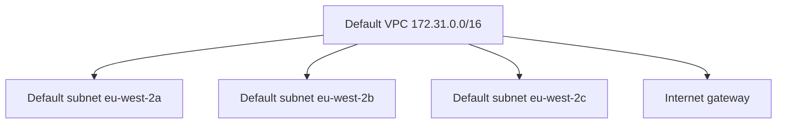

Default subnets are public because their route table has a route to the internet gateway.

---

## View the Default VPC

AWS CLI:

```bash
aws ec2 describe-vpcs \
  --filters Name=is-default,Values=true \
  --region eu-west-2
```

View default subnets:

```bash
aws ec2 describe-subnets \
  --filters Name=default-for-az,Values=true \
  --region eu-west-2
```

---

# 112. Default VPC Walkthrough – Part 2

## Main Route Table

A default VPC route table normally includes:

| Destination | Target |
| --- | --- |
| `172.31.0.0/16` | `local` |
| `0.0.0.0/0` | Internet gateway |

The `local` route enables communication within the VPC.

The default route sends other IPv4 traffic to the internet gateway.

---

## Default Security Group

A default security group normally:

- Allows inbound traffic from resources using the same security group
- Allows outbound traffic
- Is stateful

Do not assume that the default security group is appropriate for production.

Create purpose-specific security groups.

---

## Default NACL

The default NACL normally allows all inbound and outbound traffic.

A newly created custom NACL starts by denying traffic until suitable rules are added.

---

## Default VPC Advantages

- Quick to start
- Useful for simple learning exercises
- Internet connectivity is already configured
- Default subnets exist across Availability Zones

---

## Default VPC Disadvantages

- IP planning was not designed for your application
- Resources may accidentally receive public connectivity
- Separation between application tiers is limited
- Naming and routing may be unclear
- It may overlap with another network
- It is less suitable for carefully controlled production environments

> Use a custom VPC when you require deliberate IP planning, routing and security boundaries.

---

# 113. VPC in AWS

A **Virtual Private Cloud** is a logically isolated virtual network inside AWS.

A VPC belongs to one AWS Region and can contain subnets across multiple Availability Zones.

---

## VPC Scope

| Resource | Scope |
| --- | --- |
| VPC | Regional |
| Subnet | One Availability Zone |
| Internet gateway | Attached to a VPC |
| Route table | VPC resource associated with subnets |
| Security group | VPC and Region |
| NACL | VPC resource associated with subnets |
| NAT gateway | Zonal or Regional depending on selected mode |

---

## Example Custom VPC

```text
Name: devops-vpc
Region: eu-west-2
IPv4 CIDR: 10.0.0.0/16
```

A `/16` provides:

```text
65,536 total IPv4 addresses
```

The VPC can then be divided into smaller subnet ranges.

---

## VPC Components

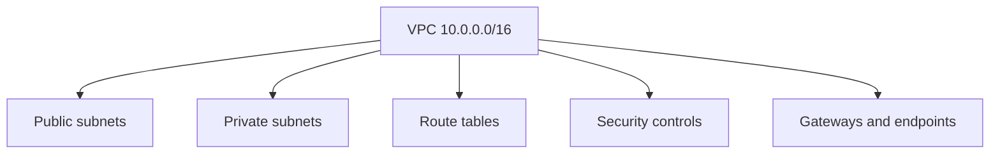

---

## Create a VPC with the CLI

```bash
aws ec2 create-vpc \
  --cidr-block 10.0.0.0/16 \
  --tag-specifications \
  'ResourceType=vpc,Tags=[{Key=Name,Value=devops-vpc}]' \
  --region eu-west-2
```

Enable DNS support:

```bash
aws ec2 modify-vpc-attribute \
  --vpc-id VPC_ID \
  --enable-dns-support '{"Value":true}' \
  --region eu-west-2
```

Enable DNS hostnames:

```bash
aws ec2 modify-vpc-attribute \
  --vpc-id VPC_ID \
  --enable-dns-hostnames '{"Value":true}' \
  --region eu-west-2
```

Replace `VPC_ID` with the real VPC ID.

---

# 114. VPC Subnets – IPv4

A subnet is a smaller IP address range inside a VPC.

A subnet belongs to exactly one Availability Zone.

---

## Example Subnet Plan

| Subnet | Availability Zone | CIDR |
| --- | --- | --- |
| Public A | `eu-west-2a` | `10.0.1.0/24` |
| Public B | `eu-west-2b` | `10.0.2.0/24` |
| Private A | `eu-west-2a` | `10.0.11.0/24` |
| Private B | `eu-west-2b` | `10.0.12.0/24` |

---

## What Makes a Subnet Public?

A subnet is public when its route table has a direct route to an internet gateway.

Example:

| Destination | Target |
| --- | --- |
| `10.0.0.0/16` | `local` |
| `0.0.0.0/0` | Internet gateway |

An EC2 instance in that subnet still needs a public IPv4 address or Elastic IP for direct IPv4 internet communication.

> A subnet is public because of its route table—not simply because an instance has a public IP address.

---

## Private Subnet

A private subnet does not have a direct route to an internet gateway.

It may use a NAT gateway for outbound IPv4 internet access.

| Destination | Target |
| --- | --- |
| `10.0.0.0/16` | `local` |
| `0.0.0.0/0` | NAT gateway |

---

## Isolated Subnet

An isolated subnet has no route outside the VPC.

| Destination | Target |
| --- | --- |
| `10.0.0.0/16` | `local` |

This can be useful for highly restricted database tiers.

---

## Create a Subnet

```bash
aws ec2 create-subnet \
  --vpc-id VPC_ID \
  --cidr-block 10.0.1.0/24 \
  --availability-zone eu-west-2a \
  --tag-specifications \
  'ResourceType=subnet,Tags=[{Key=Name,Value=public-a}]' \
  --region eu-west-2
```

---

# 115. Internet Gateway

An **Internet Gateway**, or **IGW**, connects a VPC to the public internet.

It supports IPv4 and IPv6 traffic.

---

## Internet Connectivity Requirements

For direct public IPv4 connectivity, you need:

```text
Internet gateway attached to VPC
             +
0.0.0.0/0 route to internet gateway
             +
Public IPv4 address or Elastic IP
             +
Security group permission
             +
NACL permission
             +
Application listening
```

---

## Create and Attach an Internet Gateway

Create:

```bash
aws ec2 create-internet-gateway \
  --tag-specifications \
  'ResourceType=internet-gateway,Tags=[{Key=Name,Value=devops-igw}]' \
  --region eu-west-2
```

Attach:

```bash
aws ec2 attach-internet-gateway \
  --internet-gateway-id IGW_ID \
  --vpc-id VPC_ID \
  --region eu-west-2
```

---

## Public Route

```bash
aws ec2 create-route \
  --route-table-id PUBLIC_ROUTE_TABLE_ID \
  --destination-cidr-block 0.0.0.0/0 \
  --gateway-id IGW_ID \
  --region eu-west-2
```

---

## Common Internet Gateway Problems

- Internet gateway is not attached.
- Subnet uses the wrong route table.
- No `0.0.0.0/0` route exists.
- Instance does not have a public IPv4 address.
- Security group blocks the port.
- NACL blocks traffic.
- Operating-system firewall blocks traffic.
- Application is listening only on `localhost`.

---

# 116. Bastion Hosts

A **bastion host** is a controlled entry point used to connect to resources in private subnets.

It is also called a:

```text
Jump host
Jump server
```

---

## Bastion Architecture


---

## Bastion Security Groups

### Bastion Security Group

| Type | Port | Source |
| --- | ---: | --- |
| SSH | 22 | Administrator's public IP `/32` |

### Private Instance Security Group

| Type | Port | Source |
| --- | ---: | --- |
| SSH | 22 | Bastion security group |

Referencing the bastion security group is safer than allowing an entire public subnet range.

---

## Example Connection

```bash
ssh -J ec2-user@BASTION_PUBLIC_IP \
  ec2-user@PRIVATE_INSTANCE_IP
```

Do not copy private SSH keys onto the bastion host.

---

## Bastion Host Risks

A bastion host is internet-facing and must be protected.

- Restrict SSH to trusted addresses.
- Apply operating-system updates.
- Use MFA-supported access processes.
- Monitor login activity.
- Disable password authentication.
- Avoid storing private keys on the host.
- Use the smallest required security-group rules.
- Remove the bastion when it is no longer required.

---

## AWS Systems Manager Alternative

AWS Systems Manager Session Manager can provide instance access without:

- Opening inbound port 22
- Assigning the instance a public IP
- Maintaining a bastion host
- Distributing SSH keys

The instance requires:

- SSM Agent
- An appropriate IAM instance role
- Connectivity to Systems Manager endpoints through NAT or VPC endpoints
- Authorised IAM access for the administrator

For modern AWS environments, Session Manager is often preferred over a traditional bastion host.

---

# 117. NAT Gateway

**NAT** stands for:

```text
Network Address Translation
```

A public NAT gateway allows resources in private subnets to initiate outbound IPv4 connections.

Internet systems cannot normally use the NAT gateway to initiate unsolicited connections to those private resources.

---

## Traditional Public NAT Gateway Architecture

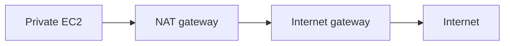

---

## Zonal NAT Gateway Requirements

A traditional public zonal NAT gateway requires:

- Placement in a public subnet
- An Elastic IP address
- An internet gateway attached to the VPC
- A public-subnet route to the internet gateway
- A private-subnet route to the NAT gateway

---

## Route Tables

### Public Subnet

| Destination | Target |
| --- | --- |
| `10.0.0.0/16` | `local` |
| `0.0.0.0/0` | Internet gateway |

### Private Subnet

| Destination | Target |
| --- | --- |
| `10.0.0.0/16` | `local` |
| `0.0.0.0/0` | NAT gateway |

---

## Why Private Instances Need Outbound Access

Private instances may need to:

- Download operating-system updates
- Install packages
- Pull container images
- Contact external APIs
- Download dependencies
- Reach public AWS service endpoints

A NAT gateway provides outbound IPv4 access without assigning each instance a public IPv4 address.

---

## NAT Gateway Cost Warning

NAT gateways normally create charges for:

- Each hour they are available
- Each gigabyte of data processed
- Applicable data transfer
- Associated public IPv4 addresses

Delete unused lab NAT gateways promptly.

---

# 118. NAT Gateway with High Availability

There are now two main NAT Gateway availability models.

---

## Traditional Zonal NAT Gateways

A zonal NAT gateway is resilient within its Availability Zone.

For zone-independent architecture, create one NAT gateway per Availability Zone.

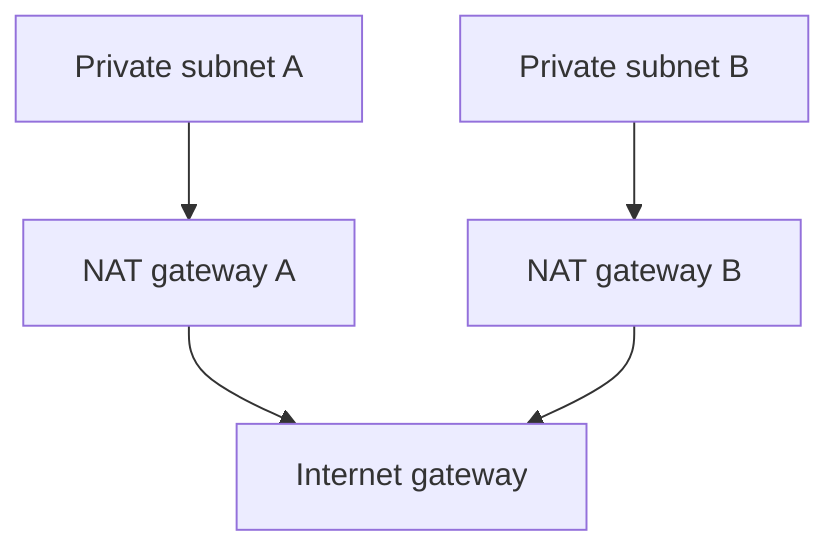

Private subnet A routes through NAT gateway A.

Private subnet B routes through NAT gateway B.

This prevents both private subnets depending on one Availability Zone.

---

## Why Not Share One Zonal NAT Gateway?

A private subnet in `eu-west-2b` can technically route through a NAT gateway in `eu-west-2a`.

However, this introduces:

- Cross-AZ dependency
- Possible cross-AZ data-transfer cost
- Loss of outbound connectivity if the NAT gateway's AZ is unavailable

---

## Regional NAT Gateway

AWS also provides **Regional NAT Gateways**.

A Regional NAT Gateway:

- Automatically expands across Availability Zones based on workload presence
- Provides high availability by default
- Uses one Regional NAT Gateway ID
- Does not require you to place it in a public subnet
- Reduces manual route and NAT management

Example creation:

```bash
aws ec2 create-nat-gateway \
  --vpc-id VPC_ID \
  --availability-mode regional \
  --region eu-west-2
```

---

## Course Pattern vs Current AWS Option

| Traditional course architecture | Newer AWS option |
| --- | --- |
| One zonal NAT gateway per AZ | One Regional NAT Gateway |
| NAT gateway placed in public subnet | No public subnet required for the Regional NAT Gateway |
| Separate private route tables | Simplified regional routing |
| Customer manages AZ placement | AWS manages expansion across AZs |
| Still valid and widely used | Newer managed option |

Understand both models because existing architectures and exam material may use the traditional zonal model.

---

# 119. NAT Gateway vs NAT Instance

A **NAT instance** is an EC2 instance configured to perform network address translation.

A **NAT gateway** is an AWS-managed NAT service.

---

## Comparison

| NAT gateway | NAT instance |
| --- | --- |
| Managed by AWS | Managed by the customer |
| Scales to high bandwidth | Limited by instance type |
| Managed availability | Customer designs failover |
| No operating-system patching | OS must be patched |
| Source/destination checks handled | Source/destination check must be disabled |
| Does not use a normal instance security group | Uses security groups |
| No direct SSH access | Can be administered through SSH or SSM |
| Hourly and data-processing charges | EC2, storage and data charges |
| Recommended for most workloads | Used when custom behaviour is required |

---

## NAT Instance Responsibilities

If using a NAT instance, you may need to:

- Select an appropriate EC2 instance type
- Configure IP forwarding
- Configure NAT rules
- Disable source/destination checks
- Patch the operating system
- Monitor CPU and network performance
- Replace failed instances
- Configure scaling or failover
- Protect it using security groups

AWS generally recommends NAT gateways where their managed behaviour meets the workload requirements.

---

# 120. Network Access Control Lists

A **Network Access Control List**, or **NACL**, is a subnet-level network security control.

A NACL controls traffic entering and leaving associated subnets.

---

## NACL Characteristics

- Applied at subnet level
- Stateless
- Supports allow rules
- Supports deny rules
- Has separate inbound and outbound rules
- Evaluates rules using rule numbers
- Uses the first matching rule
- Lower rule numbers are evaluated first

---

## Example Inbound NACL

| Rule | Protocol | Port | Source | Action |
| ---: | --- | ---: | --- | --- |
| 100 | TCP | 80 | `0.0.0.0/0` | Allow |
| 110 | TCP | 443 | `0.0.0.0/0` | Allow |
| 120 | TCP | 22 | `198.51.100.20/32` | Allow |
| `*` | All | All | `0.0.0.0/0` | Deny |

---

## Stateless Behaviour

Suppose an inbound request is allowed on port 443.

Because the NACL is stateless, the outbound response must also be allowed.

Return traffic commonly uses ephemeral ports.

Example broad ephemeral range:

```text
1024–65535
```

The exact required range depends on the clients and operating systems involved.

---

## Default and Custom NACLs

### Default NACL

The default NACL normally allows all inbound and outbound traffic.

### Custom NACL

A newly created custom NACL blocks traffic until allow rules are added.

Every subnet must be associated with a NACL.

A subnet can be associated with only one NACL at a time, but one NACL can be associated with multiple subnets.

---

## NACL Use Cases

NACLs can provide:

- Subnet-level guardrails
- Explicit deny rules
- Blocking of known unwanted address ranges
- Separation between network tiers
- Defence in depth

Security groups should normally remain the primary resource-level traffic control.

---

# 121. Security Groups and NACLs

Security groups and NACLs both control network traffic, but they work differently.

---

## Comparison

| Security group | Network ACL |
| --- | --- |
| Applied to resources or network interfaces | Applied to subnets |
| Stateful | Stateless |
| Allow rules only | Allow and deny rules |
| All rules are evaluated together | Rules processed in numerical order |
| Return traffic is automatically allowed | Return traffic requires explicit rules |
| Can reference another security group | Normally uses CIDR ranges and related rule fields |
| Primary resource-level control | Additional subnet-level guardrail |

---

## Stateful Example

Security-group rule:

```text
Allow inbound TCP 443 from 0.0.0.0/0
```

The response is automatically permitted because the security group is stateful.

---

## Stateless Example

NACL rules must permit:

```text
Inbound request
+
Outbound response
```

If either direction is blocked, the connection fails.

---

## Defence in Depth


Both controls must allow the required path.

---

## Troubleshooting Order

Check:

1. Source IP and destination IP
2. Route table
3. Internet, NAT or other gateway
4. NACL inbound rules
5. Security-group inbound rules
6. Application port
7. Security-group return traffic
8. NACL outbound ephemeral ports
9. Operating-system firewall

---

# 122. VPC Peering

A **VPC peering connection** privately connects two VPCs.

Resources communicate using private IP addresses without routing traffic over the public internet.

---

## Peering Architecture

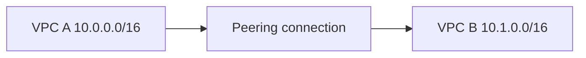

---

## VPC Peering Requirements

1. The VPC CIDR blocks must not overlap.
2. A peering request must be created.
3. The request must be accepted.
4. Route tables on both sides must be updated.
5. Security groups must allow the traffic.
6. NACLs must allow both directions.
7. DNS settings may need to be enabled.

---

## Example Routes

### VPC A Route Table

| Destination | Target |
| --- | --- |
| `10.0.0.0/16` | `local` |
| `10.1.0.0/16` | Peering connection |

### VPC B Route Table

| Destination | Target |
| --- | --- |
| `10.1.0.0/16` | `local` |
| `10.0.0.0/16` | Peering connection |

Routing must be configured in both directions.

---

## Create a Peering Request

```bash
aws ec2 create-vpc-peering-connection \
  --vpc-id VPC_A_ID \
  --peer-vpc-id VPC_B_ID \
  --region eu-west-2
```

Accept the request:

```bash
aws ec2 accept-vpc-peering-connection \
  --vpc-peering-connection-id PEERING_ID \
  --region eu-west-2
```

---

# 123. VPC Peering – Good to Know

## No Overlapping CIDRs

These VPCs cannot be peered:

```text
VPC A: 10.0.0.0/16
VPC B: 10.0.1.0/24
```

The second range is contained inside the first.

---

## Peering Is Not Transitive

Suppose:

```text
VPC A peers with VPC B
VPC B peers with VPC C
```

This does not allow VPC A to communicate with VPC C through VPC B.

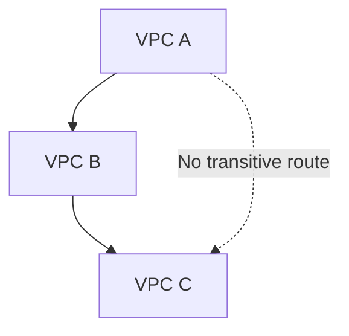

A direct connection between A and C is required.

For larger multi-VPC networks, consider AWS Transit Gateway.

---

## No Edge-to-Edge Routing

A peered VPC cannot normally use another VPC's:

- Internet gateway
- NAT gateway
- Site-to-Site VPN
- Direct Connect connection
- Gateway VPC endpoint

Each VPC must have the necessary connectivity itself.

---

## Other Peering Facts

- Peering can connect VPCs in the same account.
- Peering can connect VPCs in different accounts.
- Inter-Region peering is supported.
- Route tables are not updated automatically.
- Security rules are not updated automatically.
- DNS resolution settings may need to be enabled.
- Peering works as a one-to-one connection.

---

# 124. VPC Endpoints and AWS PrivateLink

A VPC endpoint allows resources in a VPC to access supported services or resources privately.

Traffic does not need to traverse the public internet.

---

## Without a VPC Endpoint

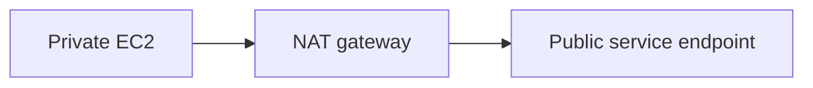

---

## With a VPC Endpoint

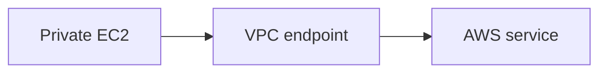

---

## Benefits

- Private connectivity
- No public IP required
- Reduced dependency on internet connectivity
- Can reduce NAT gateway data processing
- Endpoint policies can restrict access
- Traffic remains on the AWS network
- Supports stronger network isolation

---

## AWS PrivateLink

AWS PrivateLink provides private connectivity to:

- Supported AWS services
- Services in another VPC
- Services offered by other AWS accounts
- Partner services
- Customer-created endpoint services

Interface endpoints are a common way to consume services through AWS PrivateLink.

---

## Endpoint Security Layers

Access may depend on:

- IAM identity policy
- Endpoint policy
- Resource policy
- Interface endpoint security group
- Route table for gateway endpoints
- NACL rules
- DNS configuration

An endpoint policy does not automatically replace the other permission systems.

---

# 125. Types of VPC Endpoints

The two types most commonly covered in beginner AWS courses are:

- Gateway endpoints
- Interface endpoints

AWS also supports additional endpoint types.

---

## Gateway Endpoint

Gateway endpoints support:

- Amazon S3
- Amazon DynamoDB

Characteristics:

- Added to selected route tables
- No endpoint network interface
- No security group attached directly
- Does not use AWS PrivateLink
- No additional hourly gateway endpoint charge
- Available within the endpoint's Region

Example route:

| Destination | Target |
| --- | --- |
| S3 prefix list | S3 gateway endpoint |

---

## Interface Endpoint

An interface endpoint:

- Uses AWS PrivateLink
- Creates endpoint network interfaces
- Places private IP addresses in selected subnets
- Uses security groups
- Often supports private DNS
- Normally creates hourly and data-processing charges
- Supports many AWS and private services

---

## Gateway vs Interface Endpoint

| Gateway endpoint | Interface endpoint |
| --- | --- |
| S3 and DynamoDB | Many AWS and private services |
| Route-table based | Network-interface based |
| Does not use PrivateLink | Uses PrivateLink |
| No endpoint security group | Security groups supported |
| No additional endpoint hourly cost | Hourly and data charges normally apply |
| Regional route-based access | Private IP and DNS-based access |

---

## Other Current Endpoint Types

| Endpoint type | Purpose |
| --- | --- |
| Gateway Load Balancer | Sends traffic to virtual network appliances |
| Resource | Privately accesses a shared resource such as a database or IP target |
| Service network | Accesses multiple services or resources through a service network |

These are more advanced than the gateway and interface endpoint types normally introduced first.

---

## Example: S3 Gateway Endpoint

A private EC2 instance can access S3 without:

- A public IPv4 address
- An internet gateway route
- A NAT gateway

The route table sends S3 traffic to the gateway endpoint.

An endpoint policy can restrict access to selected buckets.

---

# 126. What Is IPv6?

IPv6 is a newer version of the Internet Protocol.

IPv4 uses 32-bit addresses.

IPv6 uses 128-bit addresses.

---

## Example IPv4 Address

```text
192.168.1.10
```

## Example IPv6 Address

```text
2001:db8:1234:5678:abcd:ef01:2345:6789
```

IPv6 uses hexadecimal characters:

```text
0–9
a–f
```

---

## IPv6 Compression

Leading zeros can be removed.

```text
2001:0db8:0000:0000:0000:0000:0000:0001
```

Becomes:

```text
2001:db8::1
```

`::` can normally be used only once in an address because it represents one or more groups of zeros.

---

## Why IPv6 Exists

IPv4 has a limited address space.

IPv6 provides:

- A much larger address space
- Reduced need for address conservation
- End-to-end addressing
- Improved support for modern internet growth
- Reduced dependence on traditional NAT

---

## IPv4 vs IPv6

| IPv4 | IPv6 |
| --- | --- |
| 32 bits | 128 bits |
| Decimal notation | Hexadecimal notation |
| Example: `10.0.1.10` | Example: `2001:db8::10` |
| NAT commonly used | NAT is generally not required |
| `0.0.0.0/0` means all IPv4 | `::/0` means all IPv6 |
| Private RFC 1918 ranges common | Public globally unique addresses common |

---

# 127. IPv6 in a VPC

A VPC can support:

- IPv4 only
- Dual stack with IPv4 and IPv6
- IPv6-focused or IPv6-only subnet configurations where supported

---

## Dual Stack

A dual-stack resource has both:

- An IPv4 address
- An IPv6 address

Applications can choose the appropriate protocol.

---

## AWS IPv6 CIDR Allocation

A common Amazon-provided IPv6 VPC allocation is:

```text
/56
```

A subnet commonly receives:

```text
/64
```

Example documentation range:

```text
VPC: 2001:db8:1234:1a00::/56
Subnet: 2001:db8:1234:1a01::/64
```

The exact real range is assigned by AWS and will not use the documentation-only `2001:db8::/32` range.

---

## IPv6 Does Not Use Public IPv4 Translation

A publicly routable IPv6 address can be routed directly.

This means security is extremely important.

A resource still needs:

- An IPv6 address
- An IPv6 route
- A suitable internet or egress-only gateway
- Security-group rules
- NACL rules
- An IPv6-capable application

---

## IPv6 Security-Group Rules

IPv4 and IPv6 rules are separate.

IPv4 public HTTPS rule:

```text
Source: 0.0.0.0/0
Protocol: TCP
Port: 443
```

IPv6 public HTTPS rule:

```text
Source: ::/0
Protocol: TCP
Port: 443
```

Adding an IPv4 rule does not automatically permit IPv6 traffic.

---

# 128. IPv6 Troubleshooting

When IPv4 works but IPv6 fails, check each IPv6 component separately.

---

## IPv6 Troubleshooting Checklist

1. Does the VPC have an IPv6 CIDR?
2. Does the subnet have an IPv6 CIDR?
3. Does the resource have an IPv6 address?
4. Does the route table contain an IPv6 route?
5. Is the correct gateway being used?
6. Does the security group allow IPv6?
7. Does the NACL allow IPv6 in both directions?
8. Does DNS return an `AAAA` record?
9. Is the operating system configured for IPv6?
10. Is the application listening on IPv6?
11. Does the destination support IPv6?

---

## Linux Commands

View IPv6 addresses:

```bash
ip -6 address
```

View IPv6 routes:

```bash
ip -6 route
```

Test IPv6 connectivity:

```bash
ping -6 IPV6_ADDRESS
```

Test an IPv6 website:

```bash
curl -6 https://example.com
```

Check IPv6 DNS:

```bash
dig AAAA example.com
```

View listening sockets:

```bash
sudo ss -lntp
```

---

## Common IPv6 Problems

| Problem | Cause |
| --- | --- |
| No IPv6 address | Subnet or network interface not configured |
| No outbound traffic | Missing `::/0` route |
| Public inbound fails | Security group or NACL blocks IPv6 |
| IPv4 works but hostname fails over IPv6 | Missing or incorrect `AAAA` record |
| Application unreachable | Application listens only on IPv4 |
| Private subnet accepts inbound IPv6 | Route points to IGW instead of egress-only IGW |
| Ping fails | ICMPv6 is blocked or unsupported |

ICMPv6 is important for IPv6 operation and troubleshooting. Do not block it without understanding the effect.

---

# 129. Egress-Only Internet Gateway

An **egress-only internet gateway** provides outbound-only internet connectivity for public IPv6 addresses.

It allows resources to initiate IPv6 connections while preventing internet systems from initiating new connections through that gateway.

---

## Why It Is Needed

For IPv4 private subnets:

```text
Private EC2 → NAT gateway → Internet
```

For IPv6 private-style outbound access:

```text
IPv6 EC2 → Egress-only internet gateway → Internet
```

---

## Important Difference

An egress-only internet gateway does not perform NAT.

IPv6 addresses remain unchanged.

It controls the direction in which connections can be initiated.

---

## Private IPv6 Route

| Destination | Target |
| --- | --- |
| VPC IPv6 CIDR | `local` |
| `::/0` | Egress-only internet gateway |

---

## Create an Egress-Only Internet Gateway

```bash
aws ec2 create-egress-only-internet-gateway \
  --vpc-id VPC_ID \
  --region eu-west-2
```

Add a route:

```bash
aws ec2 create-route \
  --route-table-id PRIVATE_ROUTE_TABLE_ID \
  --destination-ipv6-cidr-block ::/0 \
  --egress-only-internet-gateway-id EIGW_ID \
  --region eu-west-2
```

---

# 130. IPv6 Routing

IPv4 and IPv6 use separate routes.

---

## Public Dual-Stack Route Table

| Destination | Target |
| --- | --- |
| `10.0.0.0/16` | `local` |
| VPC IPv6 CIDR | `local` |
| `0.0.0.0/0` | Internet gateway |
| `::/0` | Internet gateway |

The `::/0` route through the internet gateway permits direct IPv6 internet routing.

Security groups and NACLs still determine which traffic is allowed.

---

## Private Dual-Stack Route Table

| Destination | Target |
| --- | --- |
| `10.0.0.0/16` | `local` |
| VPC IPv6 CIDR | `local` |
| `0.0.0.0/0` | NAT gateway |
| `::/0` | Egress-only internet gateway |

---

## Longest Prefix Match

AWS selects the most specific matching route.

Example:

| Destination | Target |
| --- | --- |
| `0.0.0.0/0` | NAT gateway |
| `10.1.0.0/16` | Peering connection |
| `10.1.2.0/24` | Network appliance |

Traffic to:

```text
10.1.2.50
```

uses the `/24` route because it is more specific than `/16` and `/0`.

---

# 131. IPv6 Routing Architecture

## Dual-Stack Architecture

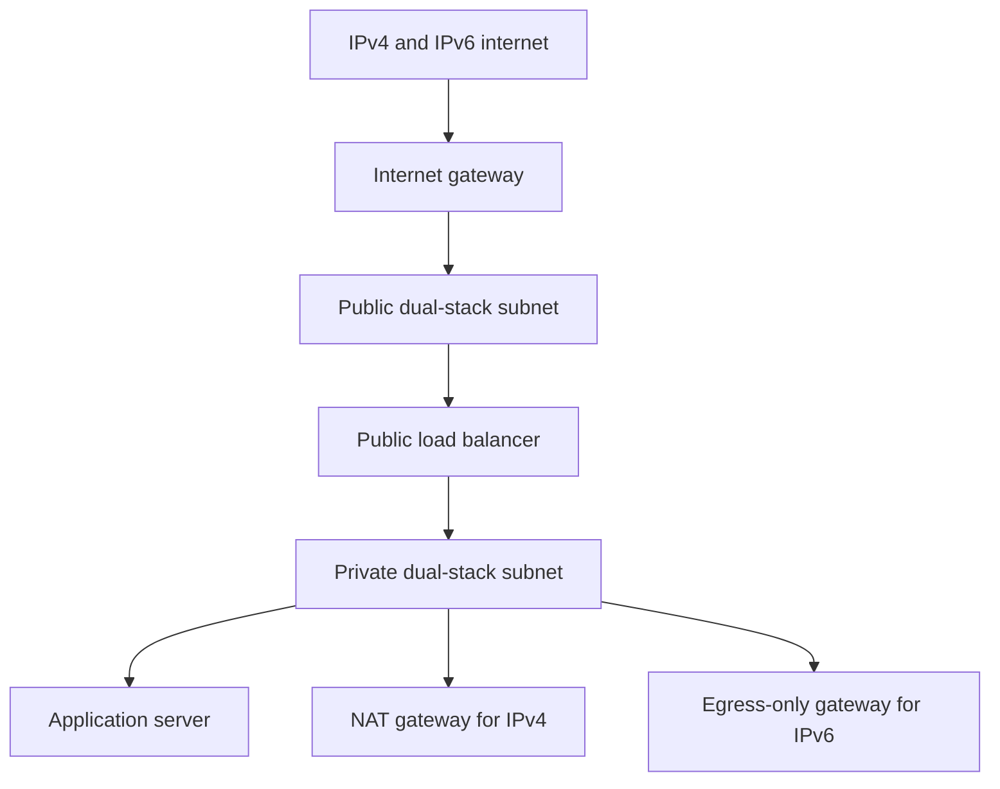

---

## Protocol Paths

### Public IPv4

```text
Resource → 0.0.0.0/0 → Internet gateway
```

The resource also needs a public IPv4 address.

### Private IPv4 Outbound

```text
Resource → 0.0.0.0/0 → NAT gateway → Internet gateway
```

### Public IPv6

```text
Resource → ::/0 → Internet gateway
```

### Private-Style IPv6 Outbound

```text
Resource → ::/0 → Egress-only internet gateway
```

---

## Important IPv6 Security Point

An IPv6 address can be globally routable, but that does not automatically mean the resource is reachable.

Reachability also depends on:

- Routes
- Internet or egress-only gateway
- Security groups
- NACLs
- Operating-system firewall
- Listening application

---

# 132. VPC Section Summary

- Amazon VPC creates an isolated network inside AWS.
- A VPC is Regional.
- A subnet belongs to one Availability Zone.
- CIDR defines an IP address range.
- IPv4 contains 32 bits.
- AWS reserves five IPv4 addresses in each subnet.
- Public subnets have direct routes to an internet gateway.
- Private subnets do not have direct routes to an internet gateway.
- An instance also needs a public IPv4 address for direct public IPv4 access.
- Route tables determine where network traffic is sent.
- `0.0.0.0/0` represents every IPv4 address.
- `::/0` represents every IPv6 address.
- NAT gateways provide outbound connectivity.
- Zonal NAT gateways should normally be deployed per AZ for zone independence.
- Regional NAT Gateways can provide automatic multi-AZ expansion.
- Security groups are stateful and applied to resources.
- NACLs are stateless and applied to subnets.
- VPC peering privately connects non-overlapping VPCs.
- VPC peering is not transitive.
- Gateway endpoints support S3 and DynamoDB.
- Interface endpoints use AWS PrivateLink.
- IPv6 uses 128-bit addresses.
- IPv6 does not normally require NAT.
- An egress-only internet gateway provides outbound-only IPv6 access.
- VPC Flow Logs and Reachability Analyzer help troubleshoot connectivity.

---

# AWS Networking End-to-End Demo

This demo creates a resilient two-AZ network with:

- One custom VPC
- Two public subnets
- Two private subnets
- An internet gateway
- Public and private route tables
- NAT connectivity
- A public Application Load Balancer
- Private EC2 web servers
- Security-group references
- Optional S3 gateway endpoint
- Systems Manager access

---

## Target Architecture

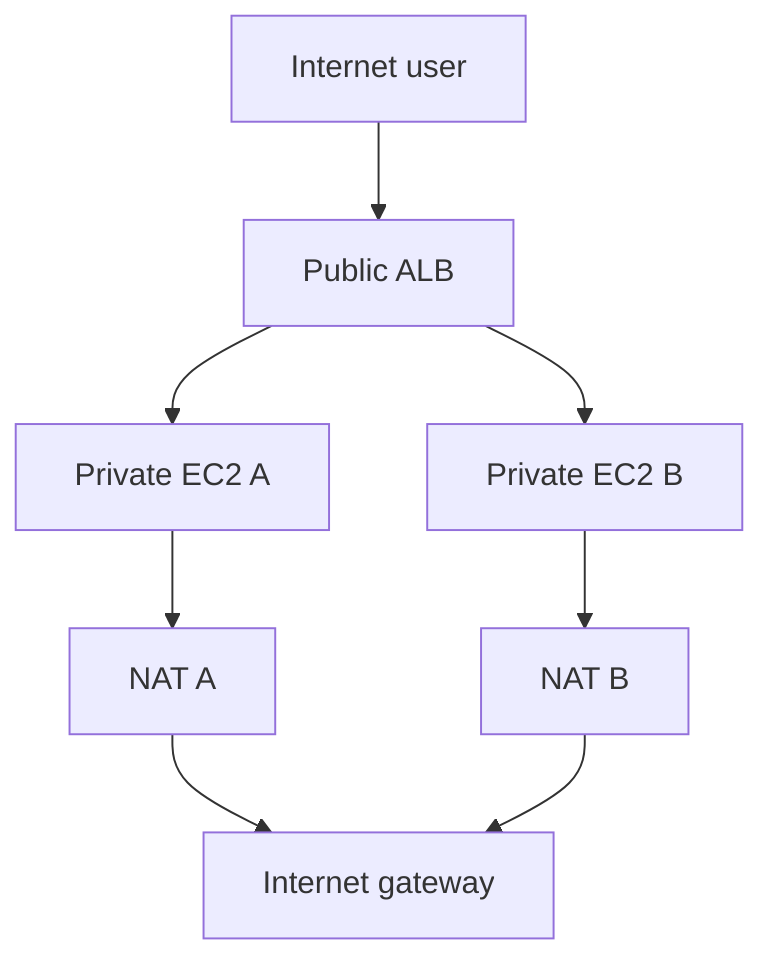

---

## Network Plan

```text
Region: eu-west-2
VPC: 10.20.0.0/16

Public A: 10.20.1.0/24 in eu-west-2a
Public B: 10.20.2.0/24 in eu-west-2b

Private A: 10.20.11.0/24 in eu-west-2a
Private B: 10.20.12.0/24 in eu-west-2b
```

---

## Step 1: Create the VPC

1. Open the VPC console.
2. Select **Create VPC**.
3. Select **VPC only** or the VPC creation workflow.
4. Enter `networking-lab-vpc`.
5. Enter `10.20.0.0/16`.
6. Select IPv4 only for the initial lab.
7. Create the VPC.
8. Enable DNS resolution and DNS hostnames.

---

## Step 2: Create the Subnets

Create:

| Name | CIDR | Availability Zone |
| --- | --- | --- |
| `public-a` | `10.20.1.0/24` | `eu-west-2a` |
| `public-b` | `10.20.2.0/24` | `eu-west-2b` |
| `private-a` | `10.20.11.0/24` | `eu-west-2a` |
| `private-b` | `10.20.12.0/24` | `eu-west-2b` |

Enable automatic public IPv4 assignment only for the public subnets if public instances will be launched there.

The private subnets should not automatically assign public IPv4 addresses.

---

## Step 3: Create the Internet Gateway

1. Create an internet gateway named `networking-lab-igw`.
2. Attach it to `networking-lab-vpc`.

---

## Step 4: Create the Public Route Table

Create `public-rt`.

Add:

| Destination | Target |
| --- | --- |
| `10.20.0.0/16` | `local` |
| `0.0.0.0/0` | `networking-lab-igw` |

Associate:

- `public-a`
- `public-b`

---

## Step 5: Create NAT Connectivity

For the full traditional high-availability architecture:

1. Allocate Elastic IP A.
2. Create NAT gateway A in `public-a`.
3. Allocate Elastic IP B.
4. Create NAT gateway B in `public-b`.
5. Wait until both NAT gateways show `Available`.

NAT gateways create charges. Delete them immediately after the lab.

Alternatively, investigate a Regional NAT Gateway if it is available and appropriate for the lab.

---

## Step 6: Create Private Route Tables

### `private-a-rt`

| Destination | Target |
| --- | --- |
| `10.20.0.0/16` | `local` |
| `0.0.0.0/0` | NAT gateway A |

Associate it with:

```text
private-a
```

### `private-b-rt`

| Destination | Target |
| --- | --- |
| `10.20.0.0/16` | `local` |
| `0.0.0.0/0` | NAT gateway B |

Associate it with:

```text
private-b
```

---

## Step 7: Create Security Groups

### Load Balancer Security Group

Name:

```text
alb-sg
```

Inbound:

| Type | Port | Source |
| --- | ---: | --- |
| HTTP | 80 | `0.0.0.0/0` |
| HTTPS | 443 | `0.0.0.0/0` when configured |

### Application Security Group

Name:

```text
app-sg
```

Inbound:

| Type | Port | Source |
| --- | ---: | --- |
| HTTP | 80 | `alb-sg` |

Do not open HTTP directly from the internet to the application instances.

No public SSH rule is required when using Systems Manager.

---

## Step 8: Create an EC2 IAM Role

Create an EC2 role with:

```text
AmazonSSMManagedInstanceCore
```

Attach the role to both private EC2 instances.

This allows Systems Manager access when the instances have connectivity to the required Systems Manager services.

---

## Step 9: Launch Private EC2 Instances

Launch one instance in each private subnet.

### Instance A

```text
Subnet: private-a
Public IP: Disabled
Security group: app-sg
IAM role: SSM role
```

### Instance B

```text
Subnet: private-b
Public IP: Disabled
Security group: app-sg
IAM role: SSM role
```

Example User Data:

```bash
#!/bin/bash
dnf update -y
dnf install -y nginx

INSTANCE_ID=$(curl -s \
  http://169.254.169.254/latest/meta-data/instance-id)

AZ=$(curl -s \
  http://169.254.169.254/latest/meta-data/placement/availability-zone)

cat > /usr/share/nginx/html/index.html <<EOF
<!DOCTYPE html>
<html>
<head>
  <title>AWS Networking Lab</title>
</head>
<body>
  <h1>AWS Networking Lab</h1>
  <p>Instance: ${INSTANCE_ID}</p>
  <p>Availability Zone: ${AZ}</p>
</body>
</html>
EOF

systemctl enable nginx
systemctl start nginx
```

For production, use IMDSv2 tokens when reading instance metadata.

---

## Step 10: Create the Target Group

Create an instance target group:

```text
Name: networking-lab-targets
Protocol: HTTP
Port: 80
VPC: networking-lab-vpc
Health check path: /
```

Register both private EC2 instances.

Wait until both show:

```text
Healthy
```

---

## Step 11: Create the Application Load Balancer

Create:

```text
Name: networking-lab-alb
Scheme: Internet-facing
IP type: IPv4
Subnets: public-a and public-b
Security group: alb-sg
Listener: HTTP 80
Target group: networking-lab-targets
```

The load balancer receives public traffic and forwards it to private instances.

---

## Step 12: Test the Application

Open the ALB DNS name in a browser.

Example:

```text
http://networking-lab-alb-EXAMPLE.eu-west-2.elb.amazonaws.com
```

Refresh several times.

You may see responses from instances in different Availability Zones.

---

## Step 13: Add an S3 Gateway Endpoint

Create an S3 gateway endpoint for the VPC.

Select:

- `private-a-rt`
- `private-b-rt`

This allows the private instances to reach S3 without sending S3 traffic through the NAT gateways.

Review the endpoint policy and restrict it where appropriate.

---

## Expected Traffic Flows

### User to Application

```text
Browser
→ Internet gateway
→ Public ALB
→ ALB security group
→ Private EC2 security group
→ NGINX
```

### Private Instance to Internet

```text
Private EC2
→ Private route table
→ NAT gateway
→ Public route table
→ Internet gateway
→ Internet
```

### Private Instance to S3

```text
Private EC2
→ Private route table
→ S3 gateway endpoint
→ Amazon S3
```

---

## Verification Commands

Describe the VPC:

```bash
aws ec2 describe-vpcs \
  --filters Name=tag:Name,Values=networking-lab-vpc \
  --region eu-west-2
```

Describe subnets:

```bash
aws ec2 describe-subnets \
  --filters Name=vpc-id,Values=VPC_ID \
  --region eu-west-2
```

Describe route tables:

```bash
aws ec2 describe-route-tables \
  --filters Name=vpc-id,Values=VPC_ID \
  --region eu-west-2
```

Describe NAT gateways:

```bash
aws ec2 describe-nat-gateways \
  --filter Name=vpc-id,Values=VPC_ID \
  --region eu-west-2
```

Describe VPC endpoints:

```bash
aws ec2 describe-vpc-endpoints \
  --filters Name=vpc-id,Values=VPC_ID \
  --region eu-west-2
```

---

## End-to-End Troubleshooting

If the website does not load, check:

### Load Balancer

- Is the ALB internet-facing?
- Is it using both public subnets?
- Do those subnets route to the internet gateway?
- Does `alb-sg` allow TCP 80?
- Is the listener forwarding to the correct target group?

### Target Group

- Are the targets registered?
- Are the targets healthy?
- Is the health check using `/`?
- Is the health-check port correct?

### Application Instances

- Is NGINX running?
- Is port 80 listening?
- Does `app-sg` allow HTTP from `alb-sg`?
- Did User Data complete successfully?
- Can the instances download packages through NAT?

### Routing

- Does each private subnet use the correct private route table?
- Does `0.0.0.0/0` point to the NAT gateway?
- Is each zonal NAT gateway available?
- Is the NAT gateway in a public subnet?
- Does the public subnet route to the IGW?

### NACLs

- Are request ports allowed?
- Are response ephemeral ports allowed?
- Are inbound and outbound rules both configured?

---

## VPC Troubleshooting Tools

### VPC Flow Logs

VPC Flow Logs capture information about IP traffic associated with:

- VPCs
- Subnets
- Network interfaces

Records can help identify accepted and rejected flows.

Flow logs can be sent to:

- CloudWatch Logs
- Amazon S3
- Amazon Data Firehose

### Reachability Analyzer

Reachability Analyzer performs static configuration analysis.

It can identify issues such as:

- Missing routes
- Blocking security groups
- Blocking NACLs
- Incorrect gateway paths

It does not send real network packets.

---

## Cleanup

Delete resources in a safe dependency order:

1. Delete the Application Load Balancer.
2. Delete the target group.
3. Terminate the EC2 instances.
4. Delete the VPC endpoint.
5. Delete the NAT gateways.
6. Wait for the NAT gateways to be deleted.
7. Release the unused Elastic IP addresses.
8. Delete custom route-table routes and associations.
9. Delete the custom route tables.
10. Delete custom security groups.
11. Delete the subnets.
12. Detach the internet gateway.
13. Delete the internet gateway.
14. Delete the VPC.
15. Delete unused IAM roles and policies.
16. Check Billing and Cost Management.

Confirm every resource ID and name before deletion.

---

# AWS Networking Security Checklist

- [ ] VPC CIDRs do not overlap with connected networks.
- [ ] Public and private subnets have separate route tables.
- [ ] Private resources do not receive public IPv4 addresses.
- [ ] SSH is not open to `0.0.0.0/0`.
- [ ] Systems Manager is used where appropriate.
- [ ] Security groups follow least privilege.
- [ ] Security groups reference other security groups where appropriate.
- [ ] NACL rules allow only the required traffic.
- [ ] IPv4 and IPv6 rules have both been reviewed.
- [ ] NAT gateways are used only for outbound connectivity.
- [ ] VPC endpoint policies are restricted.
- [ ] S3 buckets remain private.
- [ ] VPC Flow Logs are considered.
- [ ] Reachability Analyzer is used for troubleshooting.
- [ ] Unused gateways, endpoints and public IP addresses are removed.

---

# AWS Networking Cost Checklist

- [ ] NAT gateway hourly charges are understood.
- [ ] NAT data-processing charges are understood.
- [ ] Cross-AZ routing is minimised.
- [ ] Public IPv4 address charges are considered.
- [ ] Interface endpoint charges are understood.
- [ ] Gateway endpoints are used for S3 or DynamoDB where appropriate.
- [ ] Flow Log storage costs are considered.
- [ ] Unused Elastic IP addresses are released.
- [ ] Lab load balancers are deleted.
- [ ] Resources are checked in every Region.
- [ ] Billing alerts are enabled.

---

# AWS Networking Quick Revision Questions

1. What does CIDR stand for?
2. How many bits are in an IPv4 address?
3. How many total addresses are in a `/24`?
4. How many IPv4 addresses does AWS reserve per subnet?
5. What does `/32` represent?
6. What does `0.0.0.0/0` represent?
7. What are the three RFC 1918 private ranges?
8. What is an Amazon VPC?
9. Is a VPC Regional or zonal?
10. Is a subnet Regional or zonal?
11. What makes a subnet public?
12. Does a public subnet automatically make every instance publicly reachable?
13. What is a route table?
14. What is the purpose of the `local` route?
15. What does an internet gateway do?
16. What is a bastion host?
17. Why is Session Manager often preferred to a bastion?
18. What does a public NAT gateway do?
19. Where is a zonal public NAT gateway normally placed?
20. Why might you deploy one zonal NAT gateway per AZ?
21. What is a Regional NAT Gateway?
22. What is the difference between a NAT gateway and NAT instance?
23. Is a security group stateful or stateless?
24. Is a NACL stateful or stateless?
25. Can a NACL contain deny rules?
26. How are NACL rules evaluated?
27. What is VPC peering?
28. Can VPCs with overlapping CIDRs be peered?
29. Is VPC peering transitive?
30. What is a VPC endpoint?
31. Which services support gateway endpoints?
32. Do gateway endpoints use AWS PrivateLink?
33. What is an interface endpoint?
34. What is AWS PrivateLink?
35. How many bits are in an IPv6 address?
36. What does `::/0` represent?
37. Why does IPv6 not normally require NAT?
38. What is an egress-only internet gateway?
39. What route provides outbound-only IPv6 access?
40. What information does VPC Flow Logs provide?
41. What does Reachability Analyzer do?
42. What five areas should you check when connectivity fails?

---

# AWS Networking Key Takeaways

- A VPC is a Regional isolated network.
- Subnets divide a VPC into Availability Zone-specific ranges.
- CIDR controls the size of an IP range.
- AWS reserves five IPv4 addresses in every subnet.
- Route tables decide where traffic is sent.
- A route to an internet gateway makes a subnet public.
- A public IPv4 address is also required for direct IPv4 internet access.
- NAT gateways provide outbound connectivity for private resources.
- Traditional zonal NAT gateways can be deployed per AZ.
- Regional NAT Gateways provide automatic multi-AZ expansion.
- Security groups are stateful resource-level controls.
- NACLs are stateless subnet-level controls.
- VPC peering requires non-overlapping address ranges.
- VPC peering is not transitive.
- Gateway endpoints privately connect to S3 and DynamoDB.
- Interface endpoints use AWS PrivateLink.
- IPv6 and IPv4 require separate routes and security rules.
- Egress-only internet gateways provide outbound-only IPv6 connectivity.
- VPC Flow Logs record traffic information.
- Reachability Analyzer identifies configuration problems.
- Good AWS networking requires correct addressing, routing and security.

---

# Official AWS Networking References

- [What is Amazon VPC?](https://docs.aws.amazon.com/vpc/latest/userguide/what-is-amazon-vpc.html)
- [IP addressing for VPCs](https://docs.aws.amazon.com/vpc/latest/userguide/vpc-ip-addressing.html)
- [VPC CIDR blocks](https://docs.aws.amazon.com/vpc/latest/userguide/vpc-cidr-blocks.html)
- [Subnet CIDR blocks](https://docs.aws.amazon.com/vpc/latest/userguide/subnet-sizing.html)
- [Default VPC components](https://docs.aws.amazon.com/vpc/latest/userguide/default-vpc-components.html)
- [Subnets for your VPC](https://docs.aws.amazon.com/vpc/latest/userguide/configure-subnets.html)
- [Subnet route tables](https://docs.aws.amazon.com/vpc/latest/userguide/subnet-route-tables.html)
- [Internet gateways](https://docs.aws.amazon.com/vpc/latest/userguide/VPC_Internet_Gateway.html)
- [NAT gateways](https://docs.aws.amazon.com/vpc/latest/userguide/vpc-nat-gateway.html)
- [Regional NAT gateways](https://docs.aws.amazon.com/vpc/latest/userguide/nat-gateways-regional.html)
- [NAT gateway vs NAT instance](https://docs.aws.amazon.com/vpc/latest/userguide/vpc-nat-comparison.html)
- [Security groups](https://docs.aws.amazon.com/vpc/latest/userguide/vpc-security-groups.html)
- [Network ACLs](https://docs.aws.amazon.com/vpc/latest/userguide/vpc-network-acls.html)
- [VPC peering](https://docs.aws.amazon.com/vpc/latest/peering/vpc-peering-basics.html)
- [AWS PrivateLink concepts](https://docs.aws.amazon.com/vpc/latest/privatelink/concepts.html)
- [Gateway endpoints](https://docs.aws.amazon.com/vpc/latest/privatelink/gateway-endpoints.html)
- [Interface endpoints](https://docs.aws.amazon.com/vpc/latest/privatelink/create-interface-endpoint.html)
- [IPv6 support in a VPC](https://docs.aws.amazon.com/vpc/latest/userguide/vpc-migrate-ipv6-add.html)
- [Egress-only internet gateways](https://docs.aws.amazon.com/vpc/latest/userguide/egress-only-internet-gateway.html)
- [VPC Flow Logs](https://docs.aws.amazon.com/vpc/latest/userguide/flow-logs.html)
- [Reachability Analyzer](https://docs.aws.amazon.com/vpc/latest/userguide/reachability-analyzer.html)
