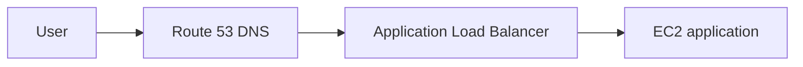
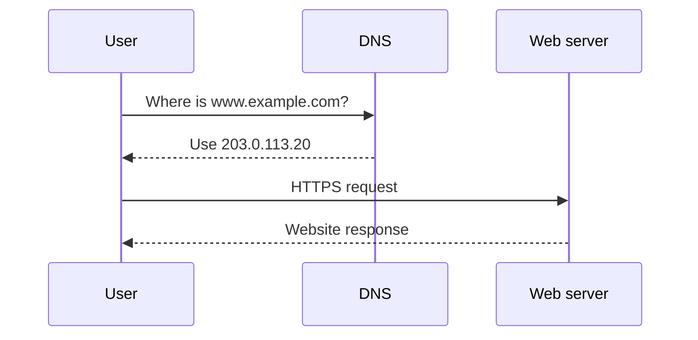
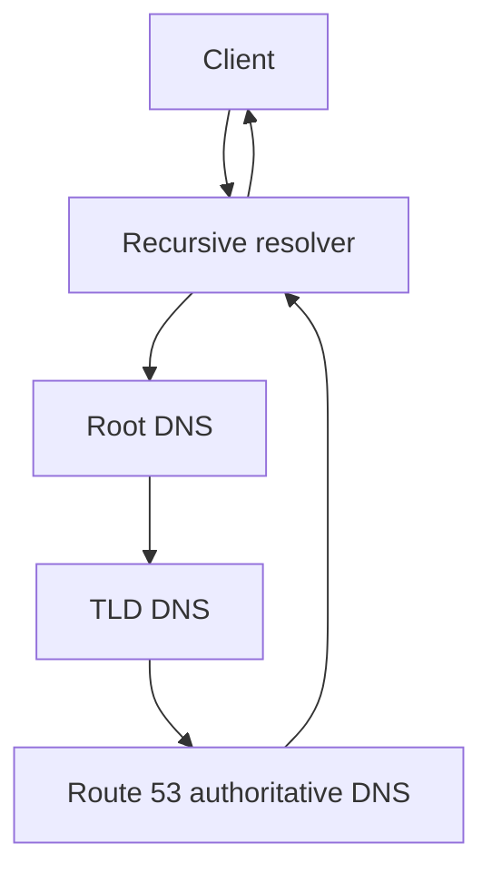
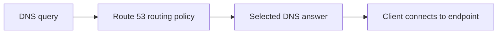
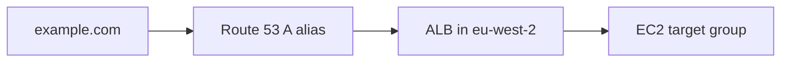
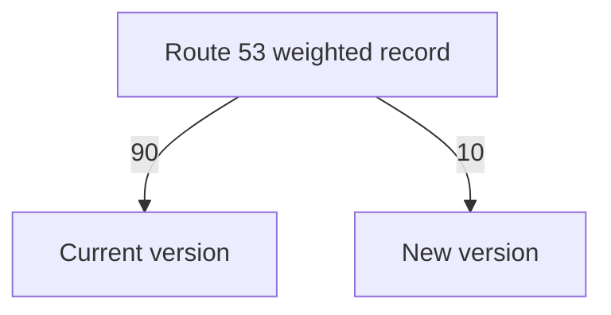
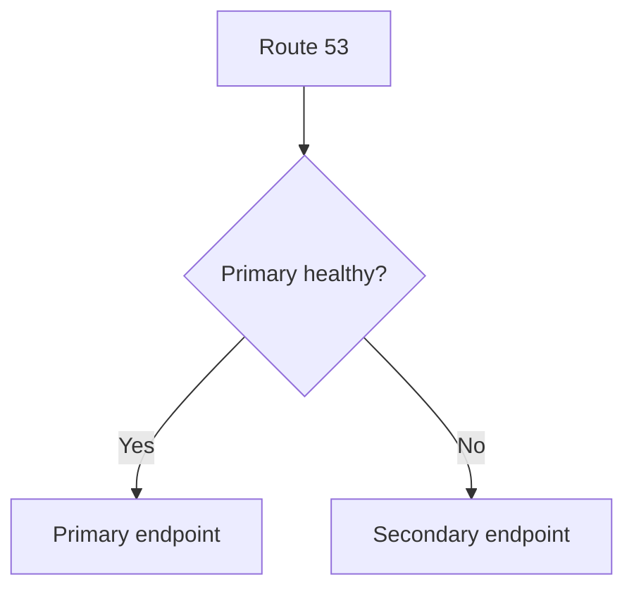
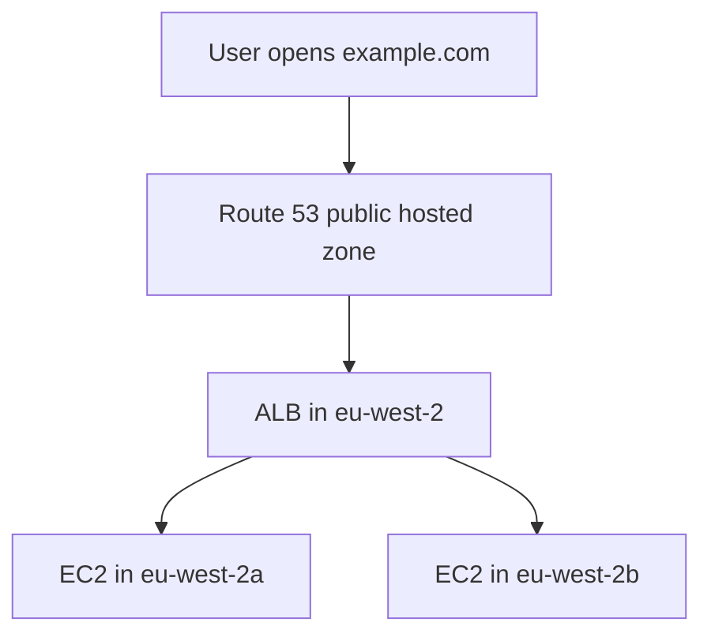

# DNS and Amazon Route 53

Amazon Route 53 is AWS’s highly available and scalable Domain Name System (DNS) service.

Route 53 can be used to:

- Register domain names
- Host public and private DNS records
- Route users to applications and AWS resources
- Monitor endpoint health
- Redirect DNS traffic away from unhealthy resources
- Apply routing decisions based on weight, latency, location or client IP

> Route 53 is named after **TCP and UDP port 53**, which are commonly used by DNS.

---

## Learning Objectives

By the end of these notes, I should be able to:

- Explain what DNS is and how a DNS lookup works.
- Explain the purpose of Amazon Route 53.
- Compare public and private hosted zones.
- Identify common DNS record types.
- Explain how DNS caching and TTL work.
- Compare CNAME and Route 53 alias records.
- Select an appropriate Route 53 routing policy.
- Explain Route 53 health checks and DNS failover.
- Distinguish geolocation from geoproximity routing.
- Explain the difference between a domain registrar and a DNS service.
- Configure Route 53 DNS for a domain registered with a third party.
- Test and troubleshoot DNS using `dig`, `nslookup` and the AWS CLI.

---

# 133. Amazon Route 53

Amazon Route 53 is a managed AWS DNS service.

It provides three main functions:

1. **Domain registration** – registering names such as `example.com`.
2. **DNS routing** – directing DNS queries to the correct application or resource.
3. **Health checking** – checking resources and helping route traffic away from unhealthy endpoints.

## Simple Explanation

People remember names more easily than IP addresses.

Instead of entering:

```text
203.0.113.20
```

A user can enter:

```text
www.example.com
```

Route 53 can provide the information needed to connect that name to the application.



## Important Route 53 Characteristics

- Route 53 is a global AWS service.
- Hosted zones are not created inside one Availability Zone.
- DNS records can direct users to resources in one or more AWS Regions.
- Route 53 can route to AWS and non-AWS resources.
- Route 53 is authoritative for a domain only when the domain is delegated to its name servers.
- Creating a hosted zone alone does not automatically update a third-party registrar.

## Why Route 53 Matters to DevOps

DevOps engineers use Route 53 for:

- Connecting domain names to cloud applications
- Automating DNS records through Infrastructure as Code
- Blue/green and canary deployments
- Multi-Region traffic management
- Disaster recovery and DNS failover
- Private service discovery inside VPCs
- Connecting custom domains to load balancers, APIs and CloudFront

> Route 53 provides domain registration, authoritative DNS and health-checking features, but these functions can be used separately.

---

# 134. Route 53 Hosted Zones

A **hosted zone** is a container for DNS records belonging to a domain and its subdomains.

Example hosted zone:

```text
example.com
```

It may contain records for:

```text
example.com
www.example.com
api.example.com
mail.example.com
```

## Records Inside a Hosted Zone

| Record name | Type | Purpose |
| --- | --- | --- |
| `example.com` | A alias | Direct the root domain to an ALB |
| `www.example.com` | CNAME or alias | Direct the `www` name to the application |
| `api.example.com` | A alias | Direct API traffic to API Gateway or an ALB |
| `example.com` | MX | Identify email servers |
| `example.com` | TXT | Store verification or email-policy text |

## Automatically Created Records

When Route 53 creates a hosted zone, it automatically creates:

- An **NS record**
- An **SOA record**

### NS Record

The NS record identifies the authoritative name servers for the hosted zone.

Route 53 normally assigns four name servers.

Example:

```text
ns-123.awsdns-45.com
ns-456.awsdns-67.net
ns-789.awsdns-10.org
ns-101.awsdns-11.co.uk
```

### SOA Record

The **Start of Authority** record contains administrative information about the DNS zone.

Do not delete or manually recreate the default NS and SOA records unless there is a specific, well-understood requirement.

## View Hosted Zones with the AWS CLI

```bash
aws route53 list-hosted-zones
```

List records in one hosted zone:

```bash
aws route53 list-resource-record-sets \
  --hosted-zone-id HOSTED_ZONE_ID
```

> A hosted zone stores the records Route 53 uses to answer DNS queries for a domain.

---

# 135. Public vs Private Hosted Zones

Route 53 supports public and private hosted zones.

## Public Hosted Zone

A public hosted zone contains records that can be answered through public DNS.

Example:

```text
www.example.com → Public Application Load Balancer
```

Use a public hosted zone for:

- Public websites
- Public APIs
- Public email records
- Public verification records
- Internet-facing AWS resources

## Private Hosted Zone

A private hosted zone provides DNS records inside associated VPCs.

Example:

```text
database.internal.example.com → 10.20.12.25
```

The private name is not intended to be resolved directly through public internet DNS.

Use a private hosted zone for:

- Internal services
- Private application endpoints
- Internal databases
- Service discovery
- Friendly names for private IP addresses

## Comparison

| Public hosted zone | Private hosted zone |
| --- | --- |
| Used for public DNS | Used inside associated VPCs |
| Queries can originate from the internet | Queries are resolved through the VPC Resolver |
| Requires domain delegation for public use | Requires association with one or more VPCs |
| Common for websites and public APIs | Common for internal services |
| Records can target public resources | Records commonly target private resources |

## Split-Horizon DNS

The same domain name can exist in both a public and private hosted zone.

Example:

```text
Public:  app.example.com → Public ALB
Private: app.example.com → Internal ALB
```

Internal VPC clients can receive the private answer while internet users receive the public answer.

> Public hosted zones answer public DNS queries; private hosted zones provide DNS within associated VPCs.

---

# 136. What Is DNS?

**DNS** stands for **Domain Name System**.

DNS translates human-readable names into information computers can use.

The most common example is translating a domain name into an IP address.

```text
www.example.com → 203.0.113.20
```

## DNS as the Internet’s Directory

Think of DNS like a contact list:

```text
Person's name → Telephone number
Domain name   → IP address or service destination
```

## DNS Does Not Carry the Website Traffic

DNS normally tells the client where to connect.

The browser then creates a separate connection to the destination.



## Why DNS Is Important

Without DNS, users would need to remember changing IP addresses for every service.

DNS allows infrastructure to change while the user-facing name remains stable.

> DNS resolves names; the application connection happens after the DNS answer is received.

---

# 137. DNS Terminology

## Domain Name

A human-readable name used to identify an internet resource.

```text
example.com
```

## Top-Level Domain

The final part of a domain name.

Examples:

```text
.com
.org
.net
.uk
```

## Second-Level Domain

The name directly before the top-level domain.

For:

```text
example.com
```

The second-level domain is:

```text
example
```

## Subdomain

A name added before the main domain.

Examples:

```text
www.example.com
api.example.com
shop.example.com
```

## Fully Qualified Domain Name

An **FQDN** identifies a complete name in the DNS hierarchy.

Example:

```text
api.example.com
```

## Domain Registrar

The organisation through which a domain is registered.

Examples include:

- Amazon Route 53 Domains
- GoDaddy
- Namecheap
- Cloudflare Registrar

## Registrant

The person or organisation that holds the domain registration.

## Name Server

A DNS server responsible for providing DNS information.

An authoritative name server stores or serves the official records for a zone.

## Recursive Resolver

A resolver receives a DNS query from a client and searches for the answer, using cached information where possible.

Resolvers may be operated by:

- An internet service provider
- A company
- A cloud provider
- A public DNS provider

## DNS Zone

An administrative section of the DNS namespace.

In Route 53, records for a zone are stored in a hosted zone.

## Record

A DNS record contains information about a domain or subdomain.

## TTL

**Time To Live** determines how long a resolver can cache a DNS answer.

## Authoritative DNS

The authoritative DNS service provides the official answer for a domain’s records.

## DNS Propagation

DNS propagation describes the period during which DNS caches and delegations are updating after a change.

The change may already exist on the authoritative server while some users still receive an older cached answer.

---

# 138. How DNS Works

Suppose a user requests:

```text
www.example.com
```

## DNS Lookup Process

1. The browser checks its DNS cache.
2. The operating system checks its cache and local configuration.
3. The query is sent to a recursive resolver.
4. If the resolver has a valid cached answer, it returns it.
5. Otherwise, the resolver can query a root DNS server.
6. The root server points it towards the relevant top-level-domain servers.
7. The TLD server points it towards the authoritative name servers.
8. The authoritative server returns the requested record.
9. The resolver caches the answer for its TTL.
10. The client connects to the returned destination.



## Recursive and Iterative Queries

### Recursive Query

The client asks a resolver to obtain the final answer.

### Iterative Query

A DNS server may return a referral telling the resolver which server to ask next.

## Local Hosts File

A local hosts file can override normal DNS resolution on one computer.

Linux location:

```text
/etc/hosts
```

Windows location:

```text
C:\Windows\System32\drivers\etc\hosts
```

Example entry:

```text
10.20.11.25 app.internal.example.com
```

This affects only the machine where the entry exists.

> DNS is hierarchical and heavily cached; Route 53 may be the authoritative final source of an answer.

---

# 139. Route 53 Routes

Route 53 does not route network packets in the same way as a VPC route table.

Instead, Route 53 selects the DNS response returned for a name.

```text
DNS query: Where is app.example.com?
DNS answer: Use the London load balancer.
```

The client then attempts to connect to that destination.

## DNS Routing Flow



## DNS Routing vs VPC Routing

| Route 53 DNS routing | VPC route table |
| --- | --- |
| Selects a DNS answer | Selects a network next hop |
| Happens before the client connection | Applies while network traffic is moving |
| Can use latency, location or weights | Uses destination CIDR and route priority |
| Affected by DNS caching | Evaluated by AWS networking for traffic |

> Route 53 tells clients which endpoint to use; it is not a proxy and does not sit in the application data path.

---

# 140. Route 53 Record Types

DNS record types store different kinds of information.

## Common Records

| Type | Meaning | Example purpose |
| --- | --- | --- |
| A | IPv4 address | Point a name to `203.0.113.20` |
| AAAA | IPv6 address | Point a name to an IPv6 address |
| CNAME | Canonical name | Point a subdomain to another hostname |
| MX | Mail exchange | Identify mail servers |
| TXT | Text | Verification, SPF, DKIM or other text |
| NS | Name server | Identify authoritative name servers |
| SOA | Start of Authority | Store zone administration information |
| CAA | Certificate Authority Authorization | Control which CAs may issue certificates |
| PTR | Pointer | Reverse DNS lookup |
| SRV | Service locator | Identify a service’s host and port |
| DS | Delegation Signer | Create a DNSSEC chain of trust |

## A Record

Maps a name to an IPv4 address.

```text
app.example.com → 203.0.113.20
```

## AAAA Record

Maps a name to an IPv6 address.

```text
app.example.com → 2001:db8::20
```

## CNAME Record

Maps one hostname to another hostname.

```text
www.example.com → app.example.net
```

## MX Record

Specifies mail servers and their priority.

```text
10 mail.example.com
```

A lower MX priority number is preferred.

## TXT Record

Stores text values used for purposes such as:

- Domain ownership validation
- SPF email policy
- DKIM configuration
- Third-party service verification

## CAA Record

Specifies which certificate authorities may issue certificates for a domain.

Example:

```text
0 issue "amazon.com"
```

## NS and SOA Records

Route 53 creates these when it creates a hosted zone.

Avoid deleting or changing them without understanding the effect on the zone.

---

# 141. Route 53 Record TTL

**TTL** stands for **Time To Live**.

TTL is the number of seconds that recursive DNS resolvers may cache a record.

Example:

```text
TTL: 300 seconds
```

This means the answer may be cached for five minutes.

## High vs Low TTL

| Low TTL | High TTL |
| --- | --- |
| Changes can be observed sooner | Fewer authoritative DNS queries |
| More queries may reach Route 53 | Existing answers remain cached longer |
| Useful before migrations | Useful for stable records |
| Can increase DNS query volume | Can delay failover or record changes |

## Example TTL Values

| TTL | Time |
| ---: | --- |
| 60 | 1 minute |
| 300 | 5 minutes |
| 900 | 15 minutes |
| 3,600 | 1 hour |
| 86,400 | 1 day |
| 172,800 | 2 days |

## Safe DNS Change Process

Before a planned migration:

1. Lower the TTL in advance.
2. Wait for the previous longer TTL to expire.
3. Make the DNS change.
4. Test the new destination.
5. Monitor the application.
6. Increase the TTL again after the change is stable.

## Important Client Behaviour

Changing a record does not remove answers already stored in external caches.

Some users may continue receiving the old answer until their cached TTL expires.

> TTL controls caching, not how long the actual DNS record exists.

---

# 142. CNAME vs Alias

A CNAME record and a Route 53 alias record can both direct one name towards another destination, but they are not the same.

## CNAME

A CNAME is a standard DNS record.

Example:

```text
www.example.com → app.example.net
```

A CNAME:

- Can point to another DNS hostname
- Cannot normally be used at the zone apex
- Cannot share the same name with other record types
- Requires another DNS lookup for the target name
- Has a configurable TTL

The zone apex is the root of the hosted zone:

```text
example.com
```

## Route 53 Alias

An alias is a Route 53 extension to DNS.

Example:

```text
example.com → Application Load Balancer
```

An alias:

- Can be used at the zone apex
- Can target selected AWS resources
- Can target another record in the same hosted zone
- Is created as an A or AAAA alias record
- Can use **Evaluate target health** for supported targets
- Does not let you enter a normal record TTL directly

## Comparison

| CNAME | Route 53 alias |
| --- | --- |
| Standard DNS record | Route 53-specific feature |
| Points to a hostname | Points to supported AWS resources or a record in the zone |
| Not allowed at the zone apex | Allowed at the zone apex |
| Configurable TTL | TTL is controlled through alias behaviour or target |
| Can point to external hostnames | Limited to supported alias targets |
| Extra DNS resolution may be required | Route 53 answers using the target information |

> Use an alias for supported AWS resources, especially when the root domain must point to an ALB, CloudFront or another supported target.

---

# 143. Route 53 Alias Records

An alias record routes DNS traffic to a supported AWS resource or another record in the same hosted zone.

## Example ALB Alias

```text
Name: example.com
Type: A
Alias: Yes
Target: dualstack.my-alb.eu-west-2.elb.amazonaws.com
```

This allows the root domain to point to a load balancer without placing a changing load-balancer IP address in an A record.

## Evaluate Target Health

For supported targets, an alias record can use:

```text
Evaluate target health: Yes
```

Route 53 then considers the target resource’s health when selecting an answer.

For an Application Load Balancer, target-group health can affect this evaluation.

## Why Not Store an ALB IP Address?

Load-balancer IP addresses can change.

Use the load balancer’s DNS name through an alias instead of attempting to store its current IP address manually.

---

# 144. Route 53 Alias Record Targets

Common alias targets include:

- Application Load Balancers
- Network Load Balancers
- Classic Load Balancers
- Amazon CloudFront distributions
- Amazon API Gateway APIs
- Amazon S3 website endpoints
- AWS Global Accelerator accelerators
- Elastic Beanstalk environments
- Supported VPC interface endpoints
- Another Route 53 record in the same hosted zone

The Route 53 console displays valid targets for the selected record and hosted zone.

## Common Architecture



## Important Limitations

- An alias cannot point to any arbitrary external hostname.
- An EC2 public IP is normally used with an A record, preferably through an Elastic IP if a fixed address is essential.
- S3 website alias targets require matching bucket and website configuration.
- CloudFront alternate domain names and certificates must also be configured correctly.
- The AWS resource and record configuration must support the selected address type.

---

# 145. Route 53 Routing Policies

A routing policy determines how Route 53 selects a DNS response when multiple possible records or endpoints exist.

## Main Policies

| Policy | Main purpose |
| --- | --- |
| Simple | Route to a standard single resource or set of values |
| Weighted | Divide traffic using relative weights |
| Latency | Route to the AWS Region offering the lowest measured latency |
| Failover | Use primary and secondary resources |
| Geolocation | Route based on the user’s geographic location |
| Geoproximity | Route based on user/resource distance, adjustable with bias |
| IP-based | Route using configured client-IP CIDR mappings |
| Multivalue answer | Return multiple healthy values |

## Routing Policy Does Not Filter Network Traffic

Routing policies influence DNS answers.

They do not replace:

- Security groups
- NACLs
- VPC route tables
- Load balancers
- Application authentication

## DNS Caching Still Applies

Route 53 makes a decision when it receives a DNS query.

If a resolver already has a cached answer, it may not ask Route 53 again until the TTL expires.

---

# 146. Simple Routing Policy

Simple routing is used when no specialised routing behaviour is required.

Example:

```text
app.example.com → One Application Load Balancer
```

## Characteristics

- Commonly routes to one resource
- Can contain multiple values in one non-alias record
- Does not perform per-value health checks
- Multiple returned values may be presented in a random order
- Can be used in public and private hosted zones

## Use Cases

- One website endpoint
- One load balancer
- One CloudFront distribution
- Simple lab environments
- Basic domain-to-IP mappings

> Simple routing is appropriate when Route 53 does not need to choose between endpoints using health, location, latency or weights.

---

# 147. Weighted Routing Policy

Weighted routing divides DNS responses between multiple resources using relative weights.

## Example

| Endpoint | Weight | Approximate share |
| --- | ---: | ---: |
| Current production | 90 | 90% |
| New release | 10 | 10% |

Calculation:

```text
Record weight / Total weight
```

For the new release:

```text
10 / (90 + 10) = 10%
```

## Common Use Cases

- Canary deployments
- Blue/green deployments
- Gradual migrations
- A/B testing
- Dividing traffic between application versions

## Important Behaviour

- Weights are relative, not fixed percentages.
- Records in the group use the same name and record type.
- DNS caching means observed client traffic may not match the exact ratio over a short period.
- A weight of zero can stop normal selection of a record.
- Health checks can remove unhealthy records from normal answers.



---

# 148. Latency-Based Routing

Latency-based routing directs a DNS query towards the configured AWS Region expected to provide the lowest latency for that user.

Example application locations:

```text
Europe (London): eu-west-2
US East (N. Virginia): us-east-1
```

Route 53 uses AWS latency measurements to choose between the Regions for which latency records exist.

## Use Cases

- Global applications
- Multi-Region APIs
- Improving user response times
- Directing users towards better-performing regional deployments

## Important Points

- Lowest latency does not necessarily mean geographically closest.
- Internet paths and latency can change over time.
- The application must be deployed in multiple locations.
- Health checks should be considered so unhealthy endpoints are not selected.
- Data-residency requirements must be considered separately.

> Latency routing optimises for expected network performance, not country borders.

---

# 149. Route 53 Health Checks

Route 53 health checks monitor endpoint availability or other health signals.

They can help Route 53 avoid returning unhealthy resources in supported routing configurations.

## Health Check Types

Route 53 can monitor:

- A specified public endpoint
- The status of other Route 53 health checks
- The state of a CloudWatch alarm

## Endpoint Health Check

Route 53 health checkers can send requests using protocols such as:

- HTTP
- HTTPS
- TCP

Configuration may include:

- IP address or domain name
- Port
- Request path
- Failure threshold
- Request interval
- Optional text matching

Example path:

```text
/health
```

A useful health endpoint should verify enough of the application to show that it can serve users.

## Private Endpoints

Public Route 53 health checkers cannot directly reach a private IP address inside a VPC.

For private resources, possible approaches include:

- A CloudWatch alarm-based health check
- Evaluating the health of an alias target such as an ALB
- Monitoring through an appropriate public or managed application endpoint

## DNS Failover



## Important Limitation

DNS failover is not always immediate because clients and resolvers may have cached the previous answer.

Choose TTL values that match the required recovery objective, while considering query volume and stability.

## Health Check Costs

Route 53 health checks can create ongoing charges, with some features costing more than basic health checks.

Delete unused lab health checks.

---

# 150. Geolocation Routing

Geolocation routing chooses an answer based on the geographic origin of the DNS query.

Locations can include:

- Continents
- Countries
- US states
- A default location

## Example

| User location | Destination |
| --- | --- |
| United Kingdom | London application |
| United States | Virginia application |
| Other locations | Default application |

## Use Cases

- Localised website content
- Language selection
- Regional product availability
- Licensing restrictions
- Data-sovereignty designs

## Default Record

A default geolocation record handles users whose location:

- Cannot be identified
- Does not match a more specific geolocation record

Without an appropriate default record, some queries may receive no answer.

## Most Specific Match

A more specific matching location takes priority over a broader one.

Example:

```text
United Kingdom record → UK users
Europe record         → Other matching European users
Default record        → Everyone else
```

> Geolocation follows configured geographic boundaries; it does not automatically choose the nearest resource.

---

# 151. Geoproximity Routing

Geoproximity routing directs users based on the location of users and resources.

It normally sends traffic to the closest configured resource, but a **bias** can change the size of the geographic area routed to that resource.

## Resource Locations

For AWS resources, a location can be an AWS Region or supported Local Zone group.

For non-AWS resources, latitude and longitude can be provided.

## Bias

| Bias | Effect |
| --- | --- |
| Positive | Expands the area routed to the resource |
| Negative | Shrinks the area routed to the resource |
| Zero | Uses the normal geographic calculation |

AWS supports bias values from `-99` to `+99`.

Change bias gradually to avoid suddenly overwhelming an endpoint.

## Geolocation vs Geoproximity

| Geolocation | Geoproximity |
| --- | --- |
| Uses defined user locations | Uses distance between users and resources |
| Country, continent or US state rules | AWS Region or latitude/longitude resource locations |
| Good for localisation and restrictions | Good for shifting traffic between nearby resources |
| Default record is important | Bias expands or shrinks an endpoint’s area |

> Geolocation asks “where is the user?” Geoproximity asks “which resource is closest, after applying bias?”

---

# 152. IP-Based Routing

IP-based routing uses configured client-IP ranges to select a DNS response.

It is useful when an organisation has its own knowledge about customers, networks or internet service providers.

## Main Components

### CIDR Block

An IP range such as:

```text
198.51.100.0/24
```

### CIDR Location

A named group of one or more CIDR blocks.

Example:

```text
uk-corporate-users
```

### CIDR Collection

A reusable collection containing CIDR locations.

## Example

| Source range | DNS destination |
| --- | --- |
| Corporate network A | Endpoint A |
| Partner network B | Endpoint B |
| Default `*` | Public endpoint |

## Use Cases

- Route particular ISPs to selected endpoints
- Optimise known network transit paths
- Direct corporate client ranges
- Override a more general location-based design

## Important Points

- A default `*` location can handle unmatched queries.
- CIDR planning must be accurate.
- The source seen by Route 53 can be influenced by recursive resolver behaviour and EDNS Client Subnet support.
- IP-based routing is not supported for private hosted-zone records.

---

# 153. Multivalue Answer Routing

Multivalue answer routing allows Route 53 to return multiple values for one DNS query.

Each resource can have its own record and optional health check.

Route 53 returns up to eight healthy records in an answer.

## Example

```text
app.example.com → 203.0.113.10
app.example.com → 203.0.113.20
app.example.com → 203.0.113.30
```

If one endpoint becomes unhealthy, Route 53 can stop including it in normal answers.

## Multivalue vs Load Balancer

| Multivalue DNS | Load balancer |
| --- | --- |
| Returns multiple DNS values | Receives and distributes application connections |
| DNS cache affects changes | Operates in the request path |
| Basic DNS-level load sharing | Advanced request or connection distribution |
| Can use Route 53 health checks | Uses target-group health checks |
| Clients select from returned values | Load balancer selects a target |

Multivalue routing is not a replacement for an Elastic Load Balancer.

## Important Behaviour

- Records without health checks are always considered healthy.
- Different resolvers may receive different sets or ordering.
- If all records are unhealthy, Route 53 can still return values rather than returning no answer.
- DNS caching can temporarily preserve an answer containing an endpoint that later fails.

---

# 154. Domain Registrar vs DNS Service

Domain registration and DNS hosting are related but separate services.

## Domain Registrar

The registrar manages the registration of the domain.

Responsibilities can include:

- Domain ownership details
- Registration and renewal
- Domain transfer settings
- Registrar lock
- Authoritative name-server delegation
- Contact information

## DNS Service

The DNS service hosts and answers DNS records.

Responsibilities can include:

- Hosted zones
- A, AAAA and CNAME records
- MX and TXT records
- Routing policies
- DNS health checks

## Comparison

| Domain registrar | DNS service |
| --- | --- |
| Registers and renews the domain | Hosts DNS records |
| Records who controls the domain | Answers DNS queries |
| Stores authoritative name-server delegation | Supplies the authoritative name servers |
| Example: GoDaddy | Example: Amazon Route 53 |

## They Do Not Need to Be the Same Company

Example:

```text
Registrar: GoDaddy
DNS service: Amazon Route 53
Application: AWS Application Load Balancer
```

The registrar delegates DNS to the Route 53 name servers.

> Moving DNS to Route 53 does not require transferring the domain registration to AWS.

---

# 155. GoDaddy as Registrar and Route 53 as DNS Service

A domain can remain registered with GoDaddy while Route 53 becomes its authoritative DNS service.

## Architecture


## Migration Process

1. Record the existing DNS configuration.
2. Export the existing zone file if the provider supports it.
3. Create a Route 53 public hosted zone with the same domain name.
4. Recreate every required record in Route 53.
5. Carefully verify MX, TXT, SPF, DKIM and verification records.
6. Lower relevant TTLs before the planned change.
7. Wait for the previous TTL to expire.
8. Copy the four Route 53 name servers.
9. At GoDaddy, select the option to use custom name servers.
10. Replace the old name servers with all four Route 53 name servers.
11. Monitor website, API and email traffic.
12. Keep the previous provider details temporarily in case rollback is needed.

## Critical Warning

Do not change the registrar name servers until the required records exist in Route 53.

Missing records can break:

- The website
- Email delivery
- Domain verification
- API endpoints
- Subdomains

## Verify Delegation

```bash
dig NS example.com
```

Or:

```bash
nslookup -type=NS example.com
```

The answer should eventually show the assigned Route 53 name servers.

---

# 156. Third-Party Registrar with Amazon Route 53

The same process works with most third-party registrars.

## General Process

```text
Register domain with third party
            ↓
Create matching public hosted zone in Route 53
            ↓
Create or import all DNS records
            ↓
Copy the four Route 53 name servers
            ↓
Update custom name servers at the registrar
            ↓
Test delegation and application traffic
```

## What Changes at the Registrar?

Only the authoritative name-server delegation needs to change when Route 53 becomes the DNS service.

The domain can remain registered and renewed through the original registrar.

## Safe Migration Checklist

- [ ] Confirm control of the correct domain.
- [ ] Copy or export every existing DNS record.
- [ ] Create the correct public hosted zone.
- [ ] Confirm Route 53 created the NS and SOA records.
- [ ] Recreate A, AAAA, CNAME, MX and TXT records.
- [ ] Check email authentication records.
- [ ] Lower TTLs in advance.
- [ ] Add all four Route 53 name servers at the registrar.
- [ ] Remove old name servers when appropriate.
- [ ] Test website, API and email services.
- [ ] Monitor during the migration window.
- [ ] Re-enable or validate DNSSEC if used.

---

# Route 53 End-to-End Demo

This demo connects a third-party domain to an internet-facing Application Load Balancer in `eu-west-2`.

## Target Architecture



## Prerequisites

- A domain you control
- A working internet-facing ALB
- Healthy targets in at least two Availability Zones
- An ALB security group allowing HTTP or HTTPS
- Access to the domain registrar
- Permission to manage Route 53

## Step 1: Check the Application First

Open the ALB DNS name directly:

```text
http://my-alb-123.eu-west-2.elb.amazonaws.com
```

Do not start the DNS migration until the ALB and targets are working.

## Step 2: Create a Public Hosted Zone

1. Open **Route 53**.
2. Select **Hosted zones**.
3. Select **Create hosted zone**.
4. Enter the exact domain, such as `example.com`.
5. Select **Public hosted zone**.
6. Create the hosted zone.
7. Record the four assigned name servers.

## Step 3: Recreate Existing Records

Before changing registrar name servers, copy all required records into Route 53.

Pay particular attention to:

- MX records
- SPF TXT records
- DKIM records
- Domain-verification records
- Existing subdomains

## Step 4: Create the Root Alias Record

Create:

```text
Record name: Leave blank for example.com
Record type: A
Alias: Yes
Route traffic to: Application and Classic Load Balancer
Region: Europe (London) eu-west-2
Target: Select the ALB
Routing policy: Simple
Evaluate target health: Yes
```

## Step 5: Create the `www` Record

Possible alias configuration:

```text
Record name: www
Record type: A
Alias: Yes
Target: The same ALB
```

Alternatively, a CNAME can point `www.example.com` to a suitable hostname, but an alias is convenient for a supported AWS target.

## Step 6: Update the Registrar Name Servers

At the registrar:

1. Open the domain’s DNS or name-server settings.
2. Choose custom name servers.
3. Remove the previous provider’s name servers as instructed by the registrar.
4. Enter all four Route 53 name servers exactly.
5. Save the change.

Do not copy trailing punctuation accidentally if the interface does not expect it.

## Step 7: Verify DNS

Check authoritative delegation:

```bash
dig NS example.com
```

Check the root record:

```bash
dig A example.com
```

Check `www`:

```bash
dig A www.example.com
```

Trace DNS delegation:

```bash
dig +trace example.com
```

Windows alternatives:

```powershell
nslookup -type=NS example.com
nslookup example.com
nslookup www.example.com
```

Test the HTTP response:

```bash
curl -I http://example.com
```

## Step 8: Add HTTPS

1. Request or import a certificate in AWS Certificate Manager.
2. Include the required names:

```text
example.com
www.example.com
```

3. Use DNS validation.
4. Create the provided validation CNAME records.
5. Wait for the certificate status to become **Issued**.
6. Add an HTTPS listener on port 443 to the ALB.
7. Attach the certificate.
8. Allow inbound TCP 443 on the ALB security group.
9. Optionally redirect HTTP port 80 to HTTPS port 443.

Test:

```bash
curl -I https://example.com
```

## Step 9: Inspect Route 53 with the CLI

List hosted zones:

```bash
aws route53 list-hosted-zones
```

View one hosted zone:

```bash
aws route53 get-hosted-zone \
  --id HOSTED_ZONE_ID
```

List its records:

```bash
aws route53 list-resource-record-sets \
  --hosted-zone-id HOSTED_ZONE_ID
```

## Example CLI Change File

`change-record.json`:

```json
{
  "Comment": "Create an A record for the application",
  "Changes": [
    {
      "Action": "UPSERT",
      "ResourceRecordSet": {
        "Name": "app.example.com",
        "Type": "A",
        "TTL": 300,
        "ResourceRecords": [
          {
            "Value": "203.0.113.20"
          }
        ]
      }
    }
  ]
}
```

Apply it:

```bash
aws route53 change-resource-record-sets \
  --hosted-zone-id HOSTED_ZONE_ID \
  --change-batch file://change-record.json
```

Use an Elastic IP rather than an automatically changing EC2 public IP if a fixed direct A record is genuinely required.

For an ALB, use an alias record instead.

---

# Route 53 Troubleshooting

| Problem | Likely cause | Check |
| --- | --- | --- |
| `NXDOMAIN` | Record or hosted zone not found | Record name, zone and delegation |
| `SERVFAIL` | DNSSEC or authoritative DNS problem | DS records, DNSSEC and name servers |
| Domain shows old destination | Cached record | TTL and resolver cache |
| Hosted zone exists but domain fails | Registrar still uses old name servers | `dig NS example.com` |
| Only some users see the change | Different resolver caches | Wait for old TTLs to expire |
| Root-domain CNAME cannot be created | CNAME not allowed at zone apex | Use a Route 53 alias |
| ALB alias does not work | Wrong target or unhealthy targets | Alias target, listener and target health |
| HTTPS certificate warning | Certificate name does not match | ACM names and ALB listener |
| Private name fails outside VPC | Private hosted-zone scope | Test inside an associated VPC |
| Private name fails inside VPC | VPC or DNS association problem | VPC association and DNS settings |
| Health check remains unhealthy | Endpoint is unreachable | Port, path, security group, NACL and response |
| Weighted results look inaccurate | DNS caching or small sample | TTL and larger query sample |
| Email stops after migration | Missing MX, TXT or DKIM records | Compare old and new zones |

## Useful Commands

Query specific record types:

```bash
dig A example.com
dig AAAA example.com
dig MX example.com
dig TXT example.com
dig CNAME www.example.com
```

Ask a specific resolver:

```bash
dig @8.8.8.8 example.com
dig @1.1.1.1 example.com
```

Ask an authoritative Route 53 server directly:

```bash
dig @ROUTE53_NAME_SERVER example.com
```

Display only the answer:

```bash
dig example.com +noall +answer
```

---

# Route 53 Security Checklist

- [ ] Enable MFA for privileged AWS and registrar access.
- [ ] Protect the registrar account with a strong unique password.
- [ ] Enable registrar lock where appropriate.
- [ ] Use least-privilege IAM permissions for Route 53 changes.
- [ ] Avoid using the root user.
- [ ] Review DNS changes through version-controlled Infrastructure as Code.
- [ ] Monitor Route 53 API activity with AWS CloudTrail.
- [ ] Use DNSSEC when the design and registrar support it.
- [ ] Protect hosted-zone deletion permissions.
- [ ] Review MX, SPF, DKIM and DMARC records carefully.
- [ ] Do not store passwords or credentials in TXT records.
- [ ] Monitor domain expiry and configure renewal appropriately.

---

# Route 53 Cost Checklist

Potential costs include:

- Domain registration and annual renewal
- Monthly public hosted-zone charges
- Monthly private hosted-zone charges
- DNS query charges
- Route 53 health checks
- Optional advanced health-check features
- Route 53 Traffic Flow policies
- Related resources such as ALBs, CloudFront and Global Accelerator

Cost-safety checks:

- [ ] Delete unused hosted zones.
- [ ] Delete unused health checks.
- [ ] Remove experimental Traffic Flow policies.
- [ ] Confirm whether a domain should renew automatically.
- [ ] Avoid duplicate hosted zones unless deliberate.
- [ ] Monitor DNS query volume and billing alerts.
- [ ] Remember that deleting a hosted zone does not cancel domain registration.
- [ ] Remember that cancelling DNS does not delete the application resources.

---

# Route 53 Quick Revision Questions

1. What are the three main functions of Route 53?
2. Why is Route 53 called Route 53?
3. Is Route 53 a global or Regional service?
4. What is a hosted zone?
5. Which records are created automatically with a hosted zone?
6. What is the difference between public and private hosted zones?
7. What is split-horizon DNS?
8. What does DNS stand for?
9. Does DNS carry the user’s website traffic?
10. What is a recursive resolver?
11. What is an authoritative name server?
12. What is an FQDN?
13. What is DNS propagation?
14. What does an A record store?
15. What does an AAAA record store?
16. What is a CNAME record?
17. What is the purpose of an MX record?
18. What are TXT records commonly used for?
19. What does a CAA record control?
20. What does TTL mean?
21. What is the trade-off between a low and high TTL?
22. Why can a CNAME not normally be used at the zone apex?
23. What advantage does a Route 53 alias provide?
24. Why should an ALB’s current IP address not be stored manually?
25. What does simple routing do?
26. How are weighted-routing percentages calculated?
27. What is a canary deployment?
28. What does latency-based routing optimise?
29. What can Route 53 health checks monitor?
30. Why might DNS failover not appear immediately?
31. What is the purpose of a default geolocation record?
32. What is the difference between geolocation and geoproximity?
33. What does positive geoproximity bias do?
34. What is a Route 53 CIDR collection?
35. How many healthy records can multivalue routing return?
36. Why is multivalue routing not a replacement for an ALB?
37. What is the difference between a registrar and a DNS service?
38. Must a domain be transferred to AWS to use Route 53 DNS?
39. What must be copied before changing authoritative name servers?
40. How can `dig NS` help troubleshoot a migration?
41. What is the difference between Route 53 routing and a VPC route table?
42. Which AWS service records Route 53 API activity?

---

# Route 53 Key Takeaways

- DNS translates domain names into service information such as IP addresses.
- Route 53 provides domain registration, DNS routing and health checking.
- A hosted zone is a container for a domain’s DNS records.
- Public hosted zones serve public DNS.
- Private hosted zones serve associated VPCs.
- NS records identify authoritative name servers.
- SOA records contain zone administration information.
- TTL controls how long resolvers cache a DNS answer.
- CNAME records cannot normally be used at a zone apex.
- Route 53 alias records can point a root domain to supported AWS resources.
- Routing policies influence DNS answers, not network packet paths.
- Weighted routing supports gradual releases and traffic splitting.
- Latency routing aims to improve performance across AWS Regions.
- Health checks can help remove unhealthy endpoints from DNS responses.
- Geolocation uses defined user locations.
- Geoproximity uses user/resource distance and optional bias.
- IP-based routing uses customer-defined CIDR mappings.
- Multivalue routing can return up to eight healthy answers.
- A registrar and DNS provider can be different companies.
- A third-party domain can use Route 53 by changing its authoritative name servers.
- Existing DNS records must be copied before changing name servers.
- DNS caches mean changes and failovers may not appear immediately.

---

# Official Route 53 References

- [What is Amazon Route 53?](https://docs.aws.amazon.com/Route53/latest/DeveloperGuide/Welcome.html)
- [Working with hosted zones](https://docs.aws.amazon.com/Route53/latest/DeveloperGuide/hosted-zones-working-with.html)
- [Public hosted zones](https://docs.aws.amazon.com/Route53/latest/DeveloperGuide/AboutHZWorkingWith.html)
- [Private hosted zones](https://docs.aws.amazon.com/Route53/latest/DeveloperGuide/hosted-zones-private.html)
- [Supported DNS record types](https://docs.aws.amazon.com/Route53/latest/DeveloperGuide/ResourceRecordTypes.html)
- [CNAME and alias records](https://docs.aws.amazon.com/Route53/latest/DeveloperGuide/ChoosingAliasNonAlias.html)
- [Choosing a routing policy](https://docs.aws.amazon.com/Route53/latest/DeveloperGuide/routing-policy.html)
- [Simple routing](https://docs.aws.amazon.com/Route53/latest/DeveloperGuide/routing-policy-simple.html)
- [Weighted routing](https://docs.aws.amazon.com/Route53/latest/DeveloperGuide/routing-policy-weighted.html)
- [Latency-based routing](https://docs.aws.amazon.com/Route53/latest/DeveloperGuide/routing-policy-latency.html)
- [Failover routing](https://docs.aws.amazon.com/Route53/latest/DeveloperGuide/routing-policy-failover.html)
- [Geolocation routing](https://docs.aws.amazon.com/Route53/latest/DeveloperGuide/routing-policy-geo.html)
- [Geoproximity routing](https://docs.aws.amazon.com/Route53/latest/DeveloperGuide/routing-policy-geoproximity.html)
- [IP-based routing](https://docs.aws.amazon.com/Route53/latest/DeveloperGuide/routing-policy-ipbased.html)
- [Multivalue answer routing](https://docs.aws.amazon.com/Route53/latest/DeveloperGuide/routing-policy-multivalue.html)
- [Route 53 health checks](https://docs.aws.amazon.com/Route53/latest/DeveloperGuide/dns-failover.html)
- [Using Route 53 with an existing domain](https://docs.aws.amazon.com/Route53/latest/DeveloperGuide/migrate-dns-domain-in-use.html)

---# DNS and Amazon Route 53

Amazon Route 53 is AWS’s highly available and scalable Domain Name System (DNS) service.

Route 53 can be used to:

- Register domain names
- Host public and private DNS records
- Route users to applications and AWS resources
- Monitor endpoint health
- Redirect DNS traffic away from unhealthy resources
- Apply routing decisions based on weight, latency, location or client IP

> Route 53 is named after **TCP and UDP port 53**, which are commonly used by DNS.

---

## Learning Objectives

By the end of these notes, I should be able to:

- Explain what DNS is and how a DNS lookup works.
- Explain the purpose of Amazon Route 53.
- Compare public and private hosted zones.
- Identify common DNS record types.
- Explain how DNS caching and TTL work.
- Compare CNAME and Route 53 alias records.
- Select an appropriate Route 53 routing policy.
- Explain Route 53 health checks and DNS failover.
- Distinguish geolocation from geoproximity routing.
- Explain the difference between a domain registrar and a DNS service.
- Configure Route 53 DNS for a domain registered with a third party.
- Test and troubleshoot DNS using `dig`, `nslookup` and the AWS CLI.

---

# 133. Amazon Route 53

Amazon Route 53 is a managed AWS DNS service.

It provides three main functions:

1. **Domain registration** – registering names such as `example.com`.
2. **DNS routing** – directing DNS queries to the correct application or resource.
3. **Health checking** – checking resources and helping route traffic away from unhealthy endpoints.

## Simple Explanation

People remember names more easily than IP addresses.

Instead of entering:

```text
203.0.113.20
```

A user can enter:

```text
www.example.com
```

Route 53 can provide the information needed to connect that name to the application.


## Important Route 53 Characteristics

- Route 53 is a global AWS service.
- Hosted zones are not created inside one Availability Zone.
- DNS records can direct users to resources in one or more AWS Regions.
- Route 53 can route to AWS and non-AWS resources.
- Route 53 is authoritative for a domain only when the domain is delegated to its name servers.
- Creating a hosted zone alone does not automatically update a third-party registrar.

## Why Route 53 Matters to DevOps

DevOps engineers use Route 53 for:

- Connecting domain names to cloud applications
- Automating DNS records through Infrastructure as Code
- Blue/green and canary deployments
- Multi-Region traffic management
- Disaster recovery and DNS failover
- Private service discovery inside VPCs
- Connecting custom domains to load balancers, APIs and CloudFront

> Route 53 provides domain registration, authoritative DNS and health-checking features, but these functions can be used separately.

---

# 134. Route 53 Hosted Zones

A **hosted zone** is a container for DNS records belonging to a domain and its subdomains.

Example hosted zone:

```text
example.com
```

It may contain records for:

```text
example.com
www.example.com
api.example.com
mail.example.com
```

## Records Inside a Hosted Zone

| Record name | Type | Purpose |
| --- | --- | --- |
| `example.com` | A alias | Direct the root domain to an ALB |
| `www.example.com` | CNAME or alias | Direct the `www` name to the application |
| `api.example.com` | A alias | Direct API traffic to API Gateway or an ALB |
| `example.com` | MX | Identify email servers |
| `example.com` | TXT | Store verification or email-policy text |

## Automatically Created Records

When Route 53 creates a hosted zone, it automatically creates:

- An **NS record**
- An **SOA record**

### NS Record

The NS record identifies the authoritative name servers for the hosted zone.

Route 53 normally assigns four name servers.

Example:

```text
ns-123.awsdns-45.com
ns-456.awsdns-67.net
ns-789.awsdns-10.org
ns-101.awsdns-11.co.uk
```

### SOA Record

The **Start of Authority** record contains administrative information about the DNS zone.

Do not delete or manually recreate the default NS and SOA records unless there is a specific, well-understood requirement.

## View Hosted Zones with the AWS CLI

```bash
aws route53 list-hosted-zones
```

List records in one hosted zone:

```bash
aws route53 list-resource-record-sets \
  --hosted-zone-id HOSTED_ZONE_ID
```

> A hosted zone stores the records Route 53 uses to answer DNS queries for a domain.

---

# 135. Public vs Private Hosted Zones

Route 53 supports public and private hosted zones.

## Public Hosted Zone

A public hosted zone contains records that can be answered through public DNS.

Example:

```text
www.example.com → Public Application Load Balancer
```

Use a public hosted zone for:

- Public websites
- Public APIs
- Public email records
- Public verification records
- Internet-facing AWS resources

## Private Hosted Zone

A private hosted zone provides DNS records inside associated VPCs.

Example:

```text
database.internal.example.com → 10.20.12.25
```

The private name is not intended to be resolved directly through public internet DNS.

Use a private hosted zone for:

- Internal services
- Private application endpoints
- Internal databases
- Service discovery
- Friendly names for private IP addresses

## Comparison

| Public hosted zone | Private hosted zone |
| --- | --- |
| Used for public DNS | Used inside associated VPCs |
| Queries can originate from the internet | Queries are resolved through the VPC Resolver |
| Requires domain delegation for public use | Requires association with one or more VPCs |
| Common for websites and public APIs | Common for internal services |
| Records can target public resources | Records commonly target private resources |

## Split-Horizon DNS

The same domain name can exist in both a public and private hosted zone.

Example:

```text
Public:  app.example.com → Public ALB
Private: app.example.com → Internal ALB
```

Internal VPC clients can receive the private answer while internet users receive the public answer.

> Public hosted zones answer public DNS queries; private hosted zones provide DNS within associated VPCs.

---

# 136. What Is DNS?

**DNS** stands for **Domain Name System**.

DNS translates human-readable names into information computers can use.

The most common example is translating a domain name into an IP address.

```text
www.example.com → 203.0.113.20
```

## DNS as the Internet’s Directory

Think of DNS like a contact list:

```text
Person's name → Telephone number
Domain name   → IP address or service destination
```

## DNS Does Not Carry the Website Traffic

DNS normally tells the client where to connect.

The browser then creates a separate connection to the destination.


## Why DNS Is Important

Without DNS, users would need to remember changing IP addresses for every service.

DNS allows infrastructure to change while the user-facing name remains stable.

> DNS resolves names; the application connection happens after the DNS answer is received.

---

# 137. DNS Terminology

## Domain Name

A human-readable name used to identify an internet resource.

```text
example.com
```

## Top-Level Domain

The final part of a domain name.

Examples:

```text
.com
.org
.net
.uk
```

## Second-Level Domain

The name directly before the top-level domain.

For:

```text
example.com
```

The second-level domain is:

```text
example
```

## Subdomain

A name added before the main domain.

Examples:

```text
www.example.com
api.example.com
shop.example.com
```

## Fully Qualified Domain Name

An **FQDN** identifies a complete name in the DNS hierarchy.

Example:

```text
api.example.com
```

## Domain Registrar

The organisation through which a domain is registered.

Examples include:

- Amazon Route 53 Domains
- GoDaddy
- Namecheap
- Cloudflare Registrar

## Registrant

The person or organisation that holds the domain registration.

## Name Server

A DNS server responsible for providing DNS information.

An authoritative name server stores or serves the official records for a zone.

## Recursive Resolver

A resolver receives a DNS query from a client and searches for the answer, using cached information where possible.

Resolvers may be operated by:

- An internet service provider
- A company
- A cloud provider
- A public DNS provider

## DNS Zone

An administrative section of the DNS namespace.

In Route 53, records for a zone are stored in a hosted zone.

## Record

A DNS record contains information about a domain or subdomain.

## TTL

**Time To Live** determines how long a resolver can cache a DNS answer.

## Authoritative DNS

The authoritative DNS service provides the official answer for a domain’s records.

## DNS Propagation

DNS propagation describes the period during which DNS caches and delegations are updating after a change.

The change may already exist on the authoritative server while some users still receive an older cached answer.

---

# 138. How DNS Works

Suppose a user requests:

```text
www.example.com
```

## DNS Lookup Process

1. The browser checks its DNS cache.
2. The operating system checks its cache and local configuration.
3. The query is sent to a recursive resolver.
4. If the resolver has a valid cached answer, it returns it.
5. Otherwise, the resolver can query a root DNS server.
6. The root server points it towards the relevant top-level-domain servers.
7. The TLD server points it towards the authoritative name servers.
8. The authoritative server returns the requested record.
9. The resolver caches the answer for its TTL.
10. The client connects to the returned destination.


## Recursive and Iterative Queries

### Recursive Query

The client asks a resolver to obtain the final answer.

### Iterative Query

A DNS server may return a referral telling the resolver which server to ask next.

## Local Hosts File

A local hosts file can override normal DNS resolution on one computer.

Linux location:

```text
/etc/hosts
```

Windows location:

```text
C:\Windows\System32\drivers\etc\hosts
```

Example entry:

```text
10.20.11.25 app.internal.example.com
```

This affects only the machine where the entry exists.

> DNS is hierarchical and heavily cached; Route 53 may be the authoritative final source of an answer.

---

# 139. Route 53 Routes

Route 53 does not route network packets in the same way as a VPC route table.

Instead, Route 53 selects the DNS response returned for a name.

```text
DNS query: Where is app.example.com?
DNS answer: Use the London load balancer.
```

The client then attempts to connect to that destination.

## DNS Routing Flow


## DNS Routing vs VPC Routing

| Route 53 DNS routing | VPC route table |
| --- | --- |
| Selects a DNS answer | Selects a network next hop |
| Happens before the client connection | Applies while network traffic is moving |
| Can use latency, location or weights | Uses destination CIDR and route priority |
| Affected by DNS caching | Evaluated by AWS networking for traffic |

> Route 53 tells clients which endpoint to use; it is not a proxy and does not sit in the application data path.

---

# 140. Route 53 Record Types

DNS record types store different kinds of information.

## Common Records

| Type | Meaning | Example purpose |
| --- | --- | --- |
| A | IPv4 address | Point a name to `203.0.113.20` |
| AAAA | IPv6 address | Point a name to an IPv6 address |
| CNAME | Canonical name | Point a subdomain to another hostname |
| MX | Mail exchange | Identify mail servers |
| TXT | Text | Verification, SPF, DKIM or other text |
| NS | Name server | Identify authoritative name servers |
| SOA | Start of Authority | Store zone administration information |
| CAA | Certificate Authority Authorization | Control which CAs may issue certificates |
| PTR | Pointer | Reverse DNS lookup |
| SRV | Service locator | Identify a service’s host and port |
| DS | Delegation Signer | Create a DNSSEC chain of trust |

## A Record

Maps a name to an IPv4 address.

```text
app.example.com → 203.0.113.20
```

## AAAA Record

Maps a name to an IPv6 address.

```text
app.example.com → 2001:db8::20
```

## CNAME Record

Maps one hostname to another hostname.

```text
www.example.com → app.example.net
```

## MX Record

Specifies mail servers and their priority.

```text
10 mail.example.com
```

A lower MX priority number is preferred.

## TXT Record

Stores text values used for purposes such as:

- Domain ownership validation
- SPF email policy
- DKIM configuration
- Third-party service verification

## CAA Record

Specifies which certificate authorities may issue certificates for a domain.

Example:

```text
0 issue "amazon.com"
```

## NS and SOA Records

Route 53 creates these when it creates a hosted zone.

Avoid deleting or changing them without understanding the effect on the zone.

---

# 141. Route 53 Record TTL

**TTL** stands for **Time To Live**.

TTL is the number of seconds that recursive DNS resolvers may cache a record.

Example:

```text
TTL: 300 seconds
```

This means the answer may be cached for five minutes.

## High vs Low TTL

| Low TTL | High TTL |
| --- | --- |
| Changes can be observed sooner | Fewer authoritative DNS queries |
| More queries may reach Route 53 | Existing answers remain cached longer |
| Useful before migrations | Useful for stable records |
| Can increase DNS query volume | Can delay failover or record changes |

## Example TTL Values

| TTL | Time |
| ---: | --- |
| 60 | 1 minute |
| 300 | 5 minutes |
| 900 | 15 minutes |
| 3,600 | 1 hour |
| 86,400 | 1 day |
| 172,800 | 2 days |

## Safe DNS Change Process

Before a planned migration:

1. Lower the TTL in advance.
2. Wait for the previous longer TTL to expire.
3. Make the DNS change.
4. Test the new destination.
5. Monitor the application.
6. Increase the TTL again after the change is stable.

## Important Client Behaviour

Changing a record does not remove answers already stored in external caches.

Some users may continue receiving the old answer until their cached TTL expires.

> TTL controls caching, not how long the actual DNS record exists.

---

# 142. CNAME vs Alias

A CNAME record and a Route 53 alias record can both direct one name towards another destination, but they are not the same.

## CNAME

A CNAME is a standard DNS record.

Example:

```text
www.example.com → app.example.net
```

A CNAME:

- Can point to another DNS hostname
- Cannot normally be used at the zone apex
- Cannot share the same name with other record types
- Requires another DNS lookup for the target name
- Has a configurable TTL

The zone apex is the root of the hosted zone:

```text
example.com
```

## Route 53 Alias

An alias is a Route 53 extension to DNS.

Example:

```text
example.com → Application Load Balancer
```

An alias:

- Can be used at the zone apex
- Can target selected AWS resources
- Can target another record in the same hosted zone
- Is created as an A or AAAA alias record
- Can use **Evaluate target health** for supported targets
- Does not let you enter a normal record TTL directly

## Comparison

| CNAME | Route 53 alias |
| --- | --- |
| Standard DNS record | Route 53-specific feature |
| Points to a hostname | Points to supported AWS resources or a record in the zone |
| Not allowed at the zone apex | Allowed at the zone apex |
| Configurable TTL | TTL is controlled through alias behaviour or target |
| Can point to external hostnames | Limited to supported alias targets |
| Extra DNS resolution may be required | Route 53 answers using the target information |

> Use an alias for supported AWS resources, especially when the root domain must point to an ALB, CloudFront or another supported target.

---

# 143. Route 53 Alias Records

An alias record routes DNS traffic to a supported AWS resource or another record in the same hosted zone.

## Example ALB Alias

```text
Name: example.com
Type: A
Alias: Yes
Target: dualstack.my-alb.eu-west-2.elb.amazonaws.com
```

This allows the root domain to point to a load balancer without placing a changing load-balancer IP address in an A record.

## Evaluate Target Health

For supported targets, an alias record can use:

```text
Evaluate target health: Yes
```

Route 53 then considers the target resource’s health when selecting an answer.

For an Application Load Balancer, target-group health can affect this evaluation.

## Why Not Store an ALB IP Address?

Load-balancer IP addresses can change.

Use the load balancer’s DNS name through an alias instead of attempting to store its current IP address manually.

---

# 144. Route 53 Alias Record Targets

Common alias targets include:

- Application Load Balancers
- Network Load Balancers
- Classic Load Balancers
- Amazon CloudFront distributions
- Amazon API Gateway APIs
- Amazon S3 website endpoints
- AWS Global Accelerator accelerators
- Elastic Beanstalk environments
- Supported VPC interface endpoints
- Another Route 53 record in the same hosted zone

The Route 53 console displays valid targets for the selected record and hosted zone.

## Common Architecture


## Important Limitations

- An alias cannot point to any arbitrary external hostname.
- An EC2 public IP is normally used with an A record, preferably through an Elastic IP if a fixed address is essential.
- S3 website alias targets require matching bucket and website configuration.
- CloudFront alternate domain names and certificates must also be configured correctly.
- The AWS resource and record configuration must support the selected address type.

---

# 145. Route 53 Routing Policies

A routing policy determines how Route 53 selects a DNS response when multiple possible records or endpoints exist.

## Main Policies

| Policy | Main purpose |
| --- | --- |
| Simple | Route to a standard single resource or set of values |
| Weighted | Divide traffic using relative weights |
| Latency | Route to the AWS Region offering the lowest measured latency |
| Failover | Use primary and secondary resources |
| Geolocation | Route based on the user’s geographic location |
| Geoproximity | Route based on user/resource distance, adjustable with bias |
| IP-based | Route using configured client-IP CIDR mappings |
| Multivalue answer | Return multiple healthy values |

## Routing Policy Does Not Filter Network Traffic

Routing policies influence DNS answers.

They do not replace:

- Security groups
- NACLs
- VPC route tables
- Load balancers
- Application authentication

## DNS Caching Still Applies

Route 53 makes a decision when it receives a DNS query.

If a resolver already has a cached answer, it may not ask Route 53 again until the TTL expires.

---

# 146. Simple Routing Policy

Simple routing is used when no specialised routing behaviour is required.

Example:

```text
app.example.com → One Application Load Balancer
```

## Characteristics

- Commonly routes to one resource
- Can contain multiple values in one non-alias record
- Does not perform per-value health checks
- Multiple returned values may be presented in a random order
- Can be used in public and private hosted zones

## Use Cases

- One website endpoint
- One load balancer
- One CloudFront distribution
- Simple lab environments
- Basic domain-to-IP mappings

> Simple routing is appropriate when Route 53 does not need to choose between endpoints using health, location, latency or weights.

---

# 147. Weighted Routing Policy

Weighted routing divides DNS responses between multiple resources using relative weights.

## Example

| Endpoint | Weight | Approximate share |
| --- | ---: | ---: |
| Current production | 90 | 90% |
| New release | 10 | 10% |

Calculation:

```text
Record weight / Total weight
```

For the new release:

```text
10 / (90 + 10) = 10%
```

## Common Use Cases

- Canary deployments
- Blue/green deployments
- Gradual migrations
- A/B testing
- Dividing traffic between application versions

## Important Behaviour

- Weights are relative, not fixed percentages.
- Records in the group use the same name and record type.
- DNS caching means observed client traffic may not match the exact ratio over a short period.
- A weight of zero can stop normal selection of a record.
- Health checks can remove unhealthy records from normal answers.


---

# 148. Latency-Based Routing

Latency-based routing directs a DNS query towards the configured AWS Region expected to provide the lowest latency for that user.

Example application locations:

```text
Europe (London): eu-west-2
US East (N. Virginia): us-east-1
```

Route 53 uses AWS latency measurements to choose between the Regions for which latency records exist.

## Use Cases

- Global applications
- Multi-Region APIs
- Improving user response times
- Directing users towards better-performing regional deployments

## Important Points

- Lowest latency does not necessarily mean geographically closest.
- Internet paths and latency can change over time.
- The application must be deployed in multiple locations.
- Health checks should be considered so unhealthy endpoints are not selected.
- Data-residency requirements must be considered separately.

> Latency routing optimises for expected network performance, not country borders.

---

# 149. Route 53 Health Checks

Route 53 health checks monitor endpoint availability or other health signals.

They can help Route 53 avoid returning unhealthy resources in supported routing configurations.

## Health Check Types

Route 53 can monitor:

- A specified public endpoint
- The status of other Route 53 health checks
- The state of a CloudWatch alarm

## Endpoint Health Check

Route 53 health checkers can send requests using protocols such as:

- HTTP
- HTTPS
- TCP

Configuration may include:

- IP address or domain name
- Port
- Request path
- Failure threshold
- Request interval
- Optional text matching

Example path:

```text
/health
```

A useful health endpoint should verify enough of the application to show that it can serve users.

## Private Endpoints

Public Route 53 health checkers cannot directly reach a private IP address inside a VPC.

For private resources, possible approaches include:

- A CloudWatch alarm-based health check
- Evaluating the health of an alias target such as an ALB
- Monitoring through an appropriate public or managed application endpoint

## DNS Failover


## Important Limitation

DNS failover is not always immediate because clients and resolvers may have cached the previous answer.

Choose TTL values that match the required recovery objective, while considering query volume and stability.

## Health Check Costs

Route 53 health checks can create ongoing charges, with some features costing more than basic health checks.

Delete unused lab health checks.

---

# 150. Geolocation Routing

Geolocation routing chooses an answer based on the geographic origin of the DNS query.

Locations can include:

- Continents
- Countries
- US states
- A default location

## Example

| User location | Destination |
| --- | --- |
| United Kingdom | London application |
| United States | Virginia application |
| Other locations | Default application |

## Use Cases

- Localised website content
- Language selection
- Regional product availability
- Licensing restrictions
- Data-sovereignty designs

## Default Record

A default geolocation record handles users whose location:

- Cannot be identified
- Does not match a more specific geolocation record

Without an appropriate default record, some queries may receive no answer.

## Most Specific Match

A more specific matching location takes priority over a broader one.

Example:

```text
United Kingdom record → UK users
Europe record         → Other matching European users
Default record        → Everyone else
```

> Geolocation follows configured geographic boundaries; it does not automatically choose the nearest resource.

---

# 151. Geoproximity Routing

Geoproximity routing directs users based on the location of users and resources.

It normally sends traffic to the closest configured resource, but a **bias** can change the size of the geographic area routed to that resource.

## Resource Locations

For AWS resources, a location can be an AWS Region or supported Local Zone group.

For non-AWS resources, latitude and longitude can be provided.

## Bias

| Bias | Effect |
| --- | --- |
| Positive | Expands the area routed to the resource |
| Negative | Shrinks the area routed to the resource |
| Zero | Uses the normal geographic calculation |

AWS supports bias values from `-99` to `+99`.

Change bias gradually to avoid suddenly overwhelming an endpoint.

## Geolocation vs Geoproximity

| Geolocation | Geoproximity |
| --- | --- |
| Uses defined user locations | Uses distance between users and resources |
| Country, continent or US state rules | AWS Region or latitude/longitude resource locations |
| Good for localisation and restrictions | Good for shifting traffic between nearby resources |
| Default record is important | Bias expands or shrinks an endpoint’s area |

> Geolocation asks “where is the user?” Geoproximity asks “which resource is closest, after applying bias?”

---

# 152. IP-Based Routing

IP-based routing uses configured client-IP ranges to select a DNS response.

It is useful when an organisation has its own knowledge about customers, networks or internet service providers.

## Main Components

### CIDR Block

An IP range such as:

```text
198.51.100.0/24
```

### CIDR Location

A named group of one or more CIDR blocks.

Example:

```text
uk-corporate-users
```

### CIDR Collection

A reusable collection containing CIDR locations.

## Example

| Source range | DNS destination |
| --- | --- |
| Corporate network A | Endpoint A |
| Partner network B | Endpoint B |
| Default `*` | Public endpoint |

## Use Cases

- Route particular ISPs to selected endpoints
- Optimise known network transit paths
- Direct corporate client ranges
- Override a more general location-based design

## Important Points

- A default `*` location can handle unmatched queries.
- CIDR planning must be accurate.
- The source seen by Route 53 can be influenced by recursive resolver behaviour and EDNS Client Subnet support.
- IP-based routing is not supported for private hosted-zone records.

---

# 153. Multivalue Answer Routing

Multivalue answer routing allows Route 53 to return multiple values for one DNS query.

Each resource can have its own record and optional health check.

Route 53 returns up to eight healthy records in an answer.

## Example

```text
app.example.com → 203.0.113.10
app.example.com → 203.0.113.20
app.example.com → 203.0.113.30
```

If one endpoint becomes unhealthy, Route 53 can stop including it in normal answers.

## Multivalue vs Load Balancer

| Multivalue DNS | Load balancer |
| --- | --- |
| Returns multiple DNS values | Receives and distributes application connections |
| DNS cache affects changes | Operates in the request path |
| Basic DNS-level load sharing | Advanced request or connection distribution |
| Can use Route 53 health checks | Uses target-group health checks |
| Clients select from returned values | Load balancer selects a target |

Multivalue routing is not a replacement for an Elastic Load Balancer.

## Important Behaviour

- Records without health checks are always considered healthy.
- Different resolvers may receive different sets or ordering.
- If all records are unhealthy, Route 53 can still return values rather than returning no answer.
- DNS caching can temporarily preserve an answer containing an endpoint that later fails.

---

# 154. Domain Registrar vs DNS Service

Domain registration and DNS hosting are related but separate services.

## Domain Registrar

The registrar manages the registration of the domain.

Responsibilities can include:

- Domain ownership details
- Registration and renewal
- Domain transfer settings
- Registrar lock
- Authoritative name-server delegation
- Contact information

## DNS Service

The DNS service hosts and answers DNS records.

Responsibilities can include:

- Hosted zones
- A, AAAA and CNAME records
- MX and TXT records
- Routing policies
- DNS health checks

## Comparison

| Domain registrar | DNS service |
| --- | --- |
| Registers and renews the domain | Hosts DNS records |
| Records who controls the domain | Answers DNS queries |
| Stores authoritative name-server delegation | Supplies the authoritative name servers |
| Example: GoDaddy | Example: Amazon Route 53 |

## They Do Not Need to Be the Same Company

Example:

```text
Registrar: GoDaddy
DNS service: Amazon Route 53
Application: AWS Application Load Balancer
```

The registrar delegates DNS to the Route 53 name servers.

> Moving DNS to Route 53 does not require transferring the domain registration to AWS.

---

# 155. GoDaddy as Registrar and Route 53 as DNS Service

A domain can remain registered with GoDaddy while Route 53 becomes its authoritative DNS service.

## Architecture


## Migration Process

1. Record the existing DNS configuration.
2. Export the existing zone file if the provider supports it.
3. Create a Route 53 public hosted zone with the same domain name.
4. Recreate every required record in Route 53.
5. Carefully verify MX, TXT, SPF, DKIM and verification records.
6. Lower relevant TTLs before the planned change.
7. Wait for the previous TTL to expire.
8. Copy the four Route 53 name servers.
9. At GoDaddy, select the option to use custom name servers.
10. Replace the old name servers with all four Route 53 name servers.
11. Monitor website, API and email traffic.
12. Keep the previous provider details temporarily in case rollback is needed.

## Critical Warning

Do not change the registrar name servers until the required records exist in Route 53.

Missing records can break:

- The website
- Email delivery
- Domain verification
- API endpoints
- Subdomains

## Verify Delegation

```bash
dig NS example.com
```

Or:

```bash
nslookup -type=NS example.com
```

The answer should eventually show the assigned Route 53 name servers.

---

# 156. Third-Party Registrar with Amazon Route 53

The same process works with most third-party registrars.

## General Process

```text
Register domain with third party
            ↓
Create matching public hosted zone in Route 53
            ↓
Create or import all DNS records
            ↓
Copy the four Route 53 name servers
            ↓
Update custom name servers at the registrar
            ↓
Test delegation and application traffic
```

## What Changes at the Registrar?

Only the authoritative name-server delegation needs to change when Route 53 becomes the DNS service.

The domain can remain registered and renewed through the original registrar.

## Safe Migration Checklist

- [ ] Confirm control of the correct domain.
- [ ] Copy or export every existing DNS record.
- [ ] Create the correct public hosted zone.
- [ ] Confirm Route 53 created the NS and SOA records.
- [ ] Recreate A, AAAA, CNAME, MX and TXT records.
- [ ] Check email authentication records.
- [ ] Lower TTLs in advance.
- [ ] Add all four Route 53 name servers at the registrar.
- [ ] Remove old name servers when appropriate.
- [ ] Test website, API and email services.
- [ ] Monitor during the migration window.
- [ ] Re-enable or validate DNSSEC if used.

---

# Route 53 End-to-End Demo

This demo connects a third-party domain to an internet-facing Application Load Balancer in `eu-west-2`.

## Target Architecture


## Prerequisites

- A domain you control
- A working internet-facing ALB
- Healthy targets in at least two Availability Zones
- An ALB security group allowing HTTP or HTTPS
- Access to the domain registrar
- Permission to manage Route 53

## Step 1: Check the Application First

Open the ALB DNS name directly:

```text
http://my-alb-123.eu-west-2.elb.amazonaws.com
```

Do not start the DNS migration until the ALB and targets are working.

## Step 2: Create a Public Hosted Zone

1. Open **Route 53**.
2. Select **Hosted zones**.
3. Select **Create hosted zone**.
4. Enter the exact domain, such as `example.com`.
5. Select **Public hosted zone**.
6. Create the hosted zone.
7. Record the four assigned name servers.

## Step 3: Recreate Existing Records

Before changing registrar name servers, copy all required records into Route 53.

Pay particular attention to:

- MX records
- SPF TXT records
- DKIM records
- Domain-verification records
- Existing subdomains

## Step 4: Create the Root Alias Record

Create:

```text
Record name: Leave blank for example.com
Record type: A
Alias: Yes
Route traffic to: Application and Classic Load Balancer
Region: Europe (London) eu-west-2
Target: Select the ALB
Routing policy: Simple
Evaluate target health: Yes
```

## Step 5: Create the `www` Record

Possible alias configuration:

```text
Record name: www
Record type: A
Alias: Yes
Target: The same ALB
```

Alternatively, a CNAME can point `www.example.com` to a suitable hostname, but an alias is convenient for a supported AWS target.

## Step 6: Update the Registrar Name Servers

At the registrar:

1. Open the domain’s DNS or name-server settings.
2. Choose custom name servers.
3. Remove the previous provider’s name servers as instructed by the registrar.
4. Enter all four Route 53 name servers exactly.
5. Save the change.

Do not copy trailing punctuation accidentally if the interface does not expect it.

## Step 7: Verify DNS

Check authoritative delegation:

```bash
dig NS example.com
```

Check the root record:

```bash
dig A example.com
```

Check `www`:

```bash
dig A www.example.com
```

Trace DNS delegation:

```bash
dig +trace example.com
```

Windows alternatives:

```powershell
nslookup -type=NS example.com
nslookup example.com
nslookup www.example.com
```

Test the HTTP response:

```bash
curl -I http://example.com
```

## Step 8: Add HTTPS

1. Request or import a certificate in AWS Certificate Manager.
2. Include the required names:

```text
example.com
www.example.com
```

3. Use DNS validation.
4. Create the provided validation CNAME records.
5. Wait for the certificate status to become **Issued**.
6. Add an HTTPS listener on port 443 to the ALB.
7. Attach the certificate.
8. Allow inbound TCP 443 on the ALB security group.
9. Optionally redirect HTTP port 80 to HTTPS port 443.

Test:

```bash
curl -I https://example.com
```

## Step 9: Inspect Route 53 with the CLI

List hosted zones:

```bash
aws route53 list-hosted-zones
```

View one hosted zone:

```bash
aws route53 get-hosted-zone \
  --id HOSTED_ZONE_ID
```

List its records:

```bash
aws route53 list-resource-record-sets \
  --hosted-zone-id HOSTED_ZONE_ID
```

## Example CLI Change File

`change-record.json`:

```json
{
  "Comment": "Create an A record for the application",
  "Changes": [
    {
      "Action": "UPSERT",
      "ResourceRecordSet": {
        "Name": "app.example.com",
        "Type": "A",
        "TTL": 300,
        "ResourceRecords": [
          {
            "Value": "203.0.113.20"
          }
        ]
      }
    }
  ]
}
```

Apply it:

```bash
aws route53 change-resource-record-sets \
  --hosted-zone-id HOSTED_ZONE_ID \
  --change-batch file://change-record.json
```

Use an Elastic IP rather than an automatically changing EC2 public IP if a fixed direct A record is genuinely required.

For an ALB, use an alias record instead.

---

# Route 53 Troubleshooting

| Problem | Likely cause | Check |
| --- | --- | --- |
| `NXDOMAIN` | Record or hosted zone not found | Record name, zone and delegation |
| `SERVFAIL` | DNSSEC or authoritative DNS problem | DS records, DNSSEC and name servers |
| Domain shows old destination | Cached record | TTL and resolver cache |
| Hosted zone exists but domain fails | Registrar still uses old name servers | `dig NS example.com` |
| Only some users see the change | Different resolver caches | Wait for old TTLs to expire |
| Root-domain CNAME cannot be created | CNAME not allowed at zone apex | Use a Route 53 alias |
| ALB alias does not work | Wrong target or unhealthy targets | Alias target, listener and target health |
| HTTPS certificate warning | Certificate name does not match | ACM names and ALB listener |
| Private name fails outside VPC | Private hosted-zone scope | Test inside an associated VPC |
| Private name fails inside VPC | VPC or DNS association problem | VPC association and DNS settings |
| Health check remains unhealthy | Endpoint is unreachable | Port, path, security group, NACL and response |
| Weighted results look inaccurate | DNS caching or small sample | TTL and larger query sample |
| Email stops after migration | Missing MX, TXT or DKIM records | Compare old and new zones |

## Useful Commands

Query specific record types:

```bash
dig A example.com
dig AAAA example.com
dig MX example.com
dig TXT example.com
dig CNAME www.example.com
```

Ask a specific resolver:

```bash
dig @8.8.8.8 example.com
dig @1.1.1.1 example.com
```

Ask an authoritative Route 53 server directly:

```bash
dig @ROUTE53_NAME_SERVER example.com
```

Display only the answer:

```bash
dig example.com +noall +answer
```

---

# Route 53 Security Checklist

- [ ] Enable MFA for privileged AWS and registrar access.
- [ ] Protect the registrar account with a strong unique password.
- [ ] Enable registrar lock where appropriate.
- [ ] Use least-privilege IAM permissions for Route 53 changes.
- [ ] Avoid using the root user.
- [ ] Review DNS changes through version-controlled Infrastructure as Code.
- [ ] Monitor Route 53 API activity with AWS CloudTrail.
- [ ] Use DNSSEC when the design and registrar support it.
- [ ] Protect hosted-zone deletion permissions.
- [ ] Review MX, SPF, DKIM and DMARC records carefully.
- [ ] Do not store passwords or credentials in TXT records.
- [ ] Monitor domain expiry and configure renewal appropriately.

---

# Route 53 Cost Checklist

Potential costs include:

- Domain registration and annual renewal
- Monthly public hosted-zone charges
- Monthly private hosted-zone charges
- DNS query charges
- Route 53 health checks
- Optional advanced health-check features
- Route 53 Traffic Flow policies
- Related resources such as ALBs, CloudFront and Global Accelerator

Cost-safety checks:

- [ ] Delete unused hosted zones.
- [ ] Delete unused health checks.
- [ ] Remove experimental Traffic Flow policies.
- [ ] Confirm whether a domain should renew automatically.
- [ ] Avoid duplicate hosted zones unless deliberate.
- [ ] Monitor DNS query volume and billing alerts.
- [ ] Remember that deleting a hosted zone does not cancel domain registration.
- [ ] Remember that cancelling DNS does not delete the application resources.

---

# Route 53 Quick Revision Questions

1. What are the three main functions of Route 53?
2. Why is Route 53 called Route 53?
3. Is Route 53 a global or Regional service?
4. What is a hosted zone?
5. Which records are created automatically with a hosted zone?
6. What is the difference between public and private hosted zones?
7. What is split-horizon DNS?
8. What does DNS stand for?
9. Does DNS carry the user’s website traffic?
10. What is a recursive resolver?
11. What is an authoritative name server?
12. What is an FQDN?
13. What is DNS propagation?
14. What does an A record store?
15. What does an AAAA record store?
16. What is a CNAME record?
17. What is the purpose of an MX record?
18. What are TXT records commonly used for?
19. What does a CAA record control?
20. What does TTL mean?
21. What is the trade-off between a low and high TTL?
22. Why can a CNAME not normally be used at the zone apex?
23. What advantage does a Route 53 alias provide?
24. Why should an ALB’s current IP address not be stored manually?
25. What does simple routing do?
26. How are weighted-routing percentages calculated?
27. What is a canary deployment?
28. What does latency-based routing optimise?
29. What can Route 53 health checks monitor?
30. Why might DNS failover not appear immediately?
31. What is the purpose of a default geolocation record?
32. What is the difference between geolocation and geoproximity?
33. What does positive geoproximity bias do?
34. What is a Route 53 CIDR collection?
35. How many healthy records can multivalue routing return?
36. Why is multivalue routing not a replacement for an ALB?
37. What is the difference between a registrar and a DNS service?
38. Must a domain be transferred to AWS to use Route 53 DNS?
39. What must be copied before changing authoritative name servers?
40. How can `dig NS` help troubleshoot a migration?
41. What is the difference between Route 53 routing and a VPC route table?
42. Which AWS service records Route 53 API activity?

---

# Route 53 Key Takeaways

- DNS translates domain names into service information such as IP addresses.
- Route 53 provides domain registration, DNS routing and health checking.
- A hosted zone is a container for a domain’s DNS records.
- Public hosted zones serve public DNS.
- Private hosted zones serve associated VPCs.
- NS records identify authoritative name servers.
- SOA records contain zone administration information.
- TTL controls how long resolvers cache a DNS answer.
- CNAME records cannot normally be used at a zone apex.
- Route 53 alias records can point a root domain to supported AWS resources.
- Routing policies influence DNS answers, not network packet paths.
- Weighted routing supports gradual releases and traffic splitting.
- Latency routing aims to improve performance across AWS Regions.
- Health checks can help remove unhealthy endpoints from DNS responses.
- Geolocation uses defined user locations.
- Geoproximity uses user/resource distance and optional bias.
- IP-based routing uses customer-defined CIDR mappings.
- Multivalue routing can return up to eight healthy answers.
- A registrar and DNS provider can be different companies.
- A third-party domain can use Route 53 by changing its authoritative name servers.
- Existing DNS records must be copied before changing name servers.
- DNS caches mean changes and failovers may not appear immediately.

---

# Official Route 53 References

- [What is Amazon Route 53?](https://docs.aws.amazon.com/Route53/latest/DeveloperGuide/Welcome.html)
- [Working with hosted zones](https://docs.aws.amazon.com/Route53/latest/DeveloperGuide/hosted-zones-working-with.html)
- [Public hosted zones](https://docs.aws.amazon.com/Route53/latest/DeveloperGuide/AboutHZWorkingWith.html)
- [Private hosted zones](https://docs.aws.amazon.com/Route53/latest/DeveloperGuide/hosted-zones-private.html)
- [Supported DNS record types](https://docs.aws.amazon.com/Route53/latest/DeveloperGuide/ResourceRecordTypes.html)
- [CNAME and alias records](https://docs.aws.amazon.com/Route53/latest/DeveloperGuide/ChoosingAliasNonAlias.html)
- [Choosing a routing policy](https://docs.aws.amazon.com/Route53/latest/DeveloperGuide/routing-policy.html)
- [Simple routing](https://docs.aws.amazon.com/Route53/latest/DeveloperGuide/routing-policy-simple.html)
- [Weighted routing](https://docs.aws.amazon.com/Route53/latest/DeveloperGuide/routing-policy-weighted.html)
- [Latency-based routing](https://docs.aws.amazon.com/Route53/latest/DeveloperGuide/routing-policy-latency.html)
- [Failover routing](https://docs.aws.amazon.com/Route53/latest/DeveloperGuide/routing-policy-failover.html)
- [Geolocation routing](https://docs.aws.amazon.com/Route53/latest/DeveloperGuide/routing-policy-geo.html)
- [Geoproximity routing](https://docs.aws.amazon.com/Route53/latest/DeveloperGuide/routing-policy-geoproximity.html)
- [IP-based routing](https://docs.aws.amazon.com/Route53/latest/DeveloperGuide/routing-policy-ipbased.html)
- [Multivalue answer routing](https://docs.aws.amazon.com/Route53/latest/DeveloperGuide/routing-policy-multivalue.html)
- [Route 53 health checks](https://docs.aws.amazon.com/Route53/latest/DeveloperGuide/dns-failover.html)
- [Using Route 53 with an existing domain](https://docs.aws.amazon.com/Route53/latest/DeveloperGuide/migrate-dns-domain-in-use.html)

---# DNS and Amazon Route 53

Amazon Route 53 is AWS’s highly available and scalable Domain Name System (DNS) service.

Route 53 can be used to:

- Register domain names
- Host public and private DNS records
- Route users to applications and AWS resources
- Monitor endpoint health
- Redirect DNS traffic away from unhealthy resources
- Apply routing decisions based on weight, latency, location or client IP

> Route 53 is named after **TCP and UDP port 53**, which are commonly used by DNS.

---

## Learning Objectives

By the end of these notes, I should be able to:

- Explain what DNS is and how a DNS lookup works.
- Explain the purpose of Amazon Route 53.
- Compare public and private hosted zones.
- Identify common DNS record types.
- Explain how DNS caching and TTL work.
- Compare CNAME and Route 53 alias records.
- Select an appropriate Route 53 routing policy.
- Explain Route 53 health checks and DNS failover.
- Distinguish geolocation from geoproximity routing.
- Explain the difference between a domain registrar and a DNS service.
- Configure Route 53 DNS for a domain registered with a third party.
- Test and troubleshoot DNS using `dig`, `nslookup` and the AWS CLI.

---

# 133. Amazon Route 53

Amazon Route 53 is a managed AWS DNS service.

It provides three main functions:

1. **Domain registration** – registering names such as `example.com`.
2. **DNS routing** – directing DNS queries to the correct application or resource.
3. **Health checking** – checking resources and helping route traffic away from unhealthy endpoints.

## Simple Explanation

People remember names more easily than IP addresses.

Instead of entering:

```text
203.0.113.20
```

A user can enter:

```text
www.example.com
```

Route 53 can provide the information needed to connect that name to the application.


## Important Route 53 Characteristics

- Route 53 is a global AWS service.
- Hosted zones are not created inside one Availability Zone.
- DNS records can direct users to resources in one or more AWS Regions.
- Route 53 can route to AWS and non-AWS resources.
- Route 53 is authoritative for a domain only when the domain is delegated to its name servers.
- Creating a hosted zone alone does not automatically update a third-party registrar.

## Why Route 53 Matters to DevOps

DevOps engineers use Route 53 for:

- Connecting domain names to cloud applications
- Automating DNS records through Infrastructure as Code
- Blue/green and canary deployments
- Multi-Region traffic management
- Disaster recovery and DNS failover
- Private service discovery inside VPCs
- Connecting custom domains to load balancers, APIs and CloudFront

> Route 53 provides domain registration, authoritative DNS and health-checking features, but these functions can be used separately.

---

# 134. Route 53 Hosted Zones

A **hosted zone** is a container for DNS records belonging to a domain and its subdomains.

Example hosted zone:

```text
example.com
```

It may contain records for:

```text
example.com
www.example.com
api.example.com
mail.example.com
```

## Records Inside a Hosted Zone

| Record name | Type | Purpose |
| --- | --- | --- |
| `example.com` | A alias | Direct the root domain to an ALB |
| `www.example.com` | CNAME or alias | Direct the `www` name to the application |
| `api.example.com` | A alias | Direct API traffic to API Gateway or an ALB |
| `example.com` | MX | Identify email servers |
| `example.com` | TXT | Store verification or email-policy text |

## Automatically Created Records

When Route 53 creates a hosted zone, it automatically creates:

- An **NS record**
- An **SOA record**

### NS Record

The NS record identifies the authoritative name servers for the hosted zone.

Route 53 normally assigns four name servers.

Example:

```text
ns-123.awsdns-45.com
ns-456.awsdns-67.net
ns-789.awsdns-10.org
ns-101.awsdns-11.co.uk
```

### SOA Record

The **Start of Authority** record contains administrative information about the DNS zone.

Do not delete or manually recreate the default NS and SOA records unless there is a specific, well-understood requirement.

## View Hosted Zones with the AWS CLI

```bash
aws route53 list-hosted-zones
```

List records in one hosted zone:

```bash
aws route53 list-resource-record-sets \
  --hosted-zone-id HOSTED_ZONE_ID
```

> A hosted zone stores the records Route 53 uses to answer DNS queries for a domain.

---

# 135. Public vs Private Hosted Zones

Route 53 supports public and private hosted zones.

## Public Hosted Zone

A public hosted zone contains records that can be answered through public DNS.

Example:

```text
www.example.com → Public Application Load Balancer
```

Use a public hosted zone for:

- Public websites
- Public APIs
- Public email records
- Public verification records
- Internet-facing AWS resources

## Private Hosted Zone

A private hosted zone provides DNS records inside associated VPCs.

Example:

```text
database.internal.example.com → 10.20.12.25
```

The private name is not intended to be resolved directly through public internet DNS.

Use a private hosted zone for:

- Internal services
- Private application endpoints
- Internal databases
- Service discovery
- Friendly names for private IP addresses

## Comparison

| Public hosted zone | Private hosted zone |
| --- | --- |
| Used for public DNS | Used inside associated VPCs |
| Queries can originate from the internet | Queries are resolved through the VPC Resolver |
| Requires domain delegation for public use | Requires association with one or more VPCs |
| Common for websites and public APIs | Common for internal services |
| Records can target public resources | Records commonly target private resources |

## Split-Horizon DNS

The same domain name can exist in both a public and private hosted zone.

Example:

```text
Public:  app.example.com → Public ALB
Private: app.example.com → Internal ALB
```

Internal VPC clients can receive the private answer while internet users receive the public answer.

> Public hosted zones answer public DNS queries; private hosted zones provide DNS within associated VPCs.

---

# 136. What Is DNS?

**DNS** stands for **Domain Name System**.

DNS translates human-readable names into information computers can use.

The most common example is translating a domain name into an IP address.

```text
www.example.com → 203.0.113.20
```

## DNS as the Internet’s Directory

Think of DNS like a contact list:

```text
Person's name → Telephone number
Domain name   → IP address or service destination
```

## DNS Does Not Carry the Website Traffic

DNS normally tells the client where to connect.

The browser then creates a separate connection to the destination.


## Why DNS Is Important

Without DNS, users would need to remember changing IP addresses for every service.

DNS allows infrastructure to change while the user-facing name remains stable.

> DNS resolves names; the application connection happens after the DNS answer is received.

---

# 137. DNS Terminology

## Domain Name

A human-readable name used to identify an internet resource.

```text
example.com
```

## Top-Level Domain

The final part of a domain name.

Examples:

```text
.com
.org
.net
.uk
```

## Second-Level Domain

The name directly before the top-level domain.

For:

```text
example.com
```

The second-level domain is:

```text
example
```

## Subdomain

A name added before the main domain.

Examples:

```text
www.example.com
api.example.com
shop.example.com
```

## Fully Qualified Domain Name

An **FQDN** identifies a complete name in the DNS hierarchy.

Example:

```text
api.example.com
```

## Domain Registrar

The organisation through which a domain is registered.

Examples include:

- Amazon Route 53 Domains
- GoDaddy
- Namecheap
- Cloudflare Registrar

## Registrant

The person or organisation that holds the domain registration.

## Name Server

A DNS server responsible for providing DNS information.

An authoritative name server stores or serves the official records for a zone.

## Recursive Resolver

A resolver receives a DNS query from a client and searches for the answer, using cached information where possible.

Resolvers may be operated by:

- An internet service provider
- A company
- A cloud provider
- A public DNS provider

## DNS Zone

An administrative section of the DNS namespace.

In Route 53, records for a zone are stored in a hosted zone.

## Record

A DNS record contains information about a domain or subdomain.

## TTL

**Time To Live** determines how long a resolver can cache a DNS answer.

## Authoritative DNS

The authoritative DNS service provides the official answer for a domain’s records.

## DNS Propagation

DNS propagation describes the period during which DNS caches and delegations are updating after a change.

The change may already exist on the authoritative server while some users still receive an older cached answer.

---

# 138. How DNS Works

Suppose a user requests:

```text
www.example.com
```

## DNS Lookup Process

1. The browser checks its DNS cache.
2. The operating system checks its cache and local configuration.
3. The query is sent to a recursive resolver.
4. If the resolver has a valid cached answer, it returns it.
5. Otherwise, the resolver can query a root DNS server.
6. The root server points it towards the relevant top-level-domain servers.
7. The TLD server points it towards the authoritative name servers.
8. The authoritative server returns the requested record.
9. The resolver caches the answer for its TTL.
10. The client connects to the returned destination.

```mermaid
flowchart TD
    Client[Client] --> Resolver[Recursive resolver]
    Resolver --> Root[Root DNS]
    Root --> TLD[TLD DNS]
    TLD --> Authoritative[Route 53 authoritative DNS]
    Authoritative --> Resolver
    Resolver --> Client
```

## Recursive and Iterative Queries

### Recursive Query

The client asks a resolver to obtain the final answer.

### Iterative Query

A DNS server may return a referral telling the resolver which server to ask next.

## Local Hosts File

A local hosts file can override normal DNS resolution on one computer.

Linux location:

```text
/etc/hosts
```

Windows location:

```text
C:\Windows\System32\drivers\etc\hosts
```

Example entry:

```text
10.20.11.25 app.internal.example.com
```

This affects only the machine where the entry exists.

> DNS is hierarchical and heavily cached; Route 53 may be the authoritative final source of an answer.

---

# 139. Route 53 Routes

Route 53 does not route network packets in the same way as a VPC route table.

Instead, Route 53 selects the DNS response returned for a name.

```text
DNS query: Where is app.example.com?
DNS answer: Use the London load balancer.
```

The client then attempts to connect to that destination.

## DNS Routing Flow

```mermaid
flowchart LR
    Query[DNS query] --> Policy[Route 53 routing policy]
    Policy --> Answer[Selected DNS answer]
    Answer --> Connection[Client connects to endpoint]
```

## DNS Routing vs VPC Routing

| Route 53 DNS routing | VPC route table |
| --- | --- |
| Selects a DNS answer | Selects a network next hop |
| Happens before the client connection | Applies while network traffic is moving |
| Can use latency, location or weights | Uses destination CIDR and route priority |
| Affected by DNS caching | Evaluated by AWS networking for traffic |

> Route 53 tells clients which endpoint to use; it is not a proxy and does not sit in the application data path.

---

# 140. Route 53 Record Types

DNS record types store different kinds of information.

## Common Records

| Type | Meaning | Example purpose |
| --- | --- | --- |
| A | IPv4 address | Point a name to `203.0.113.20` |
| AAAA | IPv6 address | Point a name to an IPv6 address |
| CNAME | Canonical name | Point a subdomain to another hostname |
| MX | Mail exchange | Identify mail servers |
| TXT | Text | Verification, SPF, DKIM or other text |
| NS | Name server | Identify authoritative name servers |
| SOA | Start of Authority | Store zone administration information |
| CAA | Certificate Authority Authorization | Control which CAs may issue certificates |
| PTR | Pointer | Reverse DNS lookup |
| SRV | Service locator | Identify a service’s host and port |
| DS | Delegation Signer | Create a DNSSEC chain of trust |

## A Record

Maps a name to an IPv4 address.

```text
app.example.com → 203.0.113.20
```

## AAAA Record

Maps a name to an IPv6 address.

```text
app.example.com → 2001:db8::20
```

## CNAME Record

Maps one hostname to another hostname.

```text
www.example.com → app.example.net
```

## MX Record

Specifies mail servers and their priority.

```text
10 mail.example.com
```

A lower MX priority number is preferred.

## TXT Record

Stores text values used for purposes such as:

- Domain ownership validation
- SPF email policy
- DKIM configuration
- Third-party service verification

## CAA Record

Specifies which certificate authorities may issue certificates for a domain.

Example:

```text
0 issue "amazon.com"
```

## NS and SOA Records

Route 53 creates these when it creates a hosted zone.

Avoid deleting or changing them without understanding the effect on the zone.

---

# 141. Route 53 Record TTL

**TTL** stands for **Time To Live**.

TTL is the number of seconds that recursive DNS resolvers may cache a record.

Example:

```text
TTL: 300 seconds
```

This means the answer may be cached for five minutes.

## High vs Low TTL

| Low TTL | High TTL |
| --- | --- |
| Changes can be observed sooner | Fewer authoritative DNS queries |
| More queries may reach Route 53 | Existing answers remain cached longer |
| Useful before migrations | Useful for stable records |
| Can increase DNS query volume | Can delay failover or record changes |

## Example TTL Values

| TTL | Time |
| ---: | --- |
| 60 | 1 minute |
| 300 | 5 minutes |
| 900 | 15 minutes |
| 3,600 | 1 hour |
| 86,400 | 1 day |
| 172,800 | 2 days |

## Safe DNS Change Process

Before a planned migration:

1. Lower the TTL in advance.
2. Wait for the previous longer TTL to expire.
3. Make the DNS change.
4. Test the new destination.
5. Monitor the application.
6. Increase the TTL again after the change is stable.

## Important Client Behaviour

Changing a record does not remove answers already stored in external caches.

Some users may continue receiving the old answer until their cached TTL expires.

> TTL controls caching, not how long the actual DNS record exists.

---

# 142. CNAME vs Alias

A CNAME record and a Route 53 alias record can both direct one name towards another destination, but they are not the same.

## CNAME

A CNAME is a standard DNS record.

Example:

```text
www.example.com → app.example.net
```

A CNAME:

- Can point to another DNS hostname
- Cannot normally be used at the zone apex
- Cannot share the same name with other record types
- Requires another DNS lookup for the target name
- Has a configurable TTL

The zone apex is the root of the hosted zone:

```text
example.com
```

## Route 53 Alias

An alias is a Route 53 extension to DNS.

Example:

```text
example.com → Application Load Balancer
```

An alias:

- Can be used at the zone apex
- Can target selected AWS resources
- Can target another record in the same hosted zone
- Is created as an A or AAAA alias record
- Can use **Evaluate target health** for supported targets
- Does not let you enter a normal record TTL directly

## Comparison

| CNAME | Route 53 alias |
| --- | --- |
| Standard DNS record | Route 53-specific feature |
| Points to a hostname | Points to supported AWS resources or a record in the zone |
| Not allowed at the zone apex | Allowed at the zone apex |
| Configurable TTL | TTL is controlled through alias behaviour or target |
| Can point to external hostnames | Limited to supported alias targets |
| Extra DNS resolution may be required | Route 53 answers using the target information |

> Use an alias for supported AWS resources, especially when the root domain must point to an ALB, CloudFront or another supported target.

---

# 143. Route 53 Alias Records

An alias record routes DNS traffic to a supported AWS resource or another record in the same hosted zone.

## Example ALB Alias

```text
Name: example.com
Type: A
Alias: Yes
Target: dualstack.my-alb.eu-west-2.elb.amazonaws.com
```

This allows the root domain to point to a load balancer without placing a changing load-balancer IP address in an A record.

## Evaluate Target Health

For supported targets, an alias record can use:

```text
Evaluate target health: Yes
```

Route 53 then considers the target resource’s health when selecting an answer.

For an Application Load Balancer, target-group health can affect this evaluation.

## Why Not Store an ALB IP Address?

Load-balancer IP addresses can change.

Use the load balancer’s DNS name through an alias instead of attempting to store its current IP address manually.

---

# 144. Route 53 Alias Record Targets

Common alias targets include:

- Application Load Balancers
- Network Load Balancers
- Classic Load Balancers
- Amazon CloudFront distributions
- Amazon API Gateway APIs
- Amazon S3 website endpoints
- AWS Global Accelerator accelerators
- Elastic Beanstalk environments
- Supported VPC interface endpoints
- Another Route 53 record in the same hosted zone

The Route 53 console displays valid targets for the selected record and hosted zone.

## Common Architecture

```mermaid
flowchart LR
    Domain[example.com] --> Alias[Route 53 A alias]
    Alias --> ALB[ALB in eu-west-2]
    ALB --> Targets[EC2 target group]
```

## Important Limitations

- An alias cannot point to any arbitrary external hostname.
- An EC2 public IP is normally used with an A record, preferably through an Elastic IP if a fixed address is essential.
- S3 website alias targets require matching bucket and website configuration.
- CloudFront alternate domain names and certificates must also be configured correctly.
- The AWS resource and record configuration must support the selected address type.

---

# 145. Route 53 Routing Policies

A routing policy determines how Route 53 selects a DNS response when multiple possible records or endpoints exist.

## Main Policies

| Policy | Main purpose |
| --- | --- |
| Simple | Route to a standard single resource or set of values |
| Weighted | Divide traffic using relative weights |
| Latency | Route to the AWS Region offering the lowest measured latency |
| Failover | Use primary and secondary resources |
| Geolocation | Route based on the user’s geographic location |
| Geoproximity | Route based on user/resource distance, adjustable with bias |
| IP-based | Route using configured client-IP CIDR mappings |
| Multivalue answer | Return multiple healthy values |

## Routing Policy Does Not Filter Network Traffic

Routing policies influence DNS answers.

They do not replace:

- Security groups
- NACLs
- VPC route tables
- Load balancers
- Application authentication

## DNS Caching Still Applies

Route 53 makes a decision when it receives a DNS query.

If a resolver already has a cached answer, it may not ask Route 53 again until the TTL expires.

---

# 146. Simple Routing Policy

Simple routing is used when no specialised routing behaviour is required.

Example:

```text
app.example.com → One Application Load Balancer
```

## Characteristics

- Commonly routes to one resource
- Can contain multiple values in one non-alias record
- Does not perform per-value health checks
- Multiple returned values may be presented in a random order
- Can be used in public and private hosted zones

## Use Cases

- One website endpoint
- One load balancer
- One CloudFront distribution
- Simple lab environments
- Basic domain-to-IP mappings

> Simple routing is appropriate when Route 53 does not need to choose between endpoints using health, location, latency or weights.

---

# 147. Weighted Routing Policy

Weighted routing divides DNS responses between multiple resources using relative weights.

## Example

| Endpoint | Weight | Approximate share |
| --- | ---: | ---: |
| Current production | 90 | 90% |
| New release | 10 | 10% |

Calculation:

```text
Record weight / Total weight
```

For the new release:

```text
10 / (90 + 10) = 10%
```

## Common Use Cases

- Canary deployments
- Blue/green deployments
- Gradual migrations
- A/B testing
- Dividing traffic between application versions

## Important Behaviour

- Weights are relative, not fixed percentages.
- Records in the group use the same name and record type.
- DNS caching means observed client traffic may not match the exact ratio over a short period.
- A weight of zero can stop normal selection of a record.
- Health checks can remove unhealthy records from normal answers.

```mermaid
flowchart TD
    DNS[Route 53 weighted record] -->|90| Blue[Current version]
    DNS -->|10| Green[New version]
```

---

# 148. Latency-Based Routing

Latency-based routing directs a DNS query towards the configured AWS Region expected to provide the lowest latency for that user.

Example application locations:

```text
Europe (London): eu-west-2
US East (N. Virginia): us-east-1
```

Route 53 uses AWS latency measurements to choose between the Regions for which latency records exist.

## Use Cases

- Global applications
- Multi-Region APIs
- Improving user response times
- Directing users towards better-performing regional deployments

## Important Points

- Lowest latency does not necessarily mean geographically closest.
- Internet paths and latency can change over time.
- The application must be deployed in multiple locations.
- Health checks should be considered so unhealthy endpoints are not selected.
- Data-residency requirements must be considered separately.

> Latency routing optimises for expected network performance, not country borders.

---

# 149. Route 53 Health Checks

Route 53 health checks monitor endpoint availability or other health signals.

They can help Route 53 avoid returning unhealthy resources in supported routing configurations.

## Health Check Types

Route 53 can monitor:

- A specified public endpoint
- The status of other Route 53 health checks
- The state of a CloudWatch alarm

## Endpoint Health Check

Route 53 health checkers can send requests using protocols such as:

- HTTP
- HTTPS
- TCP

Configuration may include:

- IP address or domain name
- Port
- Request path
- Failure threshold
- Request interval
- Optional text matching

Example path:

```text
/health
```

A useful health endpoint should verify enough of the application to show that it can serve users.

## Private Endpoints

Public Route 53 health checkers cannot directly reach a private IP address inside a VPC.

For private resources, possible approaches include:

- A CloudWatch alarm-based health check
- Evaluating the health of an alias target such as an ALB
- Monitoring through an appropriate public or managed application endpoint

## DNS Failover

```mermaid
flowchart TD
    DNS[Route 53] --> Check{Primary healthy?}
    Check -->|Yes| Primary[Primary endpoint]
    Check -->|No| Secondary[Secondary endpoint]
```

## Important Limitation

DNS failover is not always immediate because clients and resolvers may have cached the previous answer.

Choose TTL values that match the required recovery objective, while considering query volume and stability.

## Health Check Costs

Route 53 health checks can create ongoing charges, with some features costing more than basic health checks.

Delete unused lab health checks.

---

# 150. Geolocation Routing

Geolocation routing chooses an answer based on the geographic origin of the DNS query.

Locations can include:

- Continents
- Countries
- US states
- A default location

## Example

| User location | Destination |
| --- | --- |
| United Kingdom | London application |
| United States | Virginia application |
| Other locations | Default application |

## Use Cases

- Localised website content
- Language selection
- Regional product availability
- Licensing restrictions
- Data-sovereignty designs

## Default Record

A default geolocation record handles users whose location:

- Cannot be identified
- Does not match a more specific geolocation record

Without an appropriate default record, some queries may receive no answer.

## Most Specific Match

A more specific matching location takes priority over a broader one.

Example:

```text
United Kingdom record → UK users
Europe record         → Other matching European users
Default record        → Everyone else
```

> Geolocation follows configured geographic boundaries; it does not automatically choose the nearest resource.

---

# 151. Geoproximity Routing

Geoproximity routing directs users based on the location of users and resources.

It normally sends traffic to the closest configured resource, but a **bias** can change the size of the geographic area routed to that resource.

## Resource Locations

For AWS resources, a location can be an AWS Region or supported Local Zone group.

For non-AWS resources, latitude and longitude can be provided.

## Bias

| Bias | Effect |
| --- | --- |
| Positive | Expands the area routed to the resource |
| Negative | Shrinks the area routed to the resource |
| Zero | Uses the normal geographic calculation |

AWS supports bias values from `-99` to `+99`.

Change bias gradually to avoid suddenly overwhelming an endpoint.

## Geolocation vs Geoproximity

| Geolocation | Geoproximity |
| --- | --- |
| Uses defined user locations | Uses distance between users and resources |
| Country, continent or US state rules | AWS Region or latitude/longitude resource locations |
| Good for localisation and restrictions | Good for shifting traffic between nearby resources |
| Default record is important | Bias expands or shrinks an endpoint’s area |

> Geolocation asks “where is the user?” Geoproximity asks “which resource is closest, after applying bias?”

---

# 152. IP-Based Routing

IP-based routing uses configured client-IP ranges to select a DNS response.

It is useful when an organisation has its own knowledge about customers, networks or internet service providers.

## Main Components

### CIDR Block

An IP range such as:

```text
198.51.100.0/24
```

### CIDR Location

A named group of one or more CIDR blocks.

Example:

```text
uk-corporate-users
```

### CIDR Collection

A reusable collection containing CIDR locations.

## Example

| Source range | DNS destination |
| --- | --- |
| Corporate network A | Endpoint A |
| Partner network B | Endpoint B |
| Default `*` | Public endpoint |

## Use Cases

- Route particular ISPs to selected endpoints
- Optimise known network transit paths
- Direct corporate client ranges
- Override a more general location-based design

## Important Points

- A default `*` location can handle unmatched queries.
- CIDR planning must be accurate.
- The source seen by Route 53 can be influenced by recursive resolver behaviour and EDNS Client Subnet support.
- IP-based routing is not supported for private hosted-zone records.

---

# 153. Multivalue Answer Routing

Multivalue answer routing allows Route 53 to return multiple values for one DNS query.

Each resource can have its own record and optional health check.

Route 53 returns up to eight healthy records in an answer.

## Example

```text
app.example.com → 203.0.113.10
app.example.com → 203.0.113.20
app.example.com → 203.0.113.30
```

If one endpoint becomes unhealthy, Route 53 can stop including it in normal answers.

## Multivalue vs Load Balancer

| Multivalue DNS | Load balancer |
| --- | --- |
| Returns multiple DNS values | Receives and distributes application connections |
| DNS cache affects changes | Operates in the request path |
| Basic DNS-level load sharing | Advanced request or connection distribution |
| Can use Route 53 health checks | Uses target-group health checks |
| Clients select from returned values | Load balancer selects a target |

Multivalue routing is not a replacement for an Elastic Load Balancer.

## Important Behaviour

- Records without health checks are always considered healthy.
- Different resolvers may receive different sets or ordering.
- If all records are unhealthy, Route 53 can still return values rather than returning no answer.
- DNS caching can temporarily preserve an answer containing an endpoint that later fails.

---

# 154. Domain Registrar vs DNS Service

Domain registration and DNS hosting are related but separate services.

## Domain Registrar

The registrar manages the registration of the domain.

Responsibilities can include:

- Domain ownership details
- Registration and renewal
- Domain transfer settings
- Registrar lock
- Authoritative name-server delegation
- Contact information

## DNS Service

The DNS service hosts and answers DNS records.

Responsibilities can include:

- Hosted zones
- A, AAAA and CNAME records
- MX and TXT records
- Routing policies
- DNS health checks

## Comparison

| Domain registrar | DNS service |
| --- | --- |
| Registers and renews the domain | Hosts DNS records |
| Records who controls the domain | Answers DNS queries |
| Stores authoritative name-server delegation | Supplies the authoritative name servers |
| Example: GoDaddy | Example: Amazon Route 53 |

## They Do Not Need to Be the Same Company

Example:

```text
Registrar: GoDaddy
DNS service: Amazon Route 53
Application: AWS Application Load Balancer
```

The registrar delegates DNS to the Route 53 name servers.

> Moving DNS to Route 53 does not require transferring the domain registration to AWS.

---

# 155. GoDaddy as Registrar and Route 53 as DNS Service

A domain can remain registered with GoDaddy while Route 53 becomes its authoritative DNS service.

## Architecture

```mermaid
flowchart LR
    Registrar[GoDaddy registrar] --> NS[Route 53 name servers]
    NS --> Zone[Route 53 hosted zone]
    Zone --> ALB[Application Load Balancer]
```

## Migration Process

1. Record the existing DNS configuration.
2. Export the existing zone file if the provider supports it.
3. Create a Route 53 public hosted zone with the same domain name.
4. Recreate every required record in Route 53.
5. Carefully verify MX, TXT, SPF, DKIM and verification records.
6. Lower relevant TTLs before the planned change.
7. Wait for the previous TTL to expire.
8. Copy the four Route 53 name servers.
9. At GoDaddy, select the option to use custom name servers.
10. Replace the old name servers with all four Route 53 name servers.
11. Monitor website, API and email traffic.
12. Keep the previous provider details temporarily in case rollback is needed.

## Critical Warning

Do not change the registrar name servers until the required records exist in Route 53.

Missing records can break:

- The website
- Email delivery
- Domain verification
- API endpoints
- Subdomains

## Verify Delegation

```bash
dig NS example.com
```

Or:

```bash
nslookup -type=NS example.com
```

The answer should eventually show the assigned Route 53 name servers.

---

# 156. Third-Party Registrar with Amazon Route 53

The same process works with most third-party registrars.

## General Process

```text
Register domain with third party
            ↓
Create matching public hosted zone in Route 53
            ↓
Create or import all DNS records
            ↓
Copy the four Route 53 name servers
            ↓
Update custom name servers at the registrar
            ↓
Test delegation and application traffic
```

## What Changes at the Registrar?

Only the authoritative name-server delegation needs to change when Route 53 becomes the DNS service.

The domain can remain registered and renewed through the original registrar.

## Safe Migration Checklist

- [ ] Confirm control of the correct domain.
- [ ] Copy or export every existing DNS record.
- [ ] Create the correct public hosted zone.
- [ ] Confirm Route 53 created the NS and SOA records.
- [ ] Recreate A, AAAA, CNAME, MX and TXT records.
- [ ] Check email authentication records.
- [ ] Lower TTLs in advance.
- [ ] Add all four Route 53 name servers at the registrar.
- [ ] Remove old name servers when appropriate.
- [ ] Test website, API and email services.
- [ ] Monitor during the migration window.
- [ ] Re-enable or validate DNSSEC if used.

---

# Route 53 End-to-End Demo

This demo connects a third-party domain to an internet-facing Application Load Balancer in `eu-west-2`.

## Target Architecture

```mermaid
flowchart TD
    User[User opens example.com] --> DNS[Route 53 public hosted zone]
    DNS --> ALB[ALB in eu-west-2]
    ALB --> A[EC2 in eu-west-2a]
    ALB --> B[EC2 in eu-west-2b]
```

## Prerequisites

- A domain you control
- A working internet-facing ALB
- Healthy targets in at least two Availability Zones
- An ALB security group allowing HTTP or HTTPS
- Access to the domain registrar
- Permission to manage Route 53

## Step 1: Check the Application First

Open the ALB DNS name directly:

```text
http://my-alb-123.eu-west-2.elb.amazonaws.com
```

Do not start the DNS migration until the ALB and targets are working.

## Step 2: Create a Public Hosted Zone

1. Open **Route 53**.
2. Select **Hosted zones**.
3. Select **Create hosted zone**.
4. Enter the exact domain, such as `example.com`.
5. Select **Public hosted zone**.
6. Create the hosted zone.
7. Record the four assigned name servers.

## Step 3: Recreate Existing Records

Before changing registrar name servers, copy all required records into Route 53.

Pay particular attention to:

- MX records
- SPF TXT records
- DKIM records
- Domain-verification records
- Existing subdomains

## Step 4: Create the Root Alias Record

Create:

```text
Record name: Leave blank for example.com
Record type: A
Alias: Yes
Route traffic to: Application and Classic Load Balancer
Region: Europe (London) eu-west-2
Target: Select the ALB
Routing policy: Simple
Evaluate target health: Yes
```

## Step 5: Create the `www` Record

Possible alias configuration:

```text
Record name: www
Record type: A
Alias: Yes
Target: The same ALB
```

Alternatively, a CNAME can point `www.example.com` to a suitable hostname, but an alias is convenient for a supported AWS target.

## Step 6: Update the Registrar Name Servers

At the registrar:

1. Open the domain’s DNS or name-server settings.
2. Choose custom name servers.
3. Remove the previous provider’s name servers as instructed by the registrar.
4. Enter all four Route 53 name servers exactly.
5. Save the change.

Do not copy trailing punctuation accidentally if the interface does not expect it.

## Step 7: Verify DNS

Check authoritative delegation:

```bash
dig NS example.com
```

Check the root record:

```bash
dig A example.com
```

Check `www`:

```bash
dig A www.example.com
```

Trace DNS delegation:

```bash
dig +trace example.com
```

Windows alternatives:

```powershell
nslookup -type=NS example.com
nslookup example.com
nslookup www.example.com
```

Test the HTTP response:

```bash
curl -I http://example.com
```

## Step 8: Add HTTPS

1. Request or import a certificate in AWS Certificate Manager.
2. Include the required names:

```text
example.com
www.example.com
```

3. Use DNS validation.
4. Create the provided validation CNAME records.
5. Wait for the certificate status to become **Issued**.
6. Add an HTTPS listener on port 443 to the ALB.
7. Attach the certificate.
8. Allow inbound TCP 443 on the ALB security group.
9. Optionally redirect HTTP port 80 to HTTPS port 443.

Test:

```bash
curl -I https://example.com
```

## Step 9: Inspect Route 53 with the CLI

List hosted zones:

```bash
aws route53 list-hosted-zones
```

View one hosted zone:

```bash
aws route53 get-hosted-zone \
  --id HOSTED_ZONE_ID
```

List its records:

```bash
aws route53 list-resource-record-sets \
  --hosted-zone-id HOSTED_ZONE_ID
```

## Example CLI Change File

`change-record.json`:

```json
{
  "Comment": "Create an A record for the application",
  "Changes": [
    {
      "Action": "UPSERT",
      "ResourceRecordSet": {
        "Name": "app.example.com",
        "Type": "A",
        "TTL": 300,
        "ResourceRecords": [
          {
            "Value": "203.0.113.20"
          }
        ]
      }
    }
  ]
}
```

Apply it:

```bash
aws route53 change-resource-record-sets \
  --hosted-zone-id HOSTED_ZONE_ID \
  --change-batch file://change-record.json
```

Use an Elastic IP rather than an automatically changing EC2 public IP if a fixed direct A record is genuinely required.

For an ALB, use an alias record instead.

---

# Route 53 Troubleshooting

| Problem | Likely cause | Check |
| --- | --- | --- |
| `NXDOMAIN` | Record or hosted zone not found | Record name, zone and delegation |
| `SERVFAIL` | DNSSEC or authoritative DNS problem | DS records, DNSSEC and name servers |
| Domain shows old destination | Cached record | TTL and resolver cache |
| Hosted zone exists but domain fails | Registrar still uses old name servers | `dig NS example.com` |
| Only some users see the change | Different resolver caches | Wait for old TTLs to expire |
| Root-domain CNAME cannot be created | CNAME not allowed at zone apex | Use a Route 53 alias |
| ALB alias does not work | Wrong target or unhealthy targets | Alias target, listener and target health |
| HTTPS certificate warning | Certificate name does not match | ACM names and ALB listener |
| Private name fails outside VPC | Private hosted-zone scope | Test inside an associated VPC |
| Private name fails inside VPC | VPC or DNS association problem | VPC association and DNS settings |
| Health check remains unhealthy | Endpoint is unreachable | Port, path, security group, NACL and response |
| Weighted results look inaccurate | DNS caching or small sample | TTL and larger query sample |
| Email stops after migration | Missing MX, TXT or DKIM records | Compare old and new zones |

## Useful Commands

Query specific record types:

```bash
dig A example.com
dig AAAA example.com
dig MX example.com
dig TXT example.com
dig CNAME www.example.com
```

Ask a specific resolver:

```bash
dig @8.8.8.8 example.com
dig @1.1.1.1 example.com
```

Ask an authoritative Route 53 server directly:

```bash
dig @ROUTE53_NAME_SERVER example.com
```

Display only the answer:

```bash
dig example.com +noall +answer
```

---

# Route 53 Security Checklist

- [ ] Enable MFA for privileged AWS and registrar access.
- [ ] Protect the registrar account with a strong unique password.
- [ ] Enable registrar lock where appropriate.
- [ ] Use least-privilege IAM permissions for Route 53 changes.
- [ ] Avoid using the root user.
- [ ] Review DNS changes through version-controlled Infrastructure as Code.
- [ ] Monitor Route 53 API activity with AWS CloudTrail.
- [ ] Use DNSSEC when the design and registrar support it.
- [ ] Protect hosted-zone deletion permissions.
- [ ] Review MX, SPF, DKIM and DMARC records carefully.
- [ ] Do not store passwords or credentials in TXT records.
- [ ] Monitor domain expiry and configure renewal appropriately.

---

# Route 53 Cost Checklist

Potential costs include:

- Domain registration and annual renewal
- Monthly public hosted-zone charges
- Monthly private hosted-zone charges
- DNS query charges
- Route 53 health checks
- Optional advanced health-check features
- Route 53 Traffic Flow policies
- Related resources such as ALBs, CloudFront and Global Accelerator

Cost-safety checks:

- [ ] Delete unused hosted zones.
- [ ] Delete unused health checks.
- [ ] Remove experimental Traffic Flow policies.
- [ ] Confirm whether a domain should renew automatically.
- [ ] Avoid duplicate hosted zones unless deliberate.
- [ ] Monitor DNS query volume and billing alerts.
- [ ] Remember that deleting a hosted zone does not cancel domain registration.
- [ ] Remember that cancelling DNS does not delete the application resources.

---

# Route 53 Quick Revision Questions

1. What are the three main functions of Route 53?
2. Why is Route 53 called Route 53?
3. Is Route 53 a global or Regional service?
4. What is a hosted zone?
5. Which records are created automatically with a hosted zone?
6. What is the difference between public and private hosted zones?
7. What is split-horizon DNS?
8. What does DNS stand for?
9. Does DNS carry the user’s website traffic?
10. What is a recursive resolver?
11. What is an authoritative name server?
12. What is an FQDN?
13. What is DNS propagation?
14. What does an A record store?
15. What does an AAAA record store?
16. What is a CNAME record?
17. What is the purpose of an MX record?
18. What are TXT records commonly used for?
19. What does a CAA record control?
20. What does TTL mean?
21. What is the trade-off between a low and high TTL?
22. Why can a CNAME not normally be used at the zone apex?
23. What advantage does a Route 53 alias provide?
24. Why should an ALB’s current IP address not be stored manually?
25. What does simple routing do?
26. How are weighted-routing percentages calculated?
27. What is a canary deployment?
28. What does latency-based routing optimise?
29. What can Route 53 health checks monitor?
30. Why might DNS failover not appear immediately?
31. What is the purpose of a default geolocation record?
32. What is the difference between geolocation and geoproximity?
33. What does positive geoproximity bias do?
34. What is a Route 53 CIDR collection?
35. How many healthy records can multivalue routing return?
36. Why is multivalue routing not a replacement for an ALB?
37. What is the difference between a registrar and a DNS service?
38. Must a domain be transferred to AWS to use Route 53 DNS?
39. What must be copied before changing authoritative name servers?
40. How can `dig NS` help troubleshoot a migration?
41. What is the difference between Route 53 routing and a VPC route table?
42. Which AWS service records Route 53 API activity?

---

# Route 53 Key Takeaways

- DNS translates domain names into service information such as IP addresses.
- Route 53 provides domain registration, DNS routing and health checking.
- A hosted zone is a container for a domain’s DNS records.
- Public hosted zones serve public DNS.
- Private hosted zones serve associated VPCs.
- NS records identify authoritative name servers.
- SOA records contain zone administration information.
- TTL controls how long resolvers cache a DNS answer.
- CNAME records cannot normally be used at a zone apex.
- Route 53 alias records can point a root domain to supported AWS resources.
- Routing policies influence DNS answers, not network packet paths.
- Weighted routing supports gradual releases and traffic splitting.
- Latency routing aims to improve performance across AWS Regions.
- Health checks can help remove unhealthy endpoints from DNS responses.
- Geolocation uses defined user locations.
- Geoproximity uses user/resource distance and optional bias.
- IP-based routing uses customer-defined CIDR mappings.
- Multivalue routing can return up to eight healthy answers.
- A registrar and DNS provider can be different companies.
- A third-party domain can use Route 53 by changing its authoritative name servers.
- Existing DNS records must be copied before changing name servers.
- DNS caches mean changes and failovers may not appear immediately.

---

# Official Route 53 References

- [What is Amazon Route 53?](https://docs.aws.amazon.com/Route53/latest/DeveloperGuide/Welcome.html)
- [Working with hosted zones](https://docs.aws.amazon.com/Route53/latest/DeveloperGuide/hosted-zones-working-with.html)
- [Public hosted zones](https://docs.aws.amazon.com/Route53/latest/DeveloperGuide/AboutHZWorkingWith.html)
- [Private hosted zones](https://docs.aws.amazon.com/Route53/latest/DeveloperGuide/hosted-zones-private.html)
- [Supported DNS record types](https://docs.aws.amazon.com/Route53/latest/DeveloperGuide/ResourceRecordTypes.html)
- [CNAME and alias records](https://docs.aws.amazon.com/Route53/latest/DeveloperGuide/ChoosingAliasNonAlias.html)
- [Choosing a routing policy](https://docs.aws.amazon.com/Route53/latest/DeveloperGuide/routing-policy.html)
- [Simple routing](https://docs.aws.amazon.com/Route53/latest/DeveloperGuide/routing-policy-simple.html)
- [Weighted routing](https://docs.aws.amazon.com/Route53/latest/DeveloperGuide/routing-policy-weighted.html)
- [Latency-based routing](https://docs.aws.amazon.com/Route53/latest/DeveloperGuide/routing-policy-latency.html)
- [Failover routing](https://docs.aws.amazon.com/Route53/latest/DeveloperGuide/routing-policy-failover.html)
- [Geolocation routing](https://docs.aws.amazon.com/Route53/latest/DeveloperGuide/routing-policy-geo.html)
- [Geoproximity routing](https://docs.aws.amazon.com/Route53/latest/DeveloperGuide/routing-policy-geoproximity.html)
- [IP-based routing](https://docs.aws.amazon.com/Route53/latest/DeveloperGuide/routing-policy-ipbased.html)
- [Multivalue answer routing](https://docs.aws.amazon.com/Route53/latest/DeveloperGuide/routing-policy-multivalue.html)
- [Route 53 health checks](https://docs.aws.amazon.com/Route53/latest/DeveloperGuide/dns-failover.html)
- [Using Route 53 with an existing domain](https://docs.aws.amazon.com/Route53/latest/DeveloperGuide/migrate-dns-domain-in-use.html)

---
