  # CDN and Amazon CloudFront

  A **Content Delivery Network (CDN)** is a globally distributed network of servers that delivers content closer to users.

  AWS provides its CDN service through **Amazon CloudFront**.

  CloudFront can deliver:

  - Websites
  - Images
  - Videos
  - CSS and JavaScript files
  - Software downloads
  - APIs
  - Static content
  - Dynamic content

  CloudFront improves performance by storing cached copies of content at locations called **edge locations**.

---

### Learning Objectives

By the end of this section, you should understand:

- What a CDN is
- What Amazon CloudFront does
- How CloudFront reduces latency
- What an origin is
- How CloudFront caching works
- What cache hits and cache misses are
- How CloudFront uses edge locations
- How to use an S3 bucket as an origin
- How Origin Access Control protects an S3 bucket
- How to use an Application Load Balancer as an origin
- How to use an EC2 instance as an origin
- How CloudFront VPC origins work
- How to troubleshoot common CloudFront problems

---

# 157. Amazon CloudFront

### What Is a CDN?

**CDN** stands for **Content Delivery Network**.

A CDN stores copies of content on servers distributed across different geographic locations.

When a user requests content, the CDN attempts to deliver it from a nearby location rather than always contacting the original server.

> A CDN brings content closer to users.

Without a CDN, every user may need to connect directly to the application's main server.

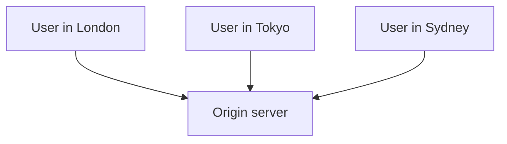

If the origin server is in London, the London user may receive a fast response.

However, users in Tokyo and Sydney may experience greater latency because their requests must travel much further.

With a CDN, cached content can be stored closer to each user.

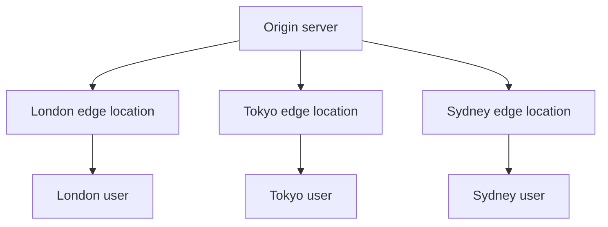

---

### What Is Amazon CloudFront?

**Amazon CloudFront** is AWS's Content Delivery Network.

CloudFront distributes content through a global network of:

- Edge locations
- Points of presence
- Regional edge caches

When a user requests content, CloudFront routes the request to an edge location that can provide low-latency delivery.

CloudFront can deliver content from AWS services and non-AWS servers.

---

### CloudFront Terminology

| Term | Meaning |
| --- | --- |
| Distribution | CloudFront configuration used to deliver content |
| Origin | Original source of the content |
| Edge location | AWS location that serves content close to users |
| Point of presence | Another name commonly used for an edge location |
| Regional edge cache | Larger cache between edge locations and the origin |
| Viewer | User or application requesting content |
| Cache | Temporary stored copy of content |
| Cache hit | Requested content is already cached |
| Cache miss | CloudFront must retrieve the content from the origin |
| Behaviour | Rules describing how CloudFront handles matching requests |
| TTL | How long content can remain cached |
| Invalidation | Request to remove cached content before it expires |

---

### What Is a CloudFront Distribution?

A **CloudFront distribution** contains the settings CloudFront needs to deliver an application.

A distribution defines:

- The origin
- Cache behaviours
- Allowed HTTP methods
- Viewer protocol policy
- Cache policy
- Origin request policy
- Custom domain names
- TLS certificates
- Logging settings
- Security protections
- Geographic restrictions

When a distribution is created, AWS gives it a CloudFront domain name.

Example:

```text
d111111abcdef8.cloudfront.net
```

An object can then be accessed using a URL such as:

```text
https://d111111abcdef8.cloudfront.net/images/logo.png
```

A custom domain can also point to the distribution:

```text
https://static.aws.abubakarmohamed.dev/images/logo.png
```

---

### What Is an Edge Location?

An **edge location** is an AWS location where CloudFront can cache and deliver content.

Edge locations are positioned close to users in many parts of the world.

They are different from:

- AWS Regions
- Availability Zones
- Local Zones

| AWS location type | Main purpose |
| --- | --- |
| Region | Hosts AWS resources such as EC2, RDS and VPCs |
| Availability Zone | Provides isolated infrastructure inside a Region |
| Edge location | Delivers cached content close to users |

For example, an S3 bucket could be created in:

```text
Europe (London): eu-west-2
```

CloudFront can then cache the bucket's content at edge locations around the world.

---

### Why Use CloudFront?

CloudFront can provide several benefits.

#### Reduced Latency

Content is served from a location closer to the user.

#### Reduced Origin Load

CloudFront can answer requests from its cache instead of repeatedly contacting the origin.

#### Improved Availability

Cached content is distributed across CloudFront's global infrastructure.

#### HTTPS Support

CloudFront can provide secure HTTPS connections between:

- The viewer and CloudFront
- CloudFront and the origin

#### DDoS Protection

CloudFront includes protection through AWS Shield Standard.

AWS WAF can also be associated with a CloudFront distribution.

#### Custom Domain Support

CloudFront can deliver content through domains such as:

```text
www.example.com
static.example.com
api.example.com
```

#### Controlled Access

CloudFront supports:

- Signed URLs
- Signed cookies
- Origin Access Control
- Geographic restrictions
- AWS WAF
- Field-level encryption
- Private VPC origins

---

### Common CloudFront Use Cases

CloudFront is commonly used for:

- Static websites
- Image delivery
- Video streaming
- Software downloads
- Public APIs
- Dynamic websites
- Single-page applications
- E-commerce applications
- Global applications
- Private downloadable content

---

### CloudFront and DevOps

CloudFront matters in DevOps because it helps teams create applications that are:

- Faster
- Globally available
- Secure
- Scalable
- Easier to monitor
- Less demanding on backend servers

CloudFront can also be deployed automatically using:

- AWS CloudFormation
- Terraform
- AWS CDK
- AWS CLI
- CI/CD pipelines

Example deployment flow:

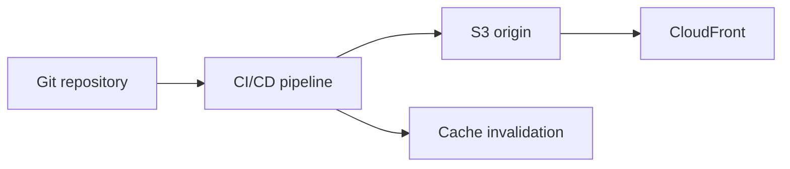

---

### CloudFront Is a Global Service

CloudFront is considered a **global AWS service**.

A CloudFront distribution is not created inside one specific AWS Region.

However, its origins may be regional resources.

Example:

```text
CloudFront distribution: Global
S3 bucket: eu-west-2
Application Load Balancer: eu-west-2
EC2 instances: eu-west-2
ACM viewer certificate: us-east-1
```

> CloudFront is global, but many of the services connected to it are regional.

---

## 158. CloudFront Origins

### What Is an Origin?

An **origin** is the original location where CloudFront retrieves content.

The origin contains the authoritative version of the files or application.

CloudFront may retrieve content from the origin when:

- The requested content is not cached
- The cached content has expired
- The cache was invalidated
- Caching is disabled
- The request is dynamic

> The origin is the source of truth for the content.

---

### Supported Origin Examples

CloudFront can use origins such as:

- Amazon S3 buckets
- Application Load Balancers
- Network Load Balancers
- EC2 instances
- API Gateway APIs
- AWS Lambda function URLs
- AWS Elemental MediaPackage
- Web servers outside AWS
- Other HTTP-compatible servers
- Private ALBs, NLBs or EC2 instances through VPC origins

---

### Origin Comparison

| Origin | Common use |
| --- | --- |
| S3 bucket | Static websites, images, CSS, JavaScript and downloads |
| Application Load Balancer | Highly available web applications |
| EC2 instance | Web application running directly on one server |
| API Gateway | Serverless APIs |
| Lambda function URL | Direct access to a Lambda-powered HTTP endpoint |
| MediaPackage | Video delivery |
| External HTTP server | Application hosted outside AWS |
| VPC origin | Private ALB, NLB or EC2 resource |

---

### Standard S3 Origin

A standard S3 origin uses the S3 REST endpoint.

Example:

```text
my-bucket.s3.eu-west-2.amazonaws.com
```

A standard S3 origin supports **Origin Access Control**.

This allows:

- The S3 bucket to remain private
- S3 Block Public Access to remain enabled
- CloudFront to sign requests to S3
- Users to access the objects through CloudFront

This is the recommended design for most private static-content solutions.

---

### S3 Website Endpoint Origin

An S3 bucket configured for static website hosting has a website endpoint.

Example:

```text
my-bucket.s3-website.eu-west-2.amazonaws.com
```

CloudFront treats an S3 website endpoint as a **custom origin**.

Important limitations include:

- Origin Access Control cannot be used
- Legacy Origin Access Identity cannot be used
- The website endpoint must be reachable by CloudFront
- S3 website endpoints do not support HTTPS
- The bucket content normally needs to be publicly readable

| Standard S3 origin | S3 website endpoint |
| --- | --- |
| Uses the S3 REST endpoint | Uses the S3 website endpoint |
| Supports OAC | Does not support OAC |
| Can keep bucket private | Normally requires public content |
| Supports HTTPS from CloudFront | Website endpoint uses HTTP |
| Recommended for secure static content | Useful when S3 website features are required |

> Do not confuse an S3 REST endpoint with an S3 website endpoint.

---

### Custom Origins

A **custom origin** is an HTTP or HTTPS server that CloudFront can contact.

Examples include:

- An Application Load Balancer
- An EC2 web server
- An on-premises web server
- A server hosted by another cloud provider
- An S3 website endpoint

For a traditional custom origin, CloudFront requires a DNS name that resolves to the origin.

Example:

```text
my-alb-123456.eu-west-2.elb.amazonaws.com
```

or:

```text
origin.example.com
```

---

### Multiple Origins

One CloudFront distribution can contain multiple origins.

For example:

| URL path | Origin |
| --- | --- |
| `/images/*` | S3 bucket |
| `/downloads/*` | S3 bucket |
| `/api/*` | Application Load Balancer |
| `/auth/*` | API Gateway |
| Default `*` | Application Load Balancer |

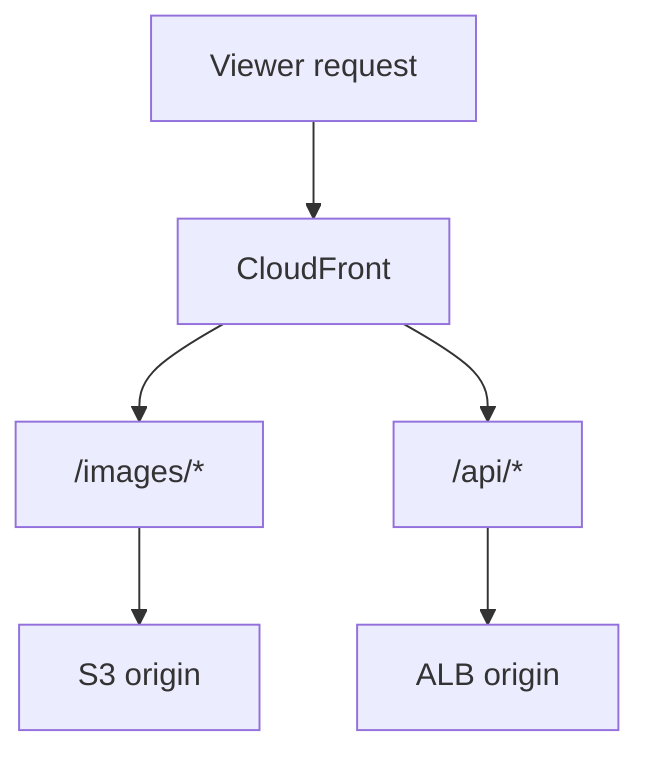

The route is selected using CloudFront **cache behaviours**.

---

### Cache Behaviours

A cache behaviour tells CloudFront how to handle requests matching a path pattern.

Every distribution has a default behaviour.

The default path pattern is:

```text
*
```

Additional behaviours can be created.

Example:

```text
/images/*
/api/*
/videos/*
/downloads/*
```

A behaviour can control:

- Which origin receives the request
- Whether HTTP redirects to HTTPS
- Which HTTP methods are allowed
- Whether content is cached
- Which headers are included in the cache key
- Which query strings are forwarded
- Which cookies are forwarded
- Whether signed URLs or cookies are required
- Which edge function runs

---

### Behaviour Priority

CloudFront checks behaviours in priority order.

More specific patterns should appear before the default behaviour.

Example:

```text
1. /api/*
2. /images/*
3. Default (*)
```

A request for:

```text
/api/users
```

matches:

```text
/api/*
```

A request for:

```text
/index.html
```

matches the default behaviour.

---

### Origin Protocol Policy

The **origin protocol policy** controls how CloudFront communicates with a custom origin.

Options include:

| Policy | Meaning |
| --- | --- |
| HTTP only | CloudFront always uses HTTP to the origin |
| HTTPS only | CloudFront always uses HTTPS to the origin |
| Match viewer | CloudFront uses the same protocol as the viewer |

For production applications, use HTTPS where possible.

Example secure connection:

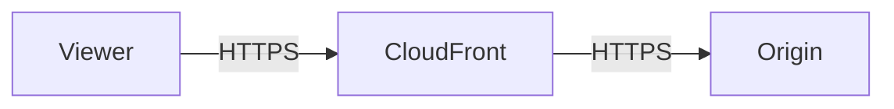

---

### Viewer Protocol Policy

The **viewer protocol policy** controls how users communicate with CloudFront.

Options include:

| Policy | Behaviour |
| --- | --- |
| HTTP and HTTPS | Accepts both protocols |
| Redirect HTTP to HTTPS | Redirects HTTP requests to HTTPS |
| HTTPS only | Rejects HTTP requests |

A common production setting is:

```text
Redirect HTTP to HTTPS
```

---

### Origin Custom Headers

CloudFront can add a custom HTTP header before sending a request to an origin.

Example:

```text
X-Origin-Verify: random-secret-value
```

An ALB listener rule or application can check for this header.

If the header is missing, the request can be rejected.

This helps prevent users from bypassing CloudFront and accessing the origin directly.

Important rules:

- Use a random value
- Treat it like a credential
- Do not upload it to GitHub
- Do not display it in public screenshots
- Rotate it if it becomes exposed
- Use HTTPS so the header is encrypted in transit

---

### Origin Groups

An **origin group** contains:

- One primary origin
- One secondary origin

If the primary origin returns selected failure responses, CloudFront can try the secondary origin.

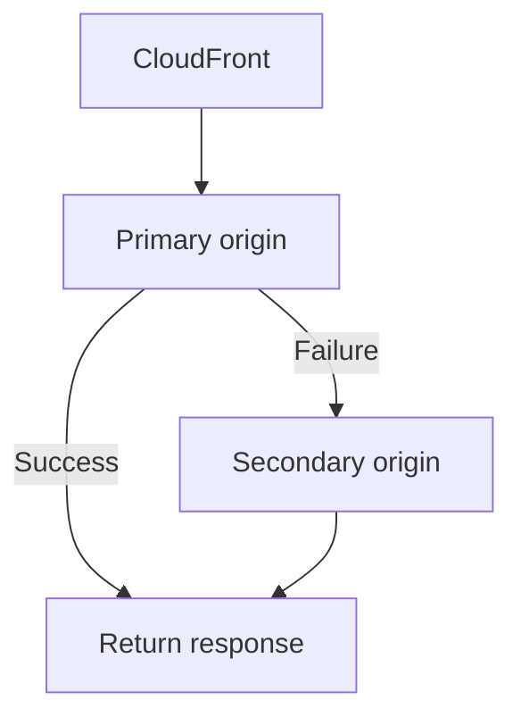

Origin groups can improve availability for suitable workloads.

They are not a replacement for:

- Multi-AZ design
- Load balancing
- Database replication
- Application-level resilience

---

### Origin Shield

**Origin Shield** provides an additional centralised caching layer between CloudFront's regional caches and the origin.

It can help:

- Reduce requests reaching the origin
- Improve cache hit ratio
- Protect origins from traffic spikes
- Reduce duplicate requests from different edge locations

Origin Shield can create additional charges, so it should be enabled when its benefits are required.

---

## 159. CloudFront at a High Level

### How a CloudFront Request Works

When a user requests content:

1. DNS directs the request to an appropriate CloudFront edge location.
2. CloudFront checks whether the object is cached.
3. If cached and valid, CloudFront returns the object.
4. If it is not cached, CloudFront sends the request to the configured origin.
5. The origin returns the object.
6. CloudFront sends the response to the user.
7. CloudFront may store the response for future requests.

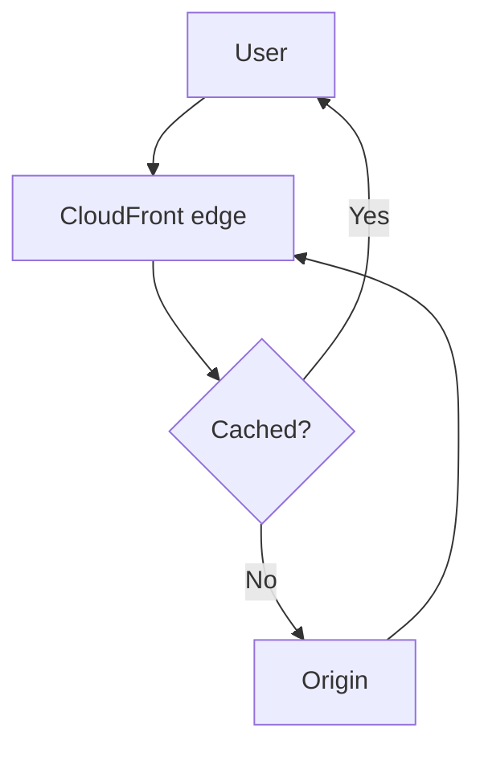

---

### Cache Hit

A **cache hit** occurs when CloudFront already has a valid cached copy of the requested content.

```text
Viewer → Edge location → Cached object → Viewer
```

Benefits include:

- Faster response
- Reduced latency
- Less origin traffic
- Lower origin processing load

---

### Cache Miss

A **cache miss** occurs when CloudFront does not have a valid cached copy.

```text
Viewer → Edge location → Origin → Edge location → Viewer
```

A cache miss can occur because:

- The object has never been requested
- The cached object expired
- An invalidation removed the object
- The cache key is different
- Caching is disabled

---

### Regional Edge Caches

CloudFront also uses **regional edge caches**.

These are larger caches positioned between edge locations and origins.

A simplified request path can be:

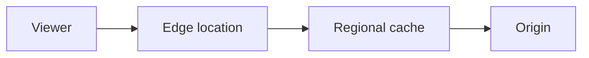

Regional edge caches help reduce the number of requests that reach the origin.

---

### Cache Key

The **cache key** determines whether two requests can use the same cached response.

The URL path is normally part of the cache key.

Depending on the cache policy, it may also include:

- Query strings
- HTTP headers
- Cookies
- Accept-Encoding values

Example requests:

```text
/images/product.jpg?colour=blue
/images/product.jpg?colour=red
```

If the `colour` query string is included in the cache key, CloudFront treats these as different cached objects.

---

### Why the Cache Key Matters

An unnecessarily large cache key reduces the cache hit ratio.

For example, including every header may cause CloudFront to create many cache variations.

Poor configuration:

```text
Cache key:
- Path
- Every header
- Every cookie
- Every query string
```

Better configuration:

```text
Cache key:
- Path
- Only values that change the response
```

> Only include a value in the cache key if the origin returns different content based on that value.

---

### Cache Policy vs Origin Request Policy

These two policies have different purposes.

| Policy | Purpose |
| --- | --- |
| Cache policy | Controls the cache key and cache duration |
| Origin request policy | Controls additional information forwarded to the origin |

A value can sometimes be sent to the origin without being included in the cache key.

This can improve the cache hit ratio while still giving the origin required information.

---

### Time to Live

**TTL** stands for **Time to Live**.

It controls how long content remains cached before CloudFront checks the origin again.

CloudFront caching can be influenced by:

- Minimum TTL
- Default TTL
- Maximum TTL
- `Cache-Control` response header
- `Expires` response header

Example:

```http
Cache-Control: public, max-age=3600
```

This requests that the content be cached for:

```text
3,600 seconds = 1 hour
```

---

### TTL Trade-Off

| Short TTL | Long TTL |
| --- | --- |
| Updates appear sooner | Better cache hit ratio |
| More origin requests | Fewer origin requests |
| Higher origin load | Lower origin load |
| Useful for frequently changing content | Useful for stable content |

Examples:

| Content | Example TTL strategy |
| --- | --- |
| Versioned image | Long TTL |
| Versioned CSS file | Long TTL |
| Product availability | Short TTL |
| User-specific account page | Do not cache publicly |
| API response | Depends on how often it changes |

---

### Cache-Control Examples

#### Cache for One Hour

```http
Cache-Control: public, max-age=3600
```

#### Cache for One Year

```http
Cache-Control: public, max-age=31536000, immutable
```

This is suitable for versioned files such as:

```text
app.7d91c2.js
styles.a810de.css
```

#### Prevent Shared Caching

```http
Cache-Control: private, no-store
```

Use careful caching rules for:

- Authentication pages
- Shopping baskets
- Account information
- Personalised responses
- Sensitive data

---

### Static and Dynamic Content

CloudFront can deliver both static and dynamic content.

#### Static Content

Static content is usually the same for every user.

Examples:

- Images
- CSS files
- JavaScript files
- Videos
- Download files

Static content is usually suitable for caching.

#### Dynamic Content

Dynamic content may change for each request.

Examples:

- User account pages
- Checkout pages
- API responses
- Search results
- Authentication requests

CloudFront can still improve dynamic delivery through:

- AWS's global network
- TLS termination
- Persistent origin connections
- AWS WAF
- DDoS protection
- Optimised routing

However, dynamic or personalised responses must not be cached incorrectly.

---

### HTTP Methods

CloudFront can process methods including:

- `GET`
- `HEAD`
- `OPTIONS`
- `PUT`
- `POST`
- `PATCH`
- `DELETE`

`GET` and `HEAD` responses are commonly cached.

Methods such as `POST`, `PUT`, `PATCH` and `DELETE` are forwarded to the origin and are not normally cached.

Only enable the methods required by the application.

---

### CloudFront Invalidations

An **invalidation** removes objects from CloudFront caches before their TTL expires.

Example AWS CLI command:

```bash
aws cloudfront create-invalidation \
  --distribution-id DISTRIBUTION_ID \
  --paths "/*"
```

Invalidate one file:

```bash
aws cloudfront create-invalidation \
  --distribution-id DISTRIBUTION_ID \
  --paths "/index.html"
```

After invalidation, the next request retrieves the current object from the origin.

---

### Invalidations vs File Versioning

Instead of replacing:

```text
styles.css
```

an application can upload:

```text
styles-v2.css
```

or:

```text
styles.a810de.css
```

| Invalidation | File versioning |
| --- | --- |
| Removes old content from CloudFront caches | Creates a new object name |
| Useful for urgent replacements | Better for regular deployments |
| Can create charges beyond the allowance | Avoids repeated invalidation costs |
| Browser caches may still hold old content | New URL bypasses old browser caches |
| Simple for `index.html` | Ideal for CSS, JavaScript and images |

A common strategy is:

- Use versioned names for CSS, JavaScript and images
- Use a shorter TTL for `index.html`
- Invalidate `index.html` after deployments when necessary

---

### Custom Domains and HTTPS

A CloudFront distribution can use a custom domain.

Example:

```text
static.aws.abubakarmohamed.dev
```

The typical process is:

1. Request an ACM certificate.
2. Validate the domain.
3. Add the domain as an alternate domain name in CloudFront.
4. Attach the ACM certificate.
5. Create a Route 53 alias record pointing to CloudFront.

Important:

> An ACM certificate used between viewers and CloudFront must be requested or imported in `us-east-1`.

Example:

```text
Certificate Region: us-east-1
S3 bucket Region: eu-west-2
CloudFront distribution: Global
```

The certificate used between CloudFront and an ALB can be created in the ALB's Region.

For a London ALB, that would normally be:

```text
eu-west-2
```

---

### CloudFront Security Services

CloudFront can integrate with:

- AWS Shield Standard
- AWS Shield Advanced
- AWS WAF
- AWS Certificate Manager
- Origin Access Control
- Signed URLs
- Signed cookies
- Geographic restrictions
- CloudFront Functions
- Lambda@Edge

---

### Signed URLs and Signed Cookies

Signed URLs and cookies can be used to restrict access to private content.

#### Signed URL

Provides access to one specific URL.

Example use cases:

- One private download
- One video file
- A temporary software package

#### Signed Cookie

Provides access to multiple protected files.

Example use cases:

- A private video library
- Paid course content
- A members-only section

| Signed URL | Signed cookie |
| --- | --- |
| Protects an individual URL | Protects multiple related files |
| Signature appears in the URL | Credentials are stored in cookies |
| Useful for downloads | Useful for private sections or streaming |

---

### Viewing CloudFront Response Headers

Use `curl` to inspect the response:

```bash
curl -I https://DISTRIBUTION_DOMAIN/index.html
```

Possible response headers include:

```text
x-cache: Hit from cloudfront
x-cache: Miss from cloudfront
via: ...cloudfront.net
x-amz-cf-pop: LHR...
```

The `x-cache` header helps identify whether the response was served from cache.

Example cache miss:

```text
x-cache: Miss from cloudfront
```

Example cache hit:

```text
x-cache: Hit from cloudfront
```

---

## 160. CloudFront – S3 as an Origin

### S3 and CloudFront Architecture

Amazon S3 is commonly used to store static files.

CloudFront delivers those files from edge locations.

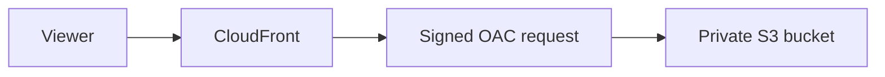

Recommended architecture:

```text
Viewer
   ↓ HTTPS
CloudFront
   ↓ Signed HTTPS request
Origin Access Control
   ↓
Private S3 bucket in eu-west-2
```

---

### Why Place CloudFront in Front of S3?

CloudFront can provide:

- Global caching
- Lower latency
- Custom domain support
- HTTPS
- AWS WAF integration
- DDoS protection
- Signed URLs and cookies
- Reduced direct requests to S3
- Private origin access through OAC

---

### Origin Access Control

**Origin Access Control**, or **OAC**, allows CloudFront to send authenticated requests to S3.

OAC uses AWS Signature Version 4 to sign origin requests.

This allows the S3 bucket to remain private while CloudFront receives permission to read selected objects.

AWS recommends OAC instead of the older **Origin Access Identity**, or OAI.

---

### OAC vs OAI

| OAC | OAI |
| --- | --- |
| Current recommended method | Legacy method |
| Uses signed CloudFront requests | Uses a special CloudFront identity |
| Supports newer AWS Regions | Has more limitations |
| Supports SSE-KMS with correct permissions | More limited SSE-KMS support |
| Supports supported dynamic S3 requests | More limited functionality |
| Preferred for new distributions | May exist in older architectures |

---

### Secure S3 Design

The secure design should normally include:

- S3 Block Public Access enabled
- Bucket not configured as a public website
- CloudFront Origin Access Control
- Bucket policy restricted to one CloudFront distribution
- HTTPS required for viewers
- Signed CloudFront requests to S3
- Least-privilege permissions

---

### Example S3 Bucket Policy for OAC

Replace:

- `BUCKET_NAME`
- `AWS_ACCOUNT_ID`
- `DISTRIBUTION_ID`

```json
{
  "Version": "2012-10-17",
  "Statement": [
    {
      "Sid": "AllowCloudFrontServicePrincipalReadOnly",
      "Effect": "Allow",
      "Principal": {
        "Service": "cloudfront.amazonaws.com"
      },
      "Action": "s3:GetObject",
      "Resource": "arn:aws:s3:::BUCKET_NAME/*",
      "Condition": {
        "StringEquals": {
          "AWS:SourceArn": "arn:aws:cloudfront::AWS_ACCOUNT_ID:distribution/DISTRIBUTION_ID"
        }
      }
    }
  ]
}
```

The `AWS:SourceArn` condition restricts access to the specified CloudFront distribution.

---

### Practical Demo: Private S3 Website Through CloudFront

#### Demo Goal

Create this architecture:

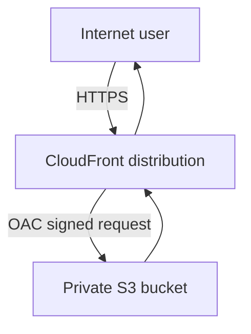

The user should be able to access the website through CloudFront but not directly through the S3 object URL.

---

### Step 1: Create the Website File

Create a file called:

```text
index.html
```

Example content:

```html
<!DOCTYPE html>
<html lang="en">
<head>
  <meta charset="UTF-8">
  <meta name="viewport" content="width=device-width, initial-scale=1.0">
  <title>CloudFront Demo</title>
  <style>
    body {
      background: #111827;
      color: #f9fafb;
      font-family: Arial, sans-serif;
      text-align: center;
      padding: 80px 20px;
    }

    .card {
      background: #1f2937;
      border-radius: 12px;
      margin: auto;
      max-width: 700px;
      padding: 40px;
    }

    h1 {
      color: #f59e0b;
    }
  </style>
</head>
<body>
  <main class="card">
    <h1>Amazon CloudFront Demo</h1>
    <p>This page is stored in a private S3 bucket.</p>
    <p>It is being delivered securely through CloudFront.</p>
  </main>
</body>
</html>
```

> On Windows, confirm that the file is not accidentally named `index.html.txt`.

---

### Step 2: Create the S3 Bucket

1. Open the **Amazon S3** console.
2. Select **Create bucket**.
3. Enter a globally unique bucket name.
4. Select:

```text
Europe (London) – eu-west-2
```

5. Leave **Block all public access** enabled.
6. Leave **Object Ownership** as:

```text
Bucket owner enforced
```

7. Create the bucket.
8. Upload `index.html`.

Do not enable public static website hosting for this OAC demo.

---

### Step 3: Create the CloudFront Distribution

1. Open the **CloudFront** console.
2. Select **Create distribution**.
3. Choose the standard S3 bucket as the origin.
4. Do not select the S3 website endpoint.
5. Under origin access, choose:

```text
Origin access control settings
```

6. Create or select an OAC.
7. Use:

```text
Sign requests
```

8. Set the viewer protocol policy to:

```text
Redirect HTTP to HTTPS
```

9. Select an appropriate managed cache policy, such as:

```text
CachingOptimized
```

10. Set the default root object to:

```text
index.html
```

11. Create the distribution.

---

### Step 4: Update the Bucket Policy

CloudFront may offer to copy or update the required bucket policy.

Confirm that the policy:

- Allows the CloudFront service principal
- Allows only `s3:GetObject`
- References the correct bucket
- References the correct distribution ARN

Do not create a public `"Principal": "*"` read policy for this design.

---

### Step 5: Wait for Deployment

CloudFront distributes its configuration globally.

Wait until the distribution status shows that deployment is complete.

Copy the distribution domain name.

Example:

```text
d111111abcdef8.cloudfront.net
```

Open:

```text
https://d111111abcdef8.cloudfront.net
```

The `index.html` page should appear.

---

### Step 6: Test Direct S3 Access

Attempt to open the direct S3 object URL.

Example:

```text
https://BUCKET_NAME.s3.eu-west-2.amazonaws.com/index.html
```

Because the bucket is private, the direct request should be denied.

The CloudFront URL should continue to work.

This proves that:

- The bucket is private
- The object is not public
- CloudFront has permission through OAC
- Users must access the object through CloudFront

---

### Step 7: Inspect the Response

Run:

```bash
curl -I https://DISTRIBUTION_DOMAIN/index.html
```

The first request may show:

```text
x-cache: Miss from cloudfront
```

Run the command again:

```bash
curl -I https://DISTRIBUTION_DOMAIN/index.html
```

A later response may show:

```text
x-cache: Hit from cloudfront
```

---

### Step 8: Upload an Updated File

Update the page and upload it again:

```bash
aws s3 cp index.html s3://BUCKET_NAME/index.html \
  --region eu-west-2
```

CloudFront may still return the cached version until it expires.

Create an invalidation:

```bash
aws cloudfront create-invalidation \
  --distribution-id DISTRIBUTION_ID \
  --paths "/index.html"
```

To invalidate every path:

```bash
aws cloudfront create-invalidation \
  --distribution-id DISTRIBUTION_ID \
  --paths "/*"
```

Use `/*` carefully because invalidation requests can create charges beyond the included allowance.

---

### Step 9: Add a Custom Domain

Example domain:

```text
static.aws.abubakarmohamed.dev
```

#### Request a Certificate

1. Open AWS Certificate Manager.
2. Change the Region to:

```text
US East (N. Virginia) – us-east-1
```

3. Request a public certificate for:

```text
static.aws.abubakarmohamed.dev
```

4. Complete DNS validation.

#### Attach the Domain to CloudFront

Add this alternate domain name:

```text
static.aws.abubakarmohamed.dev
```

Select the validated ACM certificate.

#### Create the Route 53 Record

Create a Route 53 alias record:

```text
Record name: static
Record type: A
Alias: Yes
Target: CloudFront distribution
```

You can also create an IPv6 alias record:

```text
Record type: AAAA
```

The website should then be available at:

```text
https://static.aws.abubakarmohamed.dev
```

---

### S3 and CloudFront Troubleshooting

| Problem | Possible cause |
| --- | --- |
| `403 AccessDenied` | Incorrect bucket policy |
| `403 AccessDenied` | OAC not attached to the origin |
| `403 AccessDenied` | Distribution ARN in policy is incorrect |
| `403 AccessDenied` | SSE-KMS key does not permit CloudFront |
| Root URL returns an error | Default root object is missing |
| Object returns `404` | Incorrect object key |
| Object returns `404` | Uppercase/lowercase mismatch |
| Old content appears | Object is cached |
| Custom domain fails | Route 53 record is incorrect |
| HTTPS warning appears | Certificate does not match the domain |
| Certificate not listed | Certificate was not created in `us-east-1` |
| OAC option is unavailable | S3 website endpoint was selected |
| Direct S3 URL works publicly | Bucket or object is public |

---

### Important S3 Origin Rules

- Keep Block Public Access enabled when using OAC.
- Use the S3 REST endpoint, not the website endpoint.
- Use OAC for new private S3 origins.
- Restrict the bucket policy to the required distribution.
- Do not upload account IDs or secrets unnecessarily.
- Use HTTPS.
- Use long TTLs for versioned static files.
- Use invalidations only when required.
- Protect private files with signed URLs or cookies where necessary.

---

## 161. CloudFront – ALB or EC2 as an Origin

CloudFront can use a web application running behind an Application Load Balancer or directly on EC2 as its origin.

---

### CloudFront with an Application Load Balancer

An Application Load Balancer distributes traffic across multiple targets.

Typical architecture:

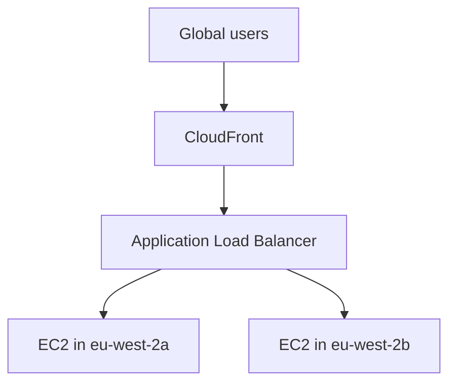

This design can provide:

- Global content delivery
- Layer 7 routing
- Multi-AZ availability
- Health checks
- Auto Scaling integration
- TLS encryption
- AWS WAF protection
- Reduced load on EC2 instances

---

### Why Use an ALB Instead of One EC2 Instance?

| ALB origin | Direct EC2 origin |
| --- | --- |
| Distributes traffic across targets | Sends traffic to one server |
| Supports multiple Availability Zones | Creates a possible single point of failure |
| Integrates with Auto Scaling | Requires manual scaling |
| Performs target health checks | No built-in multi-target health routing |
| Provides a stable DNS endpoint | Public IP may change |
| Better for production applications | Suitable for simple labs |

A common production design is:

```text
CloudFront
    ↓
Application Load Balancer
    ↓
Auto Scaling Group
    ↓
EC2 instances across multiple AZs
```

---

### Traditional Internet-Facing ALB Origin

A traditional CloudFront custom origin can use an internet-facing ALB.

Example origin domain:

```text
my-alb-123456.eu-west-2.elb.amazonaws.com
```

The ALB must be reachable by CloudFront.

However, leaving the ALB publicly accessible means users may attempt to bypass CloudFront.

Security controls should therefore restrict direct access as much as possible.

---

### Protecting an Internet-Facing ALB Origin

AWS supports several protective measures.

#### Custom Origin Header

CloudFront adds a secret custom header:

```text
X-Origin-Verify: RANDOM_SECRET_VALUE
```

The ALB listener only forwards requests containing the correct header.

Requests without the header receive an error response.

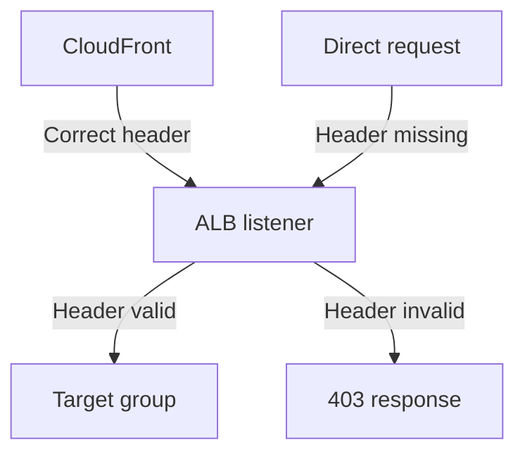

#### CloudFront Managed Prefix List

The ALB security group can allow inbound traffic from the AWS-managed CloudFront origin-facing prefix list.

Example source:

```text
com.amazonaws.global.cloudfront.origin-facing
```

This allows traffic from CloudFront's origin-facing network rather than from every IPv4 address.

#### HTTPS to the Origin

Configure CloudFront to communicate with the ALB through HTTPS.

Example:

```text
Viewer → HTTPS → CloudFront → HTTPS → ALB
```

#### AWS WAF

AWS WAF can inspect requests at CloudFront before they reach the ALB.

---

### Important Custom-Header Security Rules

The custom header value must be treated like a credential.

Do not:

- Commit it to GitHub
- Place it in public notes
- Use an easily guessed value
- Send it over an unencrypted origin connection
- Display it in screenshots
- Reuse it across unrelated applications

Use a cryptographically random value and rotate it if exposed.

---

### CloudFront VPC Origins

CloudFront **VPC origins** allow CloudFront to connect to supported resources inside private subnets.

Supported origin resources include:

- Application Load Balancers
- Network Load Balancers
- EC2 instances

This makes it possible for CloudFront to become the application's public entry point while the origin remains private.

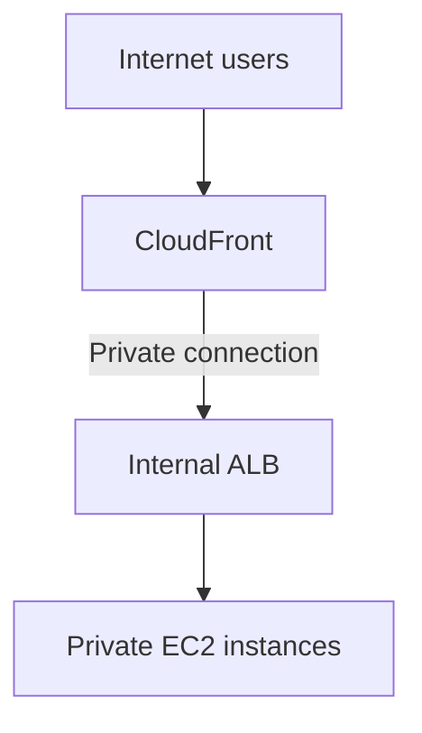

Europe (London), `eu-west-2`, supports CloudFront VPC origins.

---

### VPC Origin Requirements

A VPC-origin design requires:

- A supported AWS Region
- A VPC
- An attached internet gateway
- A private subnet
- At least one available private IPv4 address
- A supported ALB, NLB or EC2 resource
- A security group attached to the origin
- Correct security-group rules

The internet gateway is required as part of the VPC-origin configuration, but CloudFront does not use it to route traffic to the private origin.

CloudFront creates a service-managed network interface and security group.

The service-managed security group uses a name similar to:

```text
CloudFront-VPCOrigins-Service-SG
```

Do not manually create or edit a security group using this reserved naming pattern.

---

### VPC Origin Security Group

The origin security group can allow traffic from:

- The CloudFront managed prefix list
- The CloudFront service-managed security group

Using the service-managed security group is more restrictive because it can limit traffic to the configured CloudFront distributions.

Example:

```text
Origin ALB security group inbound rule:
Protocol: TCP
Port: 443
Source: CloudFront-VPCOrigins-Service-SG
```

---

### Traditional Origin vs VPC Origin

| Traditional custom origin | VPC origin |
| --- | --- |
| Origin is normally publicly reachable | Origin can remain in a private subnet |
| Uses public origin DNS | Uses private CloudFront connectivity |
| May require secret headers | Uses service-managed private access |
| May use CloudFront prefix list | Uses managed ENI and security group |
| Easier for simple existing applications | Stronger isolation for supported designs |
| Direct-origin access must be controlled | CloudFront can be the only public entry point |

---

### EC2 as a Direct Origin

An EC2 instance can act as a CloudFront custom origin.

For a traditional custom origin, the EC2 instance needs a stable, publicly resolvable endpoint.

Possible origin value:

```text
origin.example.com
```

The domain may point to:

- An Elastic IP
- A public EC2 address
- Another stable public endpoint

A direct EC2 origin should only allow required ports.

Example security-group rules:

| Type | Port | Source |
| --- | ---: | --- |
| HTTP | 80 | CloudFront origin-facing prefix list |
| HTTPS | 443 | CloudFront origin-facing prefix list |
| SSH | 22 | Administrator's IP only |

Do not allow SSH from:

```text
0.0.0.0/0
```

---

### Why Direct EC2 Is Less Resilient

A single EC2 origin can fail because of:

- Instance failure
- Operating-system failure
- Application failure
- Availability Zone failure
- Incorrect deployment
- Instance termination

For production workloads, prefer:

```text
CloudFront → ALB → Auto Scaling Group → EC2
```

rather than:

```text
CloudFront → One EC2 instance
```

---

### Practical Demo: CloudFront with an ALB Origin

#### Prerequisites

Before creating the CloudFront distribution, confirm:

- The ALB is active
- The target group has healthy targets
- The web application works through the ALB
- The ALB listener is configured
- The origin security group is correct
- DNS and certificates are ready if using HTTPS

---

### Step 1: Test the ALB

Open the ALB DNS name:

```text
http://ALB_DNS_NAME
```

or:

```text
https://origin.example.com
```

Do not continue until the application works through the ALB.

---

### Step 2: Create the Distribution

1. Open the CloudFront console.
2. Select **Create distribution**.
3. Enter the ALB DNS name as the origin.
4. Choose the origin protocol policy.
5. Prefer:

```text
HTTPS only
```

6. Set the viewer protocol policy to:

```text
Redirect HTTP to HTTPS
```

7. Select an appropriate cache policy.
8. Select an origin request policy.
9. Choose the required HTTP methods.
10. Create the distribution.

---

### Step 3: Choose the Correct Cache Policy

For static content:

```text
Managed-CachingOptimized
```

may be suitable.

For dynamic or personalised application responses:

```text
Managed-CachingDisabled
```

may be safer.

Do not cache responses containing:

- Private account details
- Authentication tokens
- Shopping-basket contents
- Personal information
- User-specific responses

unless the cache key and application design safely separate every user.

---

### Step 4: Test CloudFront

Open:

```text
https://DISTRIBUTION_DOMAIN
```

The application should load through:

```text
User → CloudFront → ALB → EC2
```

Inspect the headers:

```bash
curl -I https://DISTRIBUTION_DOMAIN
```

---

### Step 5: Restrict Direct ALB Access

For an internet-facing ALB:

1. Configure a random origin custom header in CloudFront.
2. Create an ALB listener rule that checks the header.
3. Forward valid requests to the target group.
4. Return a fixed `403` response for invalid requests.
5. Restrict the ALB security group using the CloudFront managed prefix list.
6. Use HTTPS between CloudFront and the ALB.

Test:

```text
CloudFront URL → Works
Direct ALB URL → Rejected
```

---

### Step 6: Add a Custom Domain

Example viewer domain:

```text
www.aws.abubakarmohamed.dev
```

For the viewer-facing certificate:

```text
ACM Region: us-east-1
```

For the ALB origin certificate:

```text
ACM Region: eu-west-2
```

Create a Route 53 alias pointing the viewer domain to CloudFront.

---

### ALB and EC2 Caching Considerations

#### Suitable for Caching

- Images
- CSS
- JavaScript
- Public product pages
- Public documentation
- Public API responses that change infrequently

#### Usually Unsuitable for Shared Caching

- Login responses
- Account dashboards
- Payment pages
- User profiles
- Session-specific APIs
- Private documents

A safe design may use different behaviours:

| Path | Origin | Cache policy |
| --- | --- | --- |
| `/static/*` | S3 | Caching enabled |
| `/images/*` | S3 | Caching enabled |
| `/api/public/*` | ALB | Short TTL |
| `/api/private/*` | ALB | Caching disabled |
| `/login/*` | ALB | Caching disabled |

---

### CloudFront and ALB Health

The ALB performs health checks against its targets.

If an EC2 instance becomes unhealthy, the ALB stops routing new traffic to that target.

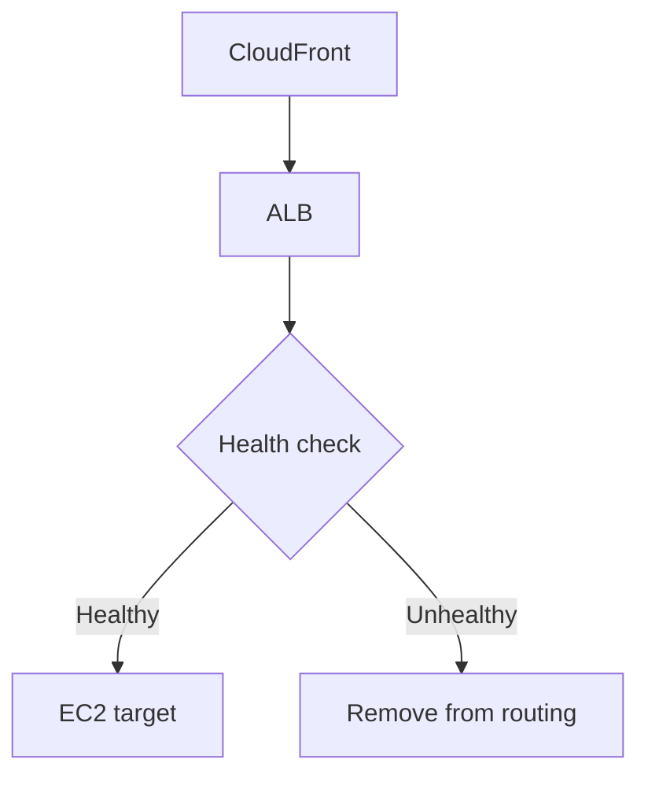

CloudFront does not replace the ALB's target health checks.

CloudFront origin groups can provide another form of failover between separate origins.

---

### Common CloudFront Errors

#### 403 Forbidden

Possible causes:

- S3 bucket policy is incorrect
- OAC is missing
- AWS WAF blocked the request
- ALB listener rejected the origin header
- Signed URL expired
- Geographic restriction blocked the request
- Requested object is private

#### 404 Not Found

Possible causes:

- Incorrect path
- Missing object
- Incorrect default root object
- Application route does not exist
- Uppercase/lowercase mismatch

#### 502 Bad Gateway

Possible causes:

- Origin TLS certificate is invalid
- Certificate name does not match the origin domain
- CloudFront cannot negotiate TLS with the origin
- The origin closed the connection
- Incorrect origin port
- Application returned an invalid response

#### 504 Gateway Timeout

Possible causes:

- Origin is taking too long to respond
- Security group blocks the connection
- Application is overloaded
- Database dependency is slow
- Network route is incorrect
- Origin response timeout is too low

#### Too Many Redirects

Possible causes:

- CloudFront redirects HTTP to HTTPS
- The origin redirects HTTPS back to HTTP
- Application does not recognise the forwarded protocol
- Conflicting redirect rules

---

### CloudFront Troubleshooting Checklist

```text
Correct distribution?
Correct origin?
Correct origin domain?
Correct path behaviour?
Correct behaviour priority?
Correct cache policy?
Correct origin request policy?
Correct HTTP methods?
Correct viewer protocol policy?
Correct origin protocol policy?
Correct security group?
Correct bucket policy?
Correct OAC?
Correct TLS certificate?
Correct certificate Region?
Correct DNS record?
Healthy ALB targets?
Cached old response?
AWS WAF blocking the request?
```

---

### Useful AWS CLI Commands

List CloudFront distributions:

```bash
aws cloudfront list-distributions
```

Get information about one distribution:

```bash
aws cloudfront get-distribution \
  --id DISTRIBUTION_ID
```

Get the distribution configuration:

```bash
aws cloudfront get-distribution-config \
  --id DISTRIBUTION_ID
```

Create an invalidation:

```bash
aws cloudfront create-invalidation \
  --distribution-id DISTRIBUTION_ID \
  --paths "/*"
```

List invalidations:

```bash
aws cloudfront list-invalidations \
  --distribution-id DISTRIBUTION_ID
```

Check an S3 bucket policy:

```bash
aws s3api get-bucket-policy \
  --bucket BUCKET_NAME
```

Check S3 Block Public Access:

```bash
aws s3api get-public-access-block \
  --bucket BUCKET_NAME
```

Describe an Application Load Balancer:

```bash
aws elbv2 describe-load-balancers \
  --region eu-west-2
```

Check target health:

```bash
aws elbv2 describe-target-health \
  --target-group-arn TARGET_GROUP_ARN \
  --region eu-west-2
```

---

## CloudFront Security Checklist

- [ ] Redirect HTTP viewers to HTTPS.
- [ ] Use HTTPS between CloudFront and custom origins.
- [ ] Keep S3 Block Public Access enabled.
- [ ] Use OAC for private S3 origins.
- [ ] Restrict the S3 bucket policy to the distribution ARN.
- [ ] Do not use a public S3 website endpoint unless required.
- [ ] Use AWS WAF where appropriate.
- [ ] Restrict internet-facing ALBs to CloudFront traffic.
- [ ] Protect custom origin-header values.
- [ ] Prefer private VPC origins where appropriate.
- [ ] Do not expose EC2 administration ports publicly.
- [ ] Use signed URLs or cookies for private content.
- [ ] Enable logging and monitoring.
- [ ] Apply least privilege to IAM and bucket policies.
- [ ] Do not commit secrets, keys or private headers to GitHub.

---

## CloudFront Cost Checklist

CloudFront can create charges for:

- Data transfer to viewers
- HTTP and HTTPS requests
- Cache invalidations beyond the included allowance
- Real-time logs
- Origin Shield
- AWS WAF
- Dedicated IP custom SSL support where selected
- Optional advanced CloudFront features
- Associated origin resources

Related resources may also create charges:

- S3 storage and requests
- Application Load Balancers
- EC2 instances
- Elastic IP addresses
- NAT gateways
- Route 53 hosted zones and queries
- AWS WAF rules
- CloudWatch logs

Cost-safety steps:

- [ ] Delete unused distributions.
- [ ] Delete unused S3 objects and buckets.
- [ ] Remove unused ALBs.
- [ ] Stop or terminate unnecessary EC2 instances.
- [ ] Avoid unnecessary `/*` invalidations.
- [ ] Use versioned file names.
- [ ] Select an appropriate cache TTL.
- [ ] Monitor AWS Budgets.
- [ ] Review Cost Explorer.
- [ ] Check whether optional features create extra charges.

---

## CloudFront Cleanup

A CloudFront distribution must normally be disabled before it can be deleted.

Suggested cleanup order:

1. Remove custom DNS records if no longer needed.
2. Disable the CloudFront distribution.
3. Wait for the change to deploy.
4. Delete the distribution.
5. Delete unused OAC configurations.
6. Remove unused S3 bucket policies.
7. Empty and delete temporary S3 buckets.
8. Delete temporary ALBs and target groups.
9. Terminate temporary EC2 instances.
10. Delete unused security groups.
11. Delete unused ACM certificates where appropriate.
12. Review Billing and Cost Explorer.

> CloudFront configuration changes may take time to deploy globally.

---

## CloudFront Quick Revision Questions

1. What does CDN stand for?
2. What problem does a CDN solve?
3. What is Amazon CloudFront?
4. What is a CloudFront distribution?
5. What is an edge location?
6. How is an edge location different from an Availability Zone?
7. What is a CloudFront origin?
8. What is a viewer?
9. What is a cache hit?
10. What is a cache miss?
11. What happens after a cache miss?
12. What is a regional edge cache?
13. What is a cache behaviour?
14. What is the default behaviour path pattern?
15. How can one distribution use multiple origins?
16. What is a cache key?
17. Why should unnecessary headers be excluded from the cache key?
18. What is the difference between a cache policy and an origin request policy?
19. What does TTL stand for?
20. What is the difference between a short and long TTL?
21. What is a CloudFront invalidation?
22. Why are versioned file names often better than repeated invalidations?
23. What Region must an ACM viewer certificate use with CloudFront?
24. What is Origin Access Control?
25. Why is OAC preferred over OAI?
26. Can OAC be used with an S3 website endpoint?
27. Should an S3 bucket using OAC be public?
28. How does a bucket policy restrict access to one distribution?
29. What is the difference between an S3 REST endpoint and website endpoint?
30. Why might CloudFront use an ALB origin?
31. Why is an ALB normally better than one direct EC2 origin?
32. How can a custom header protect an internet-facing ALB?
33. What is the CloudFront managed prefix list?
34. What is a CloudFront VPC origin?
35. Which resources can be used as VPC origins?
36. Can an internal ALB be used with CloudFront?
37. Why must personalised responses be cached carefully?
38. What could cause a CloudFront `403` error?
39. What could cause a CloudFront `502` error?
40. What could cause a CloudFront `504` error?
41. How can `curl` help identify a cache hit?
42. What does `x-cache: Hit from cloudfront` mean?
43. What AWS service can filter malicious requests at CloudFront?
44. What is the difference between signed URLs and signed cookies?
45. Why should a CloudFront distribution be disabled before deletion?

---

## CloudFront Key Takeaways

- A CDN delivers content from locations closer to users.
- Amazon CloudFront is AWS's global CDN.
- CloudFront uses edge locations and regional edge caches.
- An origin stores the authoritative version of content.
- A cache hit avoids contacting the origin.
- A cache miss causes CloudFront to retrieve content from the origin.
- Cache behaviours route different paths to different origins.
- Cache policies control cache keys and TTL settings.
- Origin request policies control information sent to the origin.
- CloudFront supports static and dynamic content.
- S3 is commonly used as an origin for static content.
- OAC allows a standard S3 bucket to remain private.
- OAC cannot be used with an S3 website endpoint.
- OAC is recommended instead of legacy OAI.
- CloudFront can use an ALB or EC2 instance as an origin.
- ALBs provide better availability and scaling than one EC2 origin.
- Internet-facing origins should be protected against direct access.
- VPC origins allow supported ALB, NLB and EC2 resources to remain private.
- Viewer certificates for CloudFront must be in `us-east-1`.
- Versioned filenames are normally preferable for frequently updated static assets.
- AWS WAF, HTTPS and least privilege help secure CloudFront applications.

---

## Official CloudFront References

- [What is Amazon CloudFront?](https://docs.aws.amazon.com/AmazonCloudFront/latest/DeveloperGuide/Introduction.html)
- [How CloudFront delivers content](https://docs.aws.amazon.com/AmazonCloudFront/latest/DeveloperGuide/HowCloudFrontWorks.html)
- [Use various origins with CloudFront](https://docs.aws.amazon.com/AmazonCloudFront/latest/DeveloperGuide/DownloadDistS3AndCustomOrigins.html)
- [Restrict access to an S3 origin](https://docs.aws.amazon.com/AmazonCloudFront/latest/DeveloperGuide/private-content-restricting-access-to-s3.html)
- [Restrict access with VPC origins](https://docs.aws.amazon.com/AmazonCloudFront/latest/DeveloperGuide/private-content-vpc-origins.html)
- [Restrict access to Application Load Balancers](https://docs.aws.amazon.com/AmazonCloudFront/latest/DeveloperGuide/restrict-access-to-load-balancer.html)
- [CloudFront cache behaviour settings](https://docs.aws.amazon.com/AmazonCloudFront/latest/DeveloperGuide/DownloadDistValuesCacheBehavior.html)
- [Manage how long content stays cached](https://docs.aws.amazon.com/AmazonCloudFront/latest/DeveloperGuide/Expiration.html)
- [Invalidate cached files](https://docs.aws.amazon.com/AmazonCloudFront/latest/DeveloperGuide/Invalidation.html)
- [CloudFront SSL/TLS certificate requirements](https://docs.aws.amazon.com/AmazonCloudFront/latest/DeveloperGuide/cnames-and-https-requirements.html)
- [Use alternate domain names](https://docs.aws.amazon.com/AmazonCloudFront/latest/DeveloperGuide/CNAMEs.html)
- [Serve private content](https://docs.aws.amazon.com/AmazonCloudFront/latest/DeveloperGuide/PrivateContent.html)
- [CloudFront pricing](https://aws.amazon.com/cloudfront/pricing/)

---
