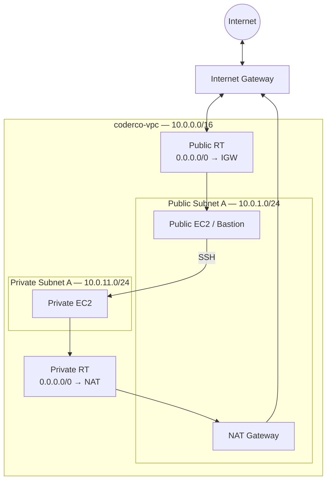

# Assignment 1 — VPC & Networking

## Overview

Built a custom VPC from scratch with one public subnet and one private subnet, separate routing, a NAT Gateway, public/private EC2 instances, Security Groups, bastion-style SSH access, and CloudWatch monitoring.

## Architecture



## Services Used

- Amazon VPC
- Public/private subnets
- Internet Gateway
- Elastic IP
- NAT Gateway
- Route tables
- EC2
- Security Groups
- CloudWatch

## Network Plan

| Resource | Configuration |
|---|---|
| VPC | `10.0.0.0/16` |
| Public subnet | `10.0.1.0/24` |
| Private subnet | `10.0.11.0/24` |
| Region | `eu-west-2` |
| Public default route | `0.0.0.0/0 → IGW` |
| Private default route | `0.0.0.0/0 → NAT Gateway` |

## What I Built

1. Created `coderco-vpc`.
2. Created public and private subnets.
3. Attached an Internet Gateway.
4. Created an Elastic IP and NAT Gateway.
5. Created public/private route tables.
6. Launched a public EC2 with a public IPv4 address.
7. Launched a private EC2 with no public IPv4 address.
8. Restricted traffic with Security Groups.
9. Connected to the private EC2 through the public EC2.
10. Verified private outbound internet access through the NAT Gateway.
11. Reviewed CloudWatch metrics.

## Validation

On the private instance:

```bash
hostname -I
curl https://checkip.amazonaws.com
```

The private IP confirmed the instance was in the private subnet, while the external IP matched the NAT Gateway's public address.

## Challenges & Fixes

- **SSH ProxyJump:** the first jump-host attempt did not apply the key correctly. I fixed it by explicitly specifying the key in the proxy command.
- **Cost management:** once the lab was documented, I deleted the NAT Gateway and released its Elastic IP.

## Key Learnings

- A public subnet is defined by routing to an Internet Gateway.
- Private EC2 instances can reach the internet outbound through NAT without having public IPs.
- Security Groups can reference other Security Groups.
- Route tables control paths; Security Groups control permitted traffic.

## Evidence

See [`screenshots/`](screenshots/).

## Supporting Script

[`user-data/public-web-server.sh`](user-data/public-web-server.sh)

## References

- https://docs.aws.amazon.com/vpc/latest/userguide/
- https://docs.aws.amazon.com/vpc/latest/userguide/vpc-nat-gateway.html
- https://docs.aws.amazon.com/vpc/latest/userguide/vpc-security-groups.html
