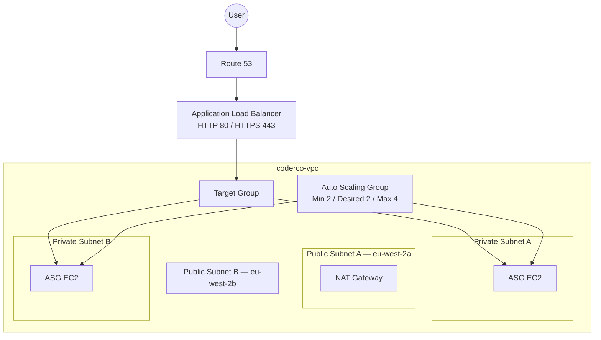

# Assignment 2 — Application Load Balancer & Auto Scaling

## Overview

Extended the VPC into a multi-AZ web architecture using an Application Load Balancer, private EC2 targets, Auto Scaling, Route 53 and HTTPS.

## Architecture



## Services Used

- Application Load Balancer
- Target Groups
- EC2
- Security Groups
- Launch Templates
- Auto Scaling
- Route 53
- ACM
- NAT Gateway

## What I Built

1. Added public/private subnets in a second AZ.
2. Created an internet-facing ALB across both public subnets.
3. Placed backend EC2 instances in private subnets.
4. Allowed backend HTTP only from the ALB Security Group.
5. Created a target group and health checks.
6. Verified traffic reached both web servers.
7. Created a Launch Template and Auto Scaling Group.
8. Configured min `2`, desired `2`, max `4`.
9. Added 50% average CPU target tracking.
10. Connected the ASG to the ALB target group.
11. Tested ASG self-healing.
12. Delegated `aws.abubakarmohamed.dev` to Route 53.
13. Added an ACM certificate and HTTPS.
14. Redirected HTTP to HTTPS.

## Security Design

```text
Internet
   ↓
ALB SG: 80 / 443
   ↓
Backend SG: HTTP 80 from ALB SG only
```

## Validation

The same ALB DNS name returned content from both AZs. The final target group showed two healthy ASG-managed instances.

## Auto Scaling Test

Stopping ASG-managed instances caused the ASG to restore desired capacity by launching replacements, demonstrating self-healing.

## Challenges & Fixes

- **Blackhole route:** the old NAT Gateway had been deleted for cost savings, so I recreated NAT access and updated the private default route.
- **Initial unhealthy ASG targets:** user-data was still installing Apache; health checks passed once bootstrap completed.

## Key Learnings

- ALBs span multiple AZs.
- Private backends can stay off the public internet.
- Security Group references isolate traffic cleanly.
- Auto Scaling maintains desired capacity.
- Route 53 + ACM + ALB provides a custom HTTPS entry point.

## Evidence

See [`screenshots/`](screenshots/).

## Supporting Scripts

- [`user-data/web-server-1.sh`](user-data/web-server-1.sh)
- [`user-data/web-server-2.sh`](user-data/web-server-2.sh)
- [`user-data/asg-web-server.sh`](user-data/asg-web-server.sh)

## References

- https://docs.aws.amazon.com/elasticloadbalancing/latest/application/
- https://docs.aws.amazon.com/autoscaling/ec2/userguide/
- https://docs.aws.amazon.com/acm/latest/userguide/
