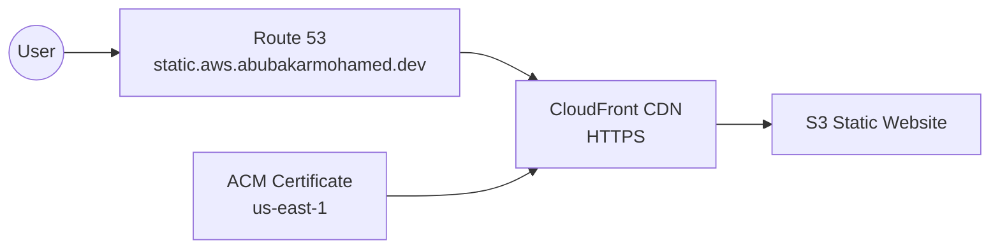

# Assignment 3 — S3 Static Website + CloudFront + Route 53

## Overview

Hosted a static website in S3, delivered it through CloudFront, enabled HTTPS with ACM, mapped a custom Route 53 name, and tested CloudFront cache invalidation.

## Architecture



## Services Used

- Amazon S3
- CloudFront
- Route 53
- ACM

## What I Built

1. Created `abubakar-coderco-static-site`.
2. Enabled S3 static website hosting.
3. Uploaded `index.html` and `error.html`.
4. Added public `s3:GetObject` access for website objects.
5. Verified the S3 website endpoint.
6. Created a CloudFront distribution using the S3 website endpoint.
7. Enabled `GET/HEAD`, compression, HTTPS redirection, and `Managed-CachingOptimized`.
8. Created an ACM certificate for `static.aws.abubakarmohamed.dev`.
9. Created a Route 53 Alias A record to CloudFront.
10. Verified both the CloudFront domain and custom HTTPS domain.
11. Updated `index.html`.
12. Invalidated `/*`.
13. Verified the new content.

## CloudFront Configuration

```text
Origin: S3 website endpoint
Origin protocol: HTTP only
Viewer protocol: Redirect HTTP to HTTPS
Allowed methods: GET, HEAD
Compression: Enabled
Cache policy: Managed-CachingOptimized
```

## DNS & HTTPS

```text
static.aws.abubakarmohamed.dev
        ↓
Route 53 Alias
        ↓
CloudFront
        ↓
S3 website
```

The CloudFront ACM certificate was created in `us-east-1`, as required for CloudFront viewer certificates.

## Challenges & Fixes

- **Invalid bucket policy resource:** fixed by using the exact bucket ARN ending in `/*`.
- **Custom domain not resolving:** fixed by creating the missing Route 53 Alias record to CloudFront.

## Key Learnings

- S3 can host static web content.
- CloudFront adds global caching and HTTPS.
- Cache invalidation forces updated content to be fetched.
- Route 53 Alias records integrate directly with CloudFront.
- CloudFront viewer certificates use ACM in `us-east-1`.

## Evidence

See [`screenshots/`](screenshots/).

## Website Files

- [`website/index.html`](website/index.html)
- [`website/error.html`](website/error.html)

## References

- https://docs.aws.amazon.com/AmazonS3/latest/userguide/WebsiteHosting.html
- https://docs.aws.amazon.com/AmazonCloudFront/latest/DeveloperGuide/
- https://docs.aws.amazon.com/Route53/latest/DeveloperGuide/routing-to-cloudfront-distribution.html
