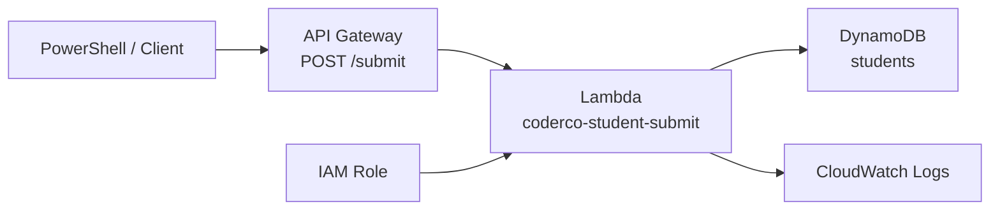

# Assignment 4 — Serverless API with Lambda, IAM & DynamoDB

## Overview

Built a serverless API that accepts `POST /submit`, invokes Lambda, generates a UUID and timestamp, stores the payload in DynamoDB, and returns a structured JSON response.

## Architecture



## Services Used

- API Gateway
- Lambda
- DynamoDB
- IAM
- CloudWatch

## DynamoDB

```text
Table: students
Partition key: id (String)
Capacity: On-demand
```

## Lambda

Function:

```text
coderco-student-submit
```

The function generates a UUID and UTC timestamp, stores `{id, timestamp, payload}` in DynamoDB, and returns HTTP `201`.

## IAM

The Lambda execution role uses basic Lambda logging permissions plus a targeted:

```text
dynamodb:PutItem
```

permission for only the `students` table.

## API Gateway

```text
API: coderco-student-api
Route: POST /submit
Integration: coderco-student-submit
```

## Testing

A PowerShell POST request returned a success message, generated ID, timestamp and payload. A new DynamoDB item appeared immediately afterward.

## CloudWatch

CloudWatch logs showed:

```text
START RequestId
END RequestId
REPORT RequestId
```

for the Lambda invocation.

## Challenges & Fixes

- **IAM policy resource error:** fixed by using the exact DynamoDB table ARN.
- **Initial API test URL:** replaced the placeholder API ID with the real invoke URL.

## Key Learnings

- API Gateway can expose Lambda through HTTP routes.
- Lambda execution roles enforce service permissions.
- DynamoDB fits simple serverless persistence.
- Least privilege is better than broad wildcard IAM permissions.
- CloudWatch is essential for serverless troubleshooting.

## Evidence

See [`screenshots/`](screenshots/).

## Project Files

- [`lambda/lambda_function.py`](lambda/lambda_function.py)
- [`iam/dynamodb-putitem-policy.json`](iam/dynamodb-putitem-policy.json)
- [`testing/powershell-post.ps1`](testing/powershell-post.ps1)

## References

- https://docs.aws.amazon.com/lambda/latest/dg/
- https://docs.aws.amazon.com/amazondynamodb/latest/developerguide/
- https://docs.aws.amazon.com/apigateway/latest/developerguide/http-api.html
